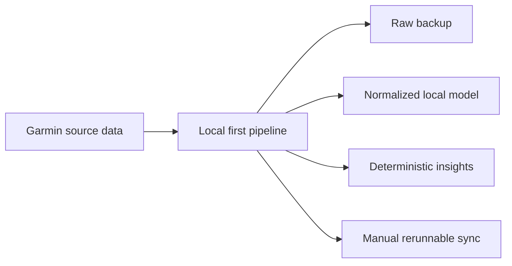

## adr_000_choose_local_first_garmin_data_sync_and_storage_architecture - Choose local-first Garmin data sync and storage architecture
> Date: 2026-04-06
> Status: Accepted
> Drivers: local privacy, raw-first analytics, rerunnable sync, provenance, extensible data model
> Related request: `req_000_backup_garmin_connect_data_and_build_first_interpretation_layer`
> Related backlog: `item_000_backup_garmin_connect_data_and_build_first_interpretation_layer`
> Related task: (none yet)
> Reminder: Update status, linked refs, decision rationale, consequences, migration plan, and follow-up work when you edit this doc.

# Overview
- Build the Garmin data foundation as a local-first pipeline.
- Prefer raw source preservation, then normalize into a reusable local analytical layer.
- Use a hybrid sync strategy: official export first, authenticated automation second when needed.
- Keep interpretation deterministic and explainable, with vendor scores stored as secondary context.
- The main impacted areas are extraction, storage layout, sync contracts, and derived metric computation.

# Context
- The project needs a trustworthy local backup of Garmin Connect data before higher-level coaching or longitudinal analysis can be built.
- The user wants local-only handling for personal health data and prefers raw measurements over opaque vendor-computed indicators whenever both exist.
- Garmin data access may require multiple mechanisms depending on what is officially exportable versus what needs authenticated retrieval.
- The first delivery should maximize long-term reuse: it must support reprocessing, schema evolution, and later feature work without discarding source fidelity.
- The same foundation must support both broad archival coverage and a first interpretation layer focused on running, recovery, and life-context signals.

# Decision
- The system will use a three-layer local data architecture:
- Layer 1: raw source preservation. Store exports or fetched payloads as close to source format as possible, with provenance metadata for source, sync run, and extraction time.
- Layer 2: normalized analytical model. Load supported Garmin datasets into a reusable local analytical store, with DuckDB as the default target for tabular analysis.
- Layer 3: deterministic derived metrics. Compute transparent, documented indicators from raw and normalized data for running load, fatigue/recovery, sleep quality, cardio consistency, progression, and overreaching signals.
- Synchronization will be manual and rerunnable in the first version. A sync execution must be idempotent enough to avoid duplicate logical records and must preserve prior raw data.
- Extraction will follow a hybrid strategy: use official export paths when they are sufficient, and authenticated automation only for the remaining datasets or refresh flows that official exports do not cover well.
- Garmin-computed indicators such as training readiness or recovery time may be stored when available, but they must remain secondary reference fields rather than the analytical ground truth.

# Alternatives considered
- Store only Garmin vendor-computed summaries and skip raw preservation. Rejected because it would make later analysis less transparent, less auditable, and more dependent on opaque upstream assumptions.
- Build directly on a remote database or cloud storage. Rejected because the user explicitly wants local-only handling for privacy-sensitive health data in the first version.
- Keep data only as loose files without a normalized analytical layer. Rejected because later reporting and interpretation would become fragile, repetitive, and harder to extend.
- Start with AI-driven recommendations from raw exports. Rejected because the first milestone should remain explainable, deterministic, and architecture-first.

# Consequences
- The architecture will be easier to audit and reprocess because raw data remains available after normalization and metric evolution.
- DuckDB should make analytical iteration fast for a local single-user workflow, but the schema design still needs care to keep cross-dataset joins stable.
- The hybrid extraction strategy increases implementation complexity, but it improves coverage and reduces lock-in to a single fragile access path.
- Deterministic derived metrics will slow down the delivery of sophisticated advice, but they create a more trustworthy base for later coaching features.
- Vendor-computed Garmin scores can still be compared against transparent house metrics, which may help detect bias or drift later.

# Migration and rollout
- Step 1: define storage directories and sync-run provenance conventions for raw artifacts.
- Step 2: implement the first extraction path for priority datasets with a manual entrypoint.
- Step 3: define and populate the normalized local model in DuckDB.
- Step 4: implement the first deterministic derived metrics and document their formulas.
- Step 5: validate reruns, deduplication behavior, and known unsupported datasets before widening scope.

# References
- `logics/request/req_000_backup_garmin_connect_data_and_build_first_interpretation_layer.md`
- `logics/backlog/item_000_backup_garmin_connect_data_and_build_first_interpretation_layer.md`
# Follow-up work
- Create the first execution task for implementing extraction, raw storage layout, DuckDB normalization, and deterministic metric computation.
- Document the first normalized schema and the provenance contract for raw sync artifacts.
- Decide the exact formulas and thresholds for the first-wave derived metrics.
- Revisit this ADR if Garmin access constraints force a materially different sync or persistence model.
