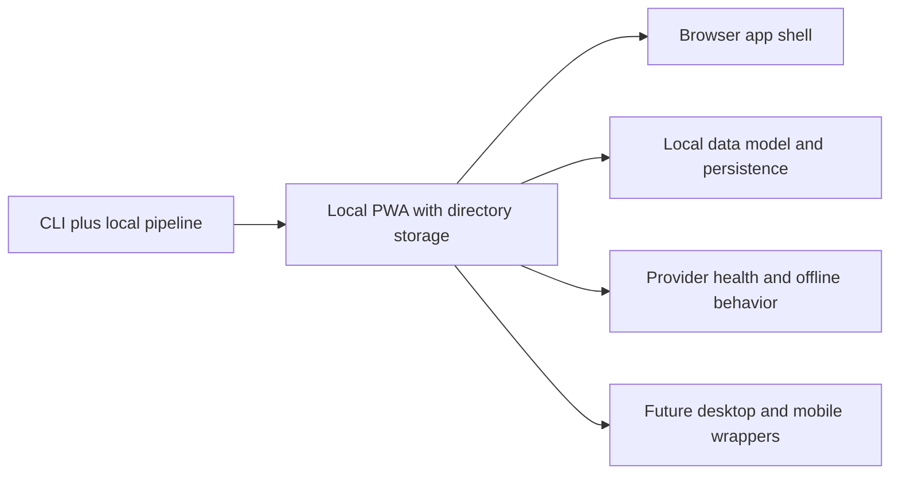

## adr_001_choose_local_pwa_storage_and_provider_integration - Choose local PWA storage and provider integration
> Date: 2026-04-11
> Status: Accepted
> Drivers: local data ownership, offline-first product behavior, provider flexibility, future desktop and mobile packaging
> Related request: [req_008_local_first_pwa_coach_dashboard](../request/req_008_local_first_pwa_coach_dashboard.md)
> Related backlog: [item_009_local_first_pwa_coach_dashboard](../backlog/item_009_local_first_pwa_coach_dashboard.md)
> Related task: [task_009_local_first_pwa_coach_dashboard](../tasks/task_009_local_first_pwa_coach_dashboard.md)
> Reminder: Update status, linked refs, decision rationale, consequences, migration plan, and follow-up work when you edit this doc.

# Overview
Coach Garmin should use a machine-local directory as the first storage target for the PWA version.
The app should stay offline-first by default, with browser access to local state and imported Garmin data.
AI providers should be abstracted behind a thin adapter so Ollama is the default, while Gemini and OpenAI remain optional fallbacks.
This decision keeps the product simple now and leaves room for a desktop wrapper or an Android wrapper later.

# Context
The existing stack already stores Garmin-derived data locally and can analyze it from DuckDB.
The missing piece is a browser-installable surface that can open that local state, keep the data ownership explicit, and switch between AI providers without entangling product logic with one vendor.
PWA storage behavior is different from native app storage, so the first release needs a simple, explicit local directory strategy rather than an opaque browser-only default.

# Decision
Use a local directory on the machine as the first canonical storage location for the PWA.
Keep the app offline-first and let it read and write local state through an explicit workspace model.
Use a provider adapter layer with Ollama as the default provider and Gemini/OpenAI as optional fallbacks.
Keep browser-only state minimal so a later desktop or mobile wrapper can reuse the same product logic.

# Alternatives considered
- Browser-only IndexedDB without a machine-local workspace.
- Cloud-first storage with remote sync as the default.
- Hard-coding a single AI provider directly into the UI layer.
- Building a desktop wrapper first and postponing the PWA surface.

# Consequences
- Positive:
  - local data ownership remains obvious
  - offline-first behavior is easier to preserve
  - the provider choice is explicit and can degrade cleanly
  - later desktop or mobile wrappers can share the same core contract
- Negative:
  - the browser app needs a local directory abstraction or permission flow
  - mobile support will need an additional sync or packaging decision later
  - provider adapters add a small amount of maintenance overhead
- Risk:
  - if local state is not modeled carefully, migration to Android can become awkward

# Migration and rollout
Start with the PWA shell and a local directory workspace.
Persist app settings, import caches, and coaching outputs in that workspace.
Keep provider selection behind a settings layer and fail cleanly if a key or local model is missing.
Only after the PWA is stable should a desktop wrapper or Android wrapper be added.

# References
- [req_008_local_first_pwa_coach_dashboard](../request/req_008_local_first_pwa_coach_dashboard.md)
- [item_009_local_first_pwa_coach_dashboard](../backlog/item_009_local_first_pwa_coach_dashboard.md)
- [task_009_local_first_pwa_coach_dashboard](../tasks/task_009_local_first_pwa_coach_dashboard.md)

# Follow-up work
- Define the local workspace layout for app state, cached imports, and coaching outputs.
- Add a provider health check path for Ollama, Gemini, and OpenAI.
- Keep the PWA shell free of vendor-specific assumptions so a future desktop or Android wrapper stays viable.
