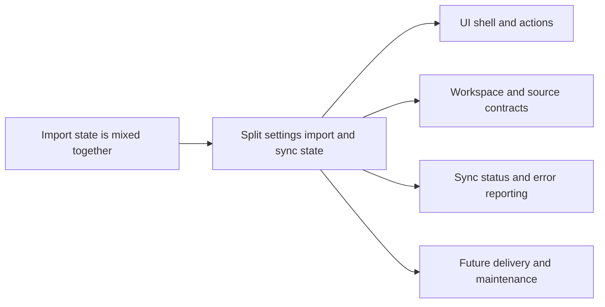

## adr_002_place_workspace_in_settings_and_add_non_blocking_garmin_sync - Place workspace in settings and add non-blocking Garmin sync
> Date: 2026-04-13
> Status: Accepted
> Drivers: clear state boundaries, local-first UX, non-blocking sync, resilient provider and import flow, settings versus action separation
> Related request: [req_012_clarify_import_workflow_accent_handling_and_refresh_actions](../request/req_012_clarify_import_workflow_accent_handling_and_refresh_actions.md)
> Related backlog: [item_013_clarify_import_workflow_accent_handling_and_refresh_actions](../backlog/item_013_clarify_import_workflow_accent_handling_and_refresh_actions.md)
> Related task: (none yet)
> Reminder: Update status, linked refs, decision rationale, consequences, migration plan, and follow-up work when you edit this doc.

# Overview
Keep the Garmin source path in the import workflow, but move the local workspace path into Settings.
Add a Garmin Connect sync action that can fail gracefully and only report the failure instead of blocking the app.
Keep sync state, import state, and workspace state separate so the UI can report each one clearly.
This decision affects the UI shell, the provider and sync contracts, and the state model used by the PWA.

# Context
The current PWA already has a working local-first import and coach flow, but the import UI still blends configuration with actions.
The workspace path is a configuration concern, while the Garmin source path is an action context and should remain close to the import button.
Garmin Connect sync is useful, but it must not behave like a hard dependency because network, auth, or provider failure should not stop local data use.
The architecture needs separate state for source path, workspace path, freshness, last import, and sync result so the UI can explain them independently.

# Decision
Store the local workspace path in Settings, not in the main import page.
Keep the Garmin source path on the import page where the import action happens.
Expose Garmin Connect sync as a best-effort action that updates sync state and reports failure without throwing the rest of the workflow off.
Model import state, sync state, and workspace state as separate concepts in the UI and in the service layer.

# Alternatives considered
- Keep workspace and source path together on the import page. Rejected because it makes the page harder to scan and blurs configuration with action.
- Hide Garmin Connect sync entirely behind import. Rejected because the user explicitly wants a visible sync button and a graceful failure signal.
- Make sync block the whole app on failure. Rejected because the rest of the local workflow must remain usable even when Garmin Connect is down.
- Move the source path into Settings as well. Rejected because the source path is action-oriented and belongs next to the import controls.

# Consequences
- Positive:
  - the import page becomes easier to understand
  - the settings page becomes the canonical home for durable configuration
  - sync failure can be reported cleanly without breaking local workflows
  - state boundaries become clearer for future automation and testing
- Negative:
  - the UI needs one more explicit state boundary in code
  - the app must preserve separate persistence for settings, source, workspace, and sync results
  - the sync action needs status handling and non-blocking error reporting

# Migration and rollout
- Move the workspace path inputs into Settings.
- Keep the Garmin source path next to the import action on the import page.
- Add the Garmin Connect sync action as non-blocking and make its status visible.
- Update the dashboard and debug surfaces so they can report workspace, source, import, and sync independently.
- Preserve backwards compatibility for any existing saved workspace settings.

# References
- (none yet)
# Follow-up work
- Implement the import page layout and button ordering that matches this decision.
- Move workspace path configuration into Settings and update persistence accordingly.
- Add explicit sync state reporting for Garmin Connect.
- Add tests for non-blocking sync failure and for the moved workspace configuration.
