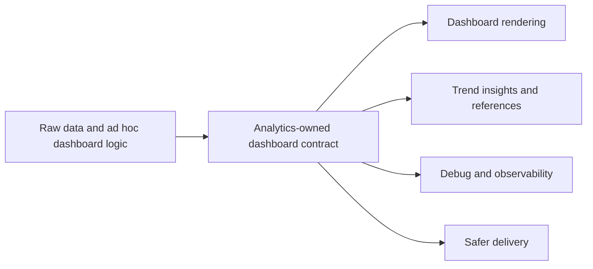

## adr_003_choose_monotone_pace_hr_curve_and_cadence_first_dashboard_metrics - Choose monotone pace HR curve and cadence-first dashboard metrics
> Date: 2026-04-14
> Status: Accepted
> Drivers: actionability, explainability, local-first analytics, stable data contracts, monotone trend rendering
> Related request: `req_013_refine_dashboard_metrics_and_data_processing_for_pace_hr_cadence_coach_analytics`
> Related backlog: `item_014_refine_dashboard_metrics_and_data_processing_for_pace_hr_cadence_coach_analytics`
> Related task: `task_014_refine_dashboard_metrics_and_data_processing_for_pace_hr_cadence_coach_analytics`
> Reminder: Update status, linked refs, decision rationale, consequences, migration plan, and follow-up work when you edit this doc.

# Overview
The analytics layer now owns the dashboard contract for the running coach.
It emits a monotone pace-versus-heart-rate curve, cadence trend data, and reference bands for load and sleep so the UI can stay simple.
Debug coverage and other technical diagnostics remain available, but outside the main user-facing dashboard.
This keeps the coach local-first, explainable, and robust against noisy interval data.

# Context
The dashboard needs richer signals, but those signals must stay understandable.
The previous approach mixed technical indicators with user-facing metrics and relied too much on ad hoc labels.
The new structure needs a stable contract so the UI can render useful trends without re-deriving the data on the fly.
The pace-versus-heart-rate relation must use recent running points, filter unstable segments, and remain monotone after smoothing.

# Decision
Compute dashboard trend insights in the analytics layer and expose them through the service payload.
Build the pace/HR curve from pace bands and nearest heart-rate values, then apply monotone smoothing so higher effort always maps to higher heart rate.
Keep cadence as a first-class daily trend.
Keep load and sleep reference bands in the metrics layer.
Keep coverage and similar diagnostics in debug views rather than the primary dashboard.

# Alternatives considered
- Render the curve from raw summary values only.
- Use a simple regression line instead of monotone smoothing.
- Keep technical coverage visible as a primary dashboard metric.
- Compute each mini-chart directly in the UI instead of using a shared analytics contract.

# Consequences
- The analytics layer becomes slightly more complex, but the dashboard becomes much clearer.
- The UI can stay thinner and focus on presentation.
- Tests need to protect monotonicity, filtering, and dashboard payload shape.
- The coach benefits from a stable contract for future additions such as HRV context or more load signals.

# Migration and rollout
- Keep a fallback when trend insights are missing so existing workspaces still render.
- Validate the new curve and trend payload through automated tests before closing the wave.
- Roll out the updated dashboard on the local PWA shell once the analytics contract is stable.

# References
- `req_013_refine_dashboard_metrics_and_data_processing_for_pace_hr_cadence_coach_analytics`
- `item_014_refine_dashboard_metrics_and_data_processing_for_pace_hr_cadence_coach_analytics`
- `task_014_refine_dashboard_metrics_and_data_processing_for_pace_hr_cadence_coach_analytics`
- `prod_002_refine_dashboard_metrics_and_data_processing_for_running_analytics`

# Follow-up work
- Tune cadence reference bands once more real data has been exercised.
- Consider a compact recovery card only if it improves decision quality.
- Add more context around HRV if it becomes useful rather than noisy.
