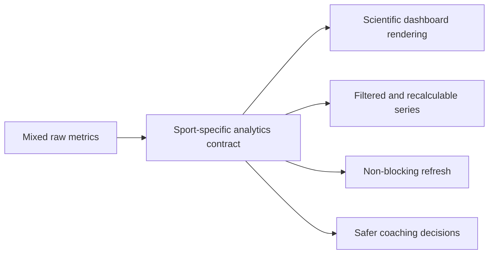

## adr_004_scientific_charts_for_sport_specific_volumes_and_data_recalculation - Scientific charts for sport specific volumes and data recalculation
> Date: 2026-04-14
> Status: Accepted
> Drivers: chart readability, sport separation, recalculation, local-first trust, stable derived metrics, explicit data readiness diagnostics
> Related request: `req_015_scientific_charts_sport_specific_volumes_and_data_recalculation_controls`
> Related backlog: `item_015_scientific_charts_sport_specific_volumes_and_data_recalculation_controls`
> Related task: (none yet)
> Reminder: Update status, linked refs, decision rationale, consequences, migration plan, and follow-up work when you edit this doc.

# Overview
The analytics layer should emit clean sport-specific series and science-style chart data instead of leaving the UI to guess.
The dashboard needs axes, ticks, hover values, and separate sport totals so the user can trust what they see.
Derived data must be recalculable on demand without blocking the local-first app.

# Context
The current dashboard implementation can only stay readable if the analytics layer prepares cleaner curves and sport-separated totals.
Running, cycling, and strength need different treatment.
The dashboard also needs a non-blocking refresh path so the user can ask for a recalculation when filtering changes or when the processed series look stale.
The latest dashboard iterations also showed a gap between the generic "analysis ready" label and the actual chart payload quality.
The UI must be able to tell whether data are ready, whether a recalculation is required, whether only partial data are available, or whether a chart is genuinely unavailable.
When a preview or modal has no exploitable points, the app must explain that state instead of escalating into a JS error.

# Decision
Use the analytics layer as the source of truth for:
- sport-specific weekly volumes
- monotone curve data
- chart-ready values with axes and hover details
- a refresh/recalculate action that recomputes derived views without blocking the UI
- explicit chart readiness states that separate ready, recalculation required, partial data, and unavailable payloads
- graceful chart recovery behavior that keeps the shell stable when a chart cannot be rendered yet

Keep the UI focused on display and interaction, not on rebuilding the data model on every render.

# Alternatives considered
- Derive all chart details directly inside the UI.
- Keep running, cycling, and strength totals blended into one dashboard volume.
- Use minimal sparklines with no axes or hover values.

# Consequences
- The analytics contract becomes richer, but much easier to reuse.
- The UI becomes more readable and less error-prone.
- A recalculation button becomes meaningful because the series it refreshes are explicit and separate.
- Tests need to protect sport separation and graph readability expectations.
- The dashboard must surface readiness problems as first-class states instead of leaving the user to infer them from empty graphs.
- Chart preview and modal code must fail soft when series are missing, filtered, or not yet stable.

# Migration and rollout
- Keep fallbacks so the current UI still renders if the recalculation payload is missing.
- Add the scientific chart behavior incrementally, reusing the existing local dashboard shell.
- Validate the series shape and the sport split before closing the wave.
- Add a readiness probe before chart rendering so the UI can show recalculation required or partial data without breaking boot.
- Validate chart payloads before modal opens so empty or incomplete series stay explanatory.

# References
- `logics/request/req_015_scientific_charts_sport_specific_volumes_and_data_recalculation_controls.md`
- `logics/backlog/item_015_scientific_charts_sport_specific_volumes_and_data_recalculation_controls.md`
- `logics/request/req_019_self_diagnose_data_readiness_and_chart_recovery.md`
- `logics/backlog/item_019_self_diagnose_data_readiness_and_chart_recovery.md`
# Follow-up work
- Add a reusable chart component with axes, hover values, and consistent tick styles.
- Wire a recalculation button to analytics refresh and derived metric rebuilds.
- Tune sport filtering rules once the next batch of data is exercised.
- Add explicit chart readiness diagnostics for ready, recalculation required, partial data, and unavailable states.
- Keep chart preview and modal error handling soft so empty payloads do not surface as JS errors.
