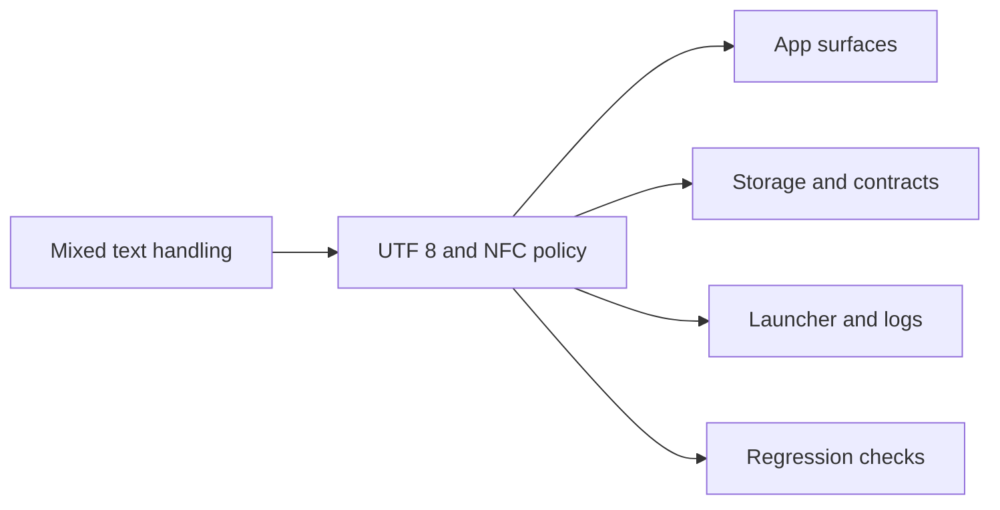

## adr_005_choose_end_to_end_utf_8_and_nfc_text_policy - Choose End-to-End UTF-8 and NFC Text Policy
> Date: 2026-04-14
> Status: Accepted
> Drivers: recurring French mojibake, local-first persistence, predictable CLI/PWA/launcher behavior, low-friction regression detection
> Related request: req_016_harden_utf_8_and_french_text_handling_end_to_end
> Related backlog: item_016_clarifications
> Related task: task_016_clarifications
> Related follow-up task: task_017_french_text_encoding_regression_tests_and_diagnostics
> Reminder: Update status, linked refs, decision rationale, consequences, migration plan, and follow-up work when you edit this doc.

# Overview
Treat UTF-8 as the only storage and transport encoding inside the project.
Normalize free text to Unicode NFC at boundaries before persistence and provider calls.
Make launcher, Python IO, browser shell, JSON, markdown, and generated reports declare UTF-8 explicitly.
Expose mojibake and encoding drift in diagnostics and tests instead of masking it.

# Context
Coach Garmin has repeatedly shown French character corruption across the PWA, CLI, launcher, logs, and generated files.
The project is local-first, so the safest fix is to standardize text boundaries instead of patching individual screens.
We need a policy that survives Windows batch files, PowerShell, Python IO, browser rendering, and local persistence round trips.
The goal is to make accented French text readable everywhere by default and make future regressions obvious in validation.

# Decision
Adopt UTF-8 as the internal and external project text encoding policy.
Normalize user-facing free text to Unicode NFC before persistence and before provider calls.
Write and read text-bearing files with explicit UTF-8 settings, using `ensure_ascii=False` or equivalent where JSON is emitted.
Set launcher and process-level UTF-8 expectations explicitly so the runtime does not depend on ambient locale defaults.
Keep diagnostic paths strict: when a source cannot be made safe, surface it loudly in logs or tests instead of silently preserving mojibake.

# Alternatives considered
- Patch one screen or file at a time as mojibake appears.
- Keep mixed encodings and rely on default system locale behavior.
- Convert text only at display time and leave storage inconsistent.
- Introduce custom per-layer encodings for convenience.

# Consequences
- One-time cleanup is required across several boundary points, but the payoff is that future text bugs become much rarer.
- Diagnostics become more useful because text corruption is visible instead of hidden.
- Some legacy outputs may need regeneration after the policy is applied.
- All new text-bearing code paths must be explicit about encoding and normalization, which adds a small amount of ceremony but removes ambiguity.
- External integrations that do not speak UTF-8 cleanly will need explicit adapters rather than implicit assumptions.

# Migration and rollout
- Start by auditing all write/read boundaries for text: launcher, Python IO, PWA shell, diagnostics, reports, and JSON payloads.
- Introduce a shared normalization and encoding helper so future code paths do not reimplement the policy differently.
- Update the launcher and server bootstrap to force UTF-8 process expectations.
- Update browser and generated content paths to preserve accents on reload, cache refresh, and round trip persistence.
- Add regression tests and smoke checks before removing any fallback behavior.
- Re-export or regenerate any text artifacts that were previously stored with corrupted encodings.

# References
- (none yet)
# Follow-up work
- Harden runtime text boundaries in the app, launcher, and generators.
- Add regression tests and diagnostics for French strings and mojibake detection.
- Review any remaining text-bearing artifacts that were previously emitted with the wrong encoding.
