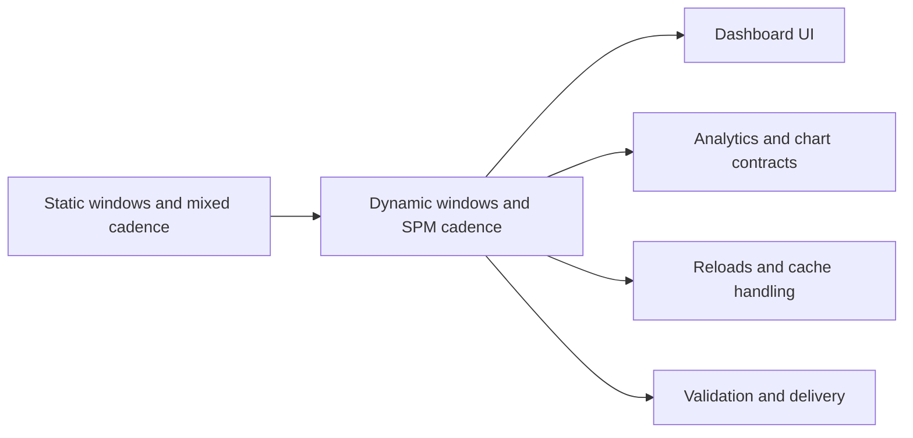

## adr_006_choose_dynamic_chart_windows_and_cadence_normalization - Choose dynamic chart windows and cadence normalization
> Date: 2026-04-15
> Status: Accepted
> Drivers: Dynamic chart windows must change the dataset, chart axes must rescale to the selected horizon, cadence must be normalized to steps per minute, and chart text must remain French-safe after reloads and cache refreshes.
> Related request: `req_018_dynamic_chart_timeframes_and_cadence_unit_correction`
> Related backlog: `item_018_dynamic_chart_timeframes_and_cadence_unit_correction`
> Related task: `task_019_dynamic_chart_timeframes_and_cadence_unit_correction`
> Reminder: Update status, linked refs, decision rationale, consequences, migration plan, and follow-up work when you edit this doc.

# Overview
Make chart windows first-class inputs, normalize cadence to steps per minute, and keep chart rendering French-safe across reloads.

# Context
The dashboard already exposes timeframe buttons, but the selected period does not yet always drive the plotted data. The cadence signal is also ambiguous in some parts of the pipeline and must be normalized to step rate in steps per minute. Finally, French text rendering must stay stable across UI reloads and cache refreshes.

# Decision
Use a single chart-state contract that carries:
- selected timeframe in days
- filtered chart dataset for that timeframe
- autoscaled y-axis bounds
- cadence expressed as steps per minute
- French-safe labels, titles, and helper text

Rendering logic must treat timeframe selection as a data filter, not only as a label change.

# Alternatives considered
- Keep the current fixed chart windows and only update labels.
- Keep cadence as a loosely derived mixed metric and explain it in text only.
- Rely on manual French text fixes without a shared UTF-8/NFC policy.

# Consequences
- Charts become more truthful and more useful for coaching decisions.
- The chart code and the analytics layer need tighter contracts.
- The UI needs validation for window switching, y-axis autoscaling, and French-safe rendering.
- Missing cadence or filtered data must be explained explicitly instead of implied.

# Migration and rollout
- Update the chart state model first.
- Wire timeframe buttons to recompute the displayed dataset.
- Rebuild cadence derivation so it emits step rate in SPM only.
- Add validation for French labels and reload/cache persistence.
- Roll out with regression tests for window switching and chart rendering.

# References
- `logics/request/req_018_dynamic_chart_timeframes_and_cadence_unit_correction.md`
- `logics/backlog/item_018_dynamic_chart_timeframes_and_cadence_unit_correction.md`
- `logics/tasks/task_019_dynamic_chart_timeframes_and_cadence_unit_correction.md`
# Follow-up work
- Implement the dynamic chart window switching and y-axis autoscaling.
- Confirm cadence derivation sources and add diagnostics for missing data.
- Add French text regression coverage for chart titles, axes, and legends.
