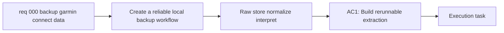

## item_000_backup_garmin_connect_data_and_build_first_interpretation_layer - Backup Garmin Connect data and build first interpretation layer
> From version: 0.1.0
> Schema version: 1.0
> Status: Done
> Understanding: 95
> Confidence: 92
> Progress: 100
> Complexity: High
> Theme: Health
> Reminder: Update status/understanding/confidence/progress and linked task references when you edit this doc.

# Problem
- Create a reliable local backup workflow for the user's Garmin Connect data, covering as much historical data as realistically possible.
- Implement one reusable foundation slice that:
  preserves raw Garmin data locally, normalizes the priority datasets into an analytical store, and exposes a first deterministic interpretation layer.
- Prioritize raw or minimally transformed measurements over Garmin-computed vendor scores so later coaching logic is explainable and less biased by opaque upstream processing.
- Keep the first sync manual and rerunnable so the user can refresh data on demand without duplicates or destructive overwrites.
- Cover the first-wave priority datasets: activities, sleep, heart rate, HRV, stress, Body Battery, steps, intensity minutes, plus recovery-oriented fields such as training readiness and recovery time when Garmin exposes them.

# Scope
- In: implement the extraction path for the priority Garmin datasets using the validated hybrid approach of official export first and authenticated automation when needed.
- In: store raw source artifacts with provenance metadata such as source endpoint/export type, extraction timestamp, and sync run identifier.
- In: normalize the extracted data into a reusable local analytical layer, with DuckDB as the default target unless implementation constraints prove another local store clearly better.
- In: compute a first deterministic interpretation layer focused on running, recovery, sleep quality, cardio consistency, progression, and overreaching/fatigue signals.
- Out: advanced coaching dialogue, AI-generated recommendations, dashboards, multi-user support, cloud sync, and medically validated advice.
- Out: broadening the scope to every Garmin feature if the marginal complexity is high and the value is low for the first foundation slice.

# Acceptance criteria
- AC1: Build a rerunnable local extraction workflow that captures the priority Garmin datasets with a manual trigger and records extraction provenance for each sync.
- AC2: Persist the raw source data without lossy transformation so the original exported or fetched content remains available for audit and reprocessing.
- AC3: Normalize the extracted datasets into a reusable local analytical model that covers, at minimum, activities, daily wellness metrics, sleep, heart rate, HRV, stress, Body Battery, steps, and intensity minutes.
- AC4: Include recovery-oriented Garmin fields such as training readiness and recovery time when they are available, but model them as secondary reference signals rather than trusted primary inputs.
- AC5: Produce a first deterministic interpretation layer with documented formulas or rules for core derived outputs including training load trend, fatigue/recovery signals, sleep quality summary, cardio consistency, running progression, and overreaching warnings.
- AC6: Ensure the first implementation remains local-only, with no external storage and no external AI processing of personal data.
- AC7: Document the storage layout, sync entrypoint, supported datasets, and known gaps so the foundation can be extended by later backlog items and tasks without reverse-engineering the data flow.

# AC Traceability
- AC1 -> Scope: Extraction path + provenance metadata. Proof: run a manual sync and verify a new sync run records source, time, and dataset coverage.
- AC2 -> Scope: Raw source artifact storage. Proof: inspect stored raw files/payloads and confirm they can be re-read without depending on normalized tables.
- AC3 -> Scope: Normalized analytical layer. Proof: query the local analytical store and confirm the core entities and fields are populated for supported datasets.
- AC4 -> Scope: Secondary recovery-oriented reference fields. Proof: confirm optional Garmin-derived readiness/recovery fields are stored separately from primary raw-driven metrics when present.
- AC5 -> Scope: Deterministic interpretation outputs. Proof: generate at least one interpretation report from sample data and link each output to a documented formula or rule.
- AC6 -> Scope: Local-only processing. Proof: review configuration and execution path to confirm no external storage or AI service is required.
- AC7 -> Scope: Documentation and extension readiness. Proof: provide a repo-visible doc describing entrypoints, storage layout, supported datasets, and known limitations.

# Decision framing
- Product framing: Not needed
- Product signals: (none detected)
- Product follow-up: No product brief follow-up is expected based on current signals.
- Architecture framing: Required
- Architecture signals: data model and persistence, state and sync, delivery and operations
- Architecture follow-up: Create or link an architecture decision before irreversible implementation work starts.

# Links
- Product brief(s): (none yet)
- Architecture decision(s): `adr_000_choose_local_first_garmin_data_sync_and_storage_architecture`
- Request: `req_000_backup_garmin_connect_data_and_build_first_interpretation_layer`
- Primary task(s): `task_000_backup_garmin_connect_data_and_build_first_interpretation_layer`

# AI Context
- Summary: Build the first reusable Garmin data foundation: manual local sync, raw backup, normalized local model, and deterministic interpretation outputs for running and recovery.
- Keywords: garmin, connect, backup, export, sync, health, running, metrics, local, interpretation
- Use when: Use when implementing or refining Garmin data extraction, local storage structure, normalization, provenance, and deterministic first-pass insight generation.
- Skip when: Skip when the work is about later UX surfaces, conversational coaching, or non-Garmin product areas.
# Priority
- Impact: High. This is the data foundation required before any reliable coaching or longitudinal analysis can exist.
- Urgency: High. The longer implementation is delayed, the longer valuable historical data remains outside the project workflow and later layers stay blocked.

# Notes
- Derived from request `req_000_backup_garmin_connect_data_and_build_first_interpretation_layer`.
- Source file: `logics\request\req_000_backup_garmin_connect_data_and_build_first_interpretation_layer.md`.
- This backlog item is intentionally the foundation slice: extraction, raw persistence, normalized local storage, and deterministic interpretation. UI, dashboards, and richer recommendation layers should come later as separate backlog items.
- Request context seeded into this backlog item from `logics\request\req_000_backup_garmin_connect_data_and_build_first_interpretation_layer.md`.
- Architecture follow-up completed via `adr_000_choose_local_first_garmin_data_sync_and_storage_architecture`.
- Delivery completed via `task_000_backup_garmin_connect_data_and_build_first_interpretation_layer`.
- Implementation now includes a runnable Python CLI, local raw/provenance storage, DuckDB normalization, deterministic report generation, project documentation, and fixture-based validation.
