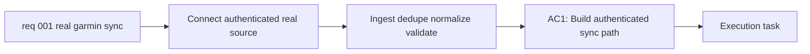

## item_001_connect_local_pipeline_to_a_real_garmin_source_and_harden_incremental_sync_on_user_data - Connect local pipeline to a real Garmin source and harden incremental sync on user data
> From version: 0.1.0
> Schema version: 1.0
> Status: Ready
> Understanding: 96
> Confidence: 92
> Progress: 0
> Complexity: High
> Theme: Health
> Reminder: Update status/understanding/confidence/progress and linked task references when you edit this doc.

# Problem
- Connect the existing local-first Garmin pipeline to a real authenticated Garmin source instead of relying only on fixtures or manual export imports.
- Make incremental sync trustworthy on real user-owned data so repeated or overlapping runs do not create duplicate logical records.
- Validate the current storage, provenance, normalization, and deterministic reporting layers against real Garmin payload shapes.
- Keep the project local-only and raw-first, so personal health data stays under user control and later analysis remains explainable.
- Prioritize the first blocking real-world datasets: activities, sleep, heart rate, HRV, stress, and steps.

# Scope
- In: implement a first authenticated Garmin sync path driven by local session material stored outside versioned files.
- In: define the rerunnable incremental sync contract, including duplicate prevention, provenance continuity, and partial refresh behavior on real data.
- In: harden the ingestion and normalization pipeline for the first blocking datasets using real payload variability rather than fixture assumptions alone.
- In: preserve raw authenticated payloads locally so every imported record can be audited or reprocessed later.
- In: verify that the current deterministic reporting layer still works on real data, or document where a metric needs adjustment before wider rollout.
- Out: dashboards, coaching UX, AI-generated recommendations, cloud sync, multi-user support, and medical interpretation.
- Out: broad coverage of every Garmin dataset if the first authenticated slice is not yet stable on the blocking datasets.

# Acceptance criteria
- AC1: Build an authenticated Garmin sync path that uses local session cookies or equivalent local session state stored outside versioned files.
- AC2: The sync is rerunnable on the same or overlapping real user data without creating duplicate logical records for activities, sleep, heart rate, HRV, stress, and steps.
- AC3: Each sync run records provenance metadata and preserves the raw authenticated payloads locally for audit and reprocessing.
- AC4: The normalization layer is hardened against real Garmin payload variability for the blocking datasets and clearly documents unsupported fields or gaps.
- AC5: Validation is performed on actual user-owned Garmin data, not only fixtures, and produces evidence that the authenticated sync, normalized layer, and rerun behavior work as expected.
- AC6: The implementation remains local-only and keeps raw or minimally transformed data as the primary analytical source over vendor-computed summary scores.
- AC7: The project documents the authenticated sync entrypoint, session storage expectations, deduplication strategy, supported datasets, and operational caveats.
- AC8: The current deterministic report path continues to produce a coherent result on real imported data, or explicitly reports the remaining metric gaps.

# AC Traceability
- AC1 -> Scope: authenticated sync path + local session handling. Proof: run the sync with a local cookie/session file and confirm no secrets are committed.
- AC2 -> Scope: incremental reruns + duplicate prevention. Proof: execute overlapping sync runs and confirm normalized logical counts remain stable.
- AC3 -> Scope: raw retention + provenance continuity. Proof: inspect stored raw payloads and run manifests for successive authenticated syncs.
- AC4 -> Scope: normalization hardening on real payloads. Proof: show successful ingestion for the blocking datasets and document any skipped fields or unsupported shapes.
- AC5 -> Scope: real-data validation. Proof: capture at least one successful real sync and one overlapping rerun using user-owned Garmin data.
- AC6 -> Scope: local-only raw-first policy. Proof: review configuration and outputs to confirm no cloud storage or external AI processing is used.
- AC7 -> Scope: operational documentation. Proof: add repo-visible guidance for session storage, sync execution, supported datasets, and known caveats.
- AC8 -> Scope: deterministic reporting on real data. Proof: generate the current report path from real imported data or explicitly log remaining incompatibilities.

# Decision framing
- Product framing: Not needed
- Product signals: (none detected)
- Product follow-up: No product brief follow-up is expected based on current signals.
- Architecture framing: Required
- Architecture signals: external integration, security and identity, state and sync, data model and persistence
- Architecture follow-up: Reuse the existing ADR baseline and create a focused follow-up ADR only if the authenticated Garmin provider choice introduces irreversible coupling or non-obvious security tradeoffs.

# Links
- Product brief(s): (none yet)
- Architecture decision(s): `adr_000_choose_local_first_garmin_data_sync_and_storage_architecture`
- Request: `req_001_connect_local_pipeline_to_a_real_garmin_source_and_harden_incremental_sync_on_user_data`
- Primary task(s): `task_001_connect_local_pipeline_to_a_real_garmin_source_and_harden_incremental_sync_on_user_data`

# AI Context
- Summary: Connect the existing local-first Garmin pipeline to a real authenticated source, harden rerunnable incremental sync, and validate the normalized/reporting layers on user-owned data.
- Keywords: garmin, authenticated, cookies, session, incremental, deduplication, real-data, provenance, local, normalization
- Use when: Use when implementing or refining authenticated Garmin access, session persistence, incremental reruns, deduplication, and validation on real user data.
- Skip when: Skip when the work is limited to fixture imports, UI features, or later advisory layers unrelated to ingestion robustness.

# Priority
- Impact: High. This is the first point where the project proves value on the user's real Garmin data rather than controlled samples.
- Urgency: High. The manual foundation exists already, and authenticated real-data ingestion is the main blocker for a usable personal workflow.

# Notes
- Derived from request `req_001_connect_local_pipeline_to_a_real_garmin_source_and_harden_incremental_sync_on_user_data`.
- Source file: `logics\request\req_001_connect_local_pipeline_to_a_real_garmin_source_and_harden_incremental_sync_on_user_data.md`.
- This backlog item intentionally narrows the first authenticated slice to the blocking datasets and reliable incremental behavior before broader dataset expansion.
- Session cookies or equivalent authenticated material must stay local and gitignored.
- Raw data remains the analytical priority over Garmin-computed summary scores.
