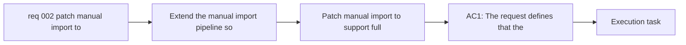

## item_002_patch_manual_import_to_support_full_garmin_connect_export_shapes - Patch manual import to support full Garmin Connect export shapes
> From version: 0.1.0
> Schema version: 1.0
> Status: Done
> Understanding: 95
> Confidence: 92
> Progress: 100%
> Complexity: Medium
> Theme: Health
> Reminder: Update status/understanding/confidence/progress and linked task references when you edit this doc.

# Problem
- Extend the manual import pipeline so it can ingest the real Garmin Connect full export already downloaded by the user.
- Map Garmin's actual export filenames and folder shapes to the internal datasets already used by the repository.
- Make the manual export path usable as a first post-processing and analytics validation path while authenticated sync remains blocked.
- Preserve the current local-first, raw-first, deterministic processing model instead of introducing a parallel one-off importer.
- The current importer sees the real export on disk but classifies all candidate files as unsupported because filename and folder detection is too narrow for Garmin-native export names.
- The first useful delivery slice should stay intentionally narrow: activities, sleep, steps, heart rate, stress, and HRV.

# Scope
- In: patch dataset discovery and deterministic filename or folder mapping for the Garmin-native export files needed by the first analytics slice.
- In: choose and document one canonical Garmin export source per supported dataset when several export files overlap.
- In: decide and document how chunked export files are handled: merge before normalization or ingest independently with downstream deduplication.
- In: validate the patched importer on the real export folder at `C:\Users\Pmondou\Downloads\garmin-export`.
- In: preserve raw artifacts, run manifests, normalized DuckDB output, and the latest metrics report.
- Out: full Garmin export coverage across every domain in the archive.
- Out: authenticated login fixes, Cloudflare workarounds, or broader product UX work.

# Acceptance criteria
- AC1: The request defines that the patch must support the real Garmin Connect export shape currently available on disk, not only simplified fixture filenames.
- AC2: The request identifies dataset detection and filename or folder mapping as the primary change area for the manual import path.
- AC3: The request states that the mapped import path must feed the existing raw, normalized, and reporting pipeline rather than a separate ad hoc loader.
- AC4: The request requires validation on the user's real export folder and a successful end-to-end local import.
- AC5: The request requires clear reporting of unsupported Garmin export files that remain outside the first supported slice.
- AC6: The request keeps scope focused on the first useful real-data datasets needed to inspect post-processing behavior: activities, sleep, steps, heart rate, stress, and HRV.
- AC7: The request allows one canonical Garmin export source to be selected per supported internal dataset when several export files overlap.
- AC8: The request explicitly requires a decision for chunked Garmin export files: either merge before normalization or ingest independently and deduplicate downstream, with the chosen behavior documented.
- AC9: The request is specific enough to promote into a bounded backlog item for importer mapping, validation, and documentation.

# AC Traceability
- AC1 -> Scope: The request defines that the patch must support the real Garmin Connect export shape currently available on disk, not only simplified fixture filenames.. Proof: capture validation evidence in this doc.
- AC2 -> Scope: The request identifies dataset detection and filename or folder mapping as the primary change area for the manual import path.. Proof: capture validation evidence in this doc.
- AC3 -> Scope: The request states that the mapped import path must feed the existing raw, normalized, and reporting pipeline rather than a separate ad hoc loader.. Proof: capture validation evidence in this doc.
- AC4 -> Scope: The request requires validation on the user's real export folder and a successful end-to-end local import.. Proof: capture validation evidence in this doc.
- AC5 -> Scope: The request requires clear reporting of unsupported Garmin export files that remain outside the first supported slice.. Proof: capture validation evidence in this doc.
- AC6 -> Scope: The request keeps scope focused on the first useful real-data datasets needed to inspect post-processing behavior: activities, sleep, steps, heart rate, stress, and HRV.. Proof: capture validation evidence in this doc.
- AC7 -> Scope: The request allows one canonical Garmin export source to be selected per supported internal dataset when several export files overlap.. Proof: capture validation evidence in this doc.
- AC8 -> Scope: The request explicitly requires a decision for chunked Garmin export files: either merge before normalization or ingest independently and deduplicate downstream, with the chosen behavior documented.. Proof: capture validation evidence in this doc.
- AC9 -> Scope: The request is specific enough to promote into a bounded backlog item for importer mapping, validation, and documentation.. Proof: capture validation evidence in this doc.

# Decision framing
- Product framing: Not needed
- Product signals: (none required for this delivery slice)
- Product follow-up: No product brief follow-up is required for this importer patch.
- Architecture framing: Required
- Architecture signals: data model and persistence, state and sync, security and identity
- Architecture follow-up: Reuse the existing ADR baseline and add a focused follow-up ADR only if canonical source selection or chunk handling creates irreversible ingestion coupling.

# Links
- Product brief(s): (none yet)
- Architecture decision(s): `adr_000_choose_local_first_garmin_data_sync_and_storage_architecture`
- Request: `req_002_patch_manual_import_to_support_full_garmin_connect_export_shapes`
- Primary task(s): `task_002_patch_manual_import_to_support_full_garmin_connect_export_shapes`

# AI Context
- Summary: Patch the manual Garmin import flow so the repository can ingest the user's full Garmin Connect export and run the existing analytics pipeline on the first supported real-data slice.
- Keywords: garmin, export, manual-import, dataset-mapping, normalization, duckdb, analytics, local-first
- Use when: Use when planning or implementing support for Garmin-native export filenames and folders in the existing manual import pipeline.
- Skip when: Skip when the work is about live Garmin authentication, UI, or unrelated analysis features.

# Priority
- Impact: High. This unlocks the first practical real-data path for inspecting post-processing and analytics while live Garmin auth is blocked.
- Urgency: High. The user already has the export on disk, and the current importer recognizes zero files from it.

# Notes
- Derived from request `req_002_patch_manual_import_to_support_full_garmin_connect_export_shapes`.
- Source file: `logics\request\req_002_patch_manual_import_to_support_full_garmin_connect_export_shapes.md`.
- Keep this backlog item as one bounded delivery slice; create sibling backlog items for the remaining request coverage instead of widening this doc.
- Request context seeded into this backlog item from `logics\request\req_002_patch_manual_import_to_support_full_garmin_connect_export_shapes.md`.
- The preferred implementation sequence is two-phase: detection and mapping first, then parsing or normalization adjustments only where real payloads require them.
