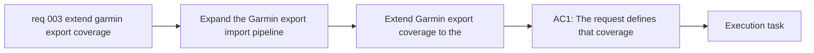

## item_003_extend_garmin_export_coverage_to_the_full_initial_data_surface - Extend Garmin export coverage to the full initial data surface
> From version: 0.1.0
> Schema version: 1.0
> Status: Done
> Understanding: 96
> Confidence: 94
> Progress: 100%
> Complexity: High
> Theme: Health
> Reminder: Update status/understanding/confidence/progress and linked task references when you edit this doc.

# Problem
- Expand the Garmin export import pipeline beyond the first supported slice so it covers the broader set of structured data already produced by Garmin Connect.
- Preserve local-first raw retention and deterministic normalization while extending coverage to more export domains.
- Make the imported archive useful as a complete post-processing source, not only a minimal analytics proof of concept.
- Keep unsupported or non-structured export artifacts visible, but stop treating the broader export as an unexplored edge case.
- The repository already imports the first slice: activities, sleep, steps, heart rate, stress, and HRV.
- The full export still contained additional domains that were not yet mapped or normalized.

# Scope
- In: one coherent delivery slice from the source request.
- Out: unrelated sibling slices that should stay in separate backlog items instead of widening this doc.

# Acceptance criteria
- AC1: The request defines that coverage should expand beyond the first supported slice to the broader structured Garmin export surface already available in the user's archive.
- AC2: The request distinguishes between analytically useful datasets, metadata/provenance files, and unsupported artifacts.
- AC3: The request keeps raw retention and deterministic normalization as first-class requirements while coverage expands.
- AC4: The request requires a staged delivery approach so the remaining Garmin export surface is added in bounded slices.
- AC5: The request requires validation on the user's real Garmin export archive.
- AC6: The request remains compatible with the first-slice importer and does not regress the datasets already supported.
- AC7: The request is specific enough to break into backlog items for the remaining Garmin export domains.
- AC8: The first expansion slice is explicitly narrow but deep on `activities`, `training_load`, `hrv`, and `sleep`.
- AC9: `training_history` and `acute_load` are explicitly prioritized as the next coaching-focused slice.
- AC10: `profile` and `heart_rate_zones` are normalized as reference data in this expansion effort.
- AC11: `device` and `settings` are retained raw-first (indexed in manifests/provenance) before any normalization work.

# AC Traceability
- AC1 -> Scope: The request defines that coverage should expand beyond the first supported slice to the broader structured Garmin export surface already available in the user's archive.. Proof: capture validation evidence in this doc.
- AC2 -> Scope: The request distinguishes between analytically useful datasets, metadata/provenance files, and unsupported artifacts.. Proof: capture validation evidence in this doc.
- AC3 -> Scope: The request keeps raw retention and deterministic normalization as first-class requirements while coverage expands.. Proof: capture validation evidence in this doc.
- AC4 -> Scope: The request requires a staged delivery approach so the remaining Garmin export surface is added in bounded slices.. Proof: capture validation evidence in this doc.
- AC5 -> Scope: The request requires validation on the user's real Garmin export archive.. Proof: capture validation evidence in this doc.
- AC6 -> Scope: The request remains compatible with the first-slice importer and does not regress the datasets already supported.. Proof: capture validation evidence in this doc.
- AC7 -> Scope: The request is specific enough to break into backlog items for the remaining Garmin export domains.. Proof: capture validation evidence in this doc.
- AC8 -> Scope: The first expansion slice is explicitly narrow but deep on `activities`, `training_load`, `hrv`, and `sleep`.. Proof: capture validation evidence in this doc.
- AC9 -> Scope: `training_history` and `acute_load` are explicitly prioritized as the next coaching-focused slice.. Proof: capture validation evidence in this doc.
- AC10 -> Scope: `profile` and `heart_rate_zones` are normalized as reference data in this expansion effort.. Proof: capture validation evidence in this doc.
- AC11 -> Scope: `device` and `settings` are retained raw-first (indexed in manifests/provenance) before any normalization work.. Proof: capture validation evidence in this doc.

# Decision framing
- Product framing: Required
- Product signals: pricing and packaging, engagement loop, experience scope
- Product follow-up: Create or link a product brief before implementation moves deeper into delivery.
- Architecture framing: Required
- Architecture signals: data model and persistence, state and sync, security and identity
- Architecture follow-up: Create or link an architecture decision before irreversible implementation work starts.

# Links
- Product brief(s): (none yet)
- Architecture decision(s): `adr_000_choose_local_first_garmin_data_sync_and_storage_architecture`
- Request: `req_003_extend_garmin_export_coverage_to_the_full_initial_data_surface`
- Primary task(s): `task_003_extend_garmin_export_coverage_to_the_full_initial_data_surface`

# AI Context
- Summary: Expand Garmin export coverage beyond the first supported slice so the broader structured archive can be used locally...
- Keywords: garmin, export, coverage, archive, normalization, provenance, local-first, datasets, metadata
- Use when: Use when planning broader Garmin export coverage after the first supported slice is working.
- Skip when: Skip when the work is only about live authentication, a single dataset fix, or unrelated UI work.
# References
- `logics/skills/logics-ui-steering/SKILL.md`

# Priority
- Impact: High. This expands the usable local archive beyond the initial slice and unlocks coaching-relevant domains.
- Urgency: High. The full archive is already available locally and can be leveraged immediately.

# Notes
- Derived from request `req_003_extend_garmin_export_coverage_to_the_full_initial_data_surface`.
- Source file: `logics\request\req_003_extend_garmin_export_coverage_to_the_full_initial_data_surface.md`.
- Keep this backlog item as one bounded delivery slice; create sibling backlog items for the remaining request coverage instead of widening this doc.
- Request context seeded into this backlog item from `logics\request\req_003_extend_garmin_export_coverage_to_the_full_initial_data_surface.md`.
