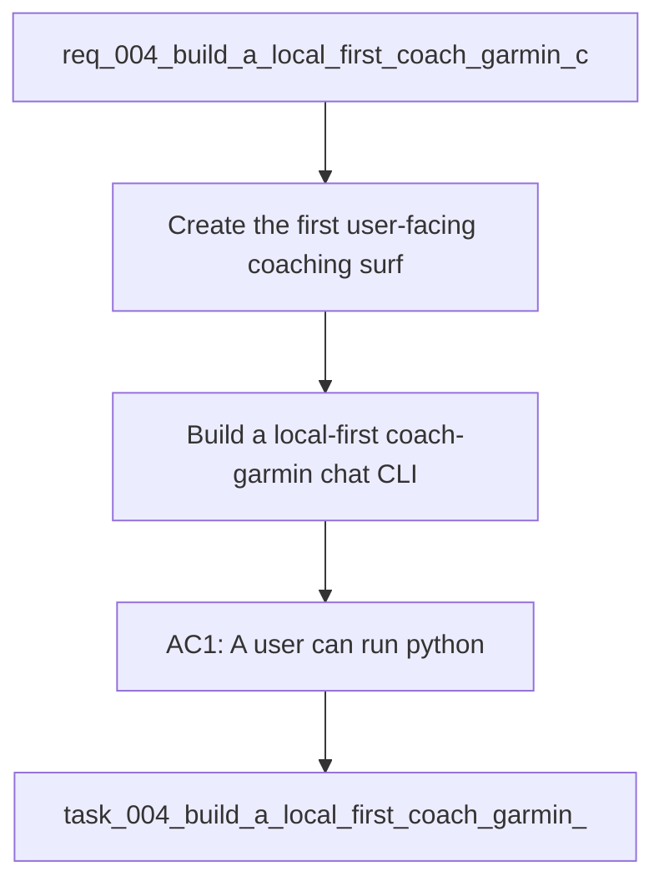

## item_004_build_a_local_first_coach_garmin_chat_cli - Build a local-first coach-garmin chat CLI
> From version: 0.1.0
> Schema version: 1.0
> Status: Done
> Understanding: 95
> Confidence: 92
> Progress: 100%
> Complexity: High
> Theme: Health
> Reminder: Update status/understanding/confidence/progress and linked task references when you edit this doc.

# Problem
- Create the first user-facing coaching surface in this repository through a CLI chat entrypoint.
- Let the user describe a running goal in natural language, answer clarification questions, and receive a first weekly plan.
- Reuse the existing local Garmin foundation so coaching is grounded in local metrics, local history, and auditable outputs.
- Keep the MVP narrow: one local model baseline, four bounded tool surfaces, and versioned saved plans.

# Scope
- In: add `python -m coach_garmin coach chat`.
- In: run the chat in French by default.
- In: use local Ollama inference with `qwen2.5:7b` as the baseline model profile.
- In: expose exactly four local coaching tool surfaces: `metrics`, `goals`, `plan`, and `history`.
- In: ask clarification questions automatically when the initial goal is incomplete.
- In: generate and save a versioned weekly plan under `data/reports/`.
- In: keep recommendations grounded in the current local analytics and reporting layer.
- Out: web UI, mobile UI, cloud APIs, long-range periodization, medical guidance, and broad product packaging work.

# Acceptance criteria
- AC1: A user can run `python -m coach_garmin coach chat` from the repository CLI.
- AC2: The chat accepts a free-form running goal in French and starts a coaching conversation.
- AC3: If essential context is missing, the system asks automatic clarification questions before proposing a plan.
- AC4: The MVP exposes exactly four local coaching tool surfaces for `metrics`, `goals`, `plan`, and `history`.
- AC5: The coaching response uses local data from the existing normalized and reporting layer rather than operating as a generic chat with no data access.
- AC6: A first weekly plan is generated in a human-readable structure and saved in a versioned file under `data/reports/`.
- AC7: The plan output clearly references the main local signals used when available, such as load, sleep, HRV, fatigue, acute load, or recent training history.
- AC8: If Ollama is unavailable, unreachable, or missing the configured model, the CLI returns a clear and actionable error.
- AC9: The MVP remains fully local-first and does not require any paid API token.
- AC10: Automated tests cover the CLI entrypoint, the four tool adapters, the clarification loop, and the main error path.

# AC Traceability
- AC1 -> Delivery slice: add the new CLI namespace and `coach chat` command. Proof: run the command and capture a successful interactive start.
- AC2 -> Conversation loop: accept a natural-language running goal in French. Proof: smoke-test a real prompt through the CLI.
- AC3 -> Clarification flow: ask follow-up questions when key fields are missing. Proof: validate with a deliberately underspecified goal.
- AC4 -> Tool contract: implement the four bounded local tools. Proof: cover each tool with targeted tests or command-level validation.
- AC5 -> Local grounding: use normalized tables and reports instead of free-form chat only. Proof: capture the metrics and history sources used in the plan output.
- AC6 -> Persistence: save a versioned plan file in `data/reports/`. Proof: inspect the generated artifact after a successful chat run.
- AC7 -> Transparency: mention the main signals that influenced the recommendation. Proof: verify the saved plan or CLI output includes signal references.
- AC8 -> Error handling: return an actionable message when Ollama or the model is unavailable. Proof: simulate an unavailable provider path in tests or validation.
- AC9 -> Local-first: keep the MVP independent from paid external APIs. Proof: implementation uses Ollama and local files only.
- AC10 -> Validation: add automated coverage for CLI entrypoint, tool adapters, clarification path, and provider error path. Proof: run the targeted test command.

# Decision framing
- Product framing: Required
- Product signals: pricing and packaging, engagement loop, experience scope
- Product follow-up: Create or link a product brief before implementation moves deeper into delivery.
- Architecture framing: Required
- Architecture signals: data model and persistence, contracts and integration, security and identity
- Architecture follow-up: Reuse the existing ADR baseline and add a focused ADR only if the local coaching contract introduces an irreversible boundary or storage choice.

# Links
- Product brief(s): (none yet)
- Architecture decision(s): `adr_000_choose_local_first_garmin_data_sync_and_storage_architecture`
- Request: `req_004_build_a_local_first_coach_garmin_chat_cli`
- Primary task(s): `task_004_build_a_local_first_coach_garmin_chat_cli`

# AI Context
- Summary: Build a local-first conversational running coach in CLI form using Ollama, local Garmin-derived metrics, four bounded tool surfaces, and versioned weekly plan outputs.
- Keywords: coaching, running, cli, chat, ollama, garmin, local-first, weekly-plan, duckdb, metrics
- Use when: Use when implementing the first user-facing coaching workflow on top of the Garmin local data foundation.
- Skip when: Skip when the work is only about ingestion, storage, authentication, or non-conversational reporting.

# References
- `coach_garmin/cli.py`
- `coach_garmin/analytics.py`
- `data/reports/latest_metrics.json`
- `logics/request/req_004_build_a_local_first_coach_garmin_chat_cli.md`

# Priority
- Impact: High. This is the first direct coaching experience exposed to the user.
- Urgency: High. The current platform is ready for MVP coaching experiments.

# Notes
- Derived from request `req_004_build_a_local_first_coach_garmin_chat_cli`.
- Source file: `logics\request\req_004_build_a_local_first_coach_garmin_chat_cli.md`.
- Keep this backlog item as one bounded MVP slice; future check-in modes, Markdown exports, or non-interactive flows should be separate follow-up items.
- Delivery completed through `task_004_build_a_local_first_coach_garmin_chat_cli`.
- Derived from `logics/request/req_004_build_a_local_first_coach_garmin_chat_cli.md`.
