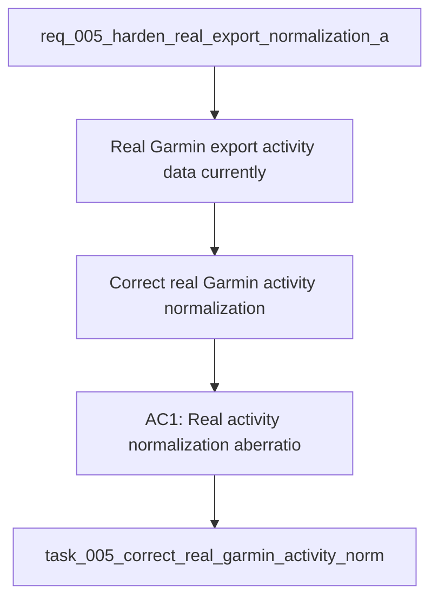

## item_005_correct_real_garmin_activity_normalization_and_coaching_plausibility_on_local_exports - Correct real Garmin activity normalization and coaching plausibility on local exports
> From version: 0.1.0
> Schema version: 1.0
> Status: Done
> Understanding: 96
> Confidence: 94
> Progress: 100%
> Complexity: High
> Theme: Health
> Reminder: Update status/understanding/confidence/progress and linked task references when you edit this doc.

# Problem
- Real Garmin export activity data currently produces impossible downstream values in local history and coaching outputs.
- The coaching MVP now works end-to-end, but its real-data recommendations are not trustworthy until activity durations, distances, loads, or field mappings are corrected.
- The repository needs a bounded delivery slice focused on restoring plausibility for real exported activities and the coach outputs derived from them.

# Scope
- In: reproduce the abnormal real-data cases from the copied local export under `data/sources/garmin-export`.
- In: inspect the relevant activity payload fields and correct the wrong units, wrong shape assumptions, or wrong fallback logic in normalization.
- In: apply a tolerant-first strategy:
- repair units and mappings before excluding a record
- only block a record from coaching if it remains implausible after correction attempts
- In: add guardrails so impossible activity-derived values do not silently propagate into `history`, plan generation, or saved coaching outputs.
- In: revalidate the coach flow on the copied local export after the correction.
- Out: broad repo cleanup, non-coaching product work, and new Garmin domains unrelated to the anomaly.

# Acceptance criteria
- AC1: Real activity normalization aberrations are reproduced, understood, and corrected with repo-visible changes.
- AC2: The corrected normalization prevents impossible values from propagating into recent-history summaries and coaching plan generation.
- AC3: The coach flow is revalidated on the copied real export and produces a plausible weekly plan with sane durations and volume references.
- AC4: Automated tests cover at least one real-shape anomaly case that previously produced absurd outputs.
- AC5: Validation evidence is recorded with exact commands and observed outcomes on the local real-export copy.
- AC6: The copied real export remains local-only and is not required for push-oriented delivery.
- AC7: The fix preserves local-first behavior and does not introduce any paid cloud dependency.

# AC Traceability
- AC1 -> Delivery slice: reproduce the anomaly and fix the responsible normalization logic. Proof: capture before and after evidence in validation.
- AC2 -> Guardrails: stop implausible values from reaching `history` and coaching outputs. Proof: inspect corrected history summaries and saved plans.
- AC3 -> Coach revalidation: rerun the local coach flow after the fix. Proof: save and inspect a plausible weekly plan artifact.
- AC4 -> Automated coverage: add at least one regression test for the previously absurd real-shape case. Proof: run the targeted test command.
- AC5 -> Validation record: store exact commands and outcomes in the linked task report. Proof: update the task report after validation.
- AC6 -> Local-only rule: keep the copied export out of push-oriented delivery flow. Proof: document the local-only handling in the task/report.
- AC7 -> Local-first rule: use only local processing and local Ollama. Proof: no paid external API dependency is added.

# Decision framing
- Product framing: Required
- Product signals: pricing and packaging, engagement loop
- Product follow-up: Create or link a product brief before implementation moves deeper into delivery.
- Architecture framing: Consider
- Architecture signals: data model and persistence
- Architecture follow-up: Review whether an architecture decision is needed before implementation becomes harder to reverse.

# Links
- Product brief(s): (none yet)
- Architecture decision(s): `adr_000_choose_local_first_garmin_data_sync_and_storage_architecture`
- Request: `req_005_harden_real_export_normalization_and_clean_repo_delivery_artifacts`
- Primary task(s): `task_005_correct_real_garmin_activity_normalization_and_coaching_plausibility_on_local_exports`

# AI Context
- Summary: Correct real Garmin activity normalization so local history and coach outputs remain plausible on the copied local export.
- Keywords: garmin, normalization, anomaly, duration, distance, load, plausibility, local-export, coaching
- Use when: Use when stabilizing real activity normalization and the coach outputs derived from it.
- Skip when: Skip when the work is only about cleanup or non-coaching repo hygiene.

# References
- `coach_garmin/analytics.py`
- `coach_garmin/coach_tools.py`
- `coach_garmin/coach_chat.py`
- `data/sources/garmin-export`

# Priority
- Impact: High. This directly affects trust in the coaching output on real data.
- Urgency: High. The current MVP should not evolve further until the absurd outputs are corrected.

# Notes
- Derived from request `req_005_harden_real_export_normalization_and_clean_repo_delivery_artifacts`.
- Source file: `logics\request\req_005_harden_real_export_normalization_and_clean_repo_delivery_artifacts.md`.
- Keep this item focused on normalization and plausibility only; repo and Logics cleanup belongs in the sibling backlog item.
- Delivered by `task_005_correct_real_garmin_activity_normalization_and_coaching_plausibility_on_local_exports`.
- Outcome: real Garmin `summarizedActivities` exports are now normalized with the correct milliseconds-to-seconds and centimeters-to-meters repair path when the raw Garmin speed hint confirms the unit shape.
- Outcome: the local coach flow was revalidated on the copied export and now yields plausible running history summaries and weekly plan durations.
