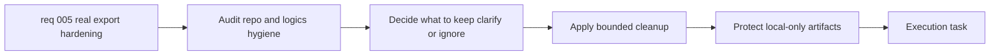

## item_006_clean_local_validation_artifacts_and_logics_delivery_hygiene - Clean local validation artifacts and logics delivery hygiene
> From version: 0.1.0
> Schema version: 1.0
> Status: Done
> Understanding: 96
> Confidence: 94
> Progress: 100%
> Complexity: Medium
> Theme: Health
> Reminder: Update status/understanding/confidence/progress and linked task references when you edit this doc.

# Problem
- The recent coach delivery wave introduced local validation copies, validation outputs, and new Logics artifacts that should be reviewed for hygiene.
- The repository needs a bounded cleanup pass so local-only data stays local, delivery debris stays controlled, and Logics docs remain accurate and reviewable.
- Cleanup should improve trust and maintainability without accidentally deleting useful evidence or widening into unrelated refactors.

# Scope
- In: audit repo hygiene around the recent coach delivery wave.
- In: audit Logics hygiene for stale placeholders, misleading references, inaccurate status indicators, or avoidable clutter.
- In: review local validation artifacts under `data/` and decide what should be retained, rotated, clarified, or gitignored.
- In: ensure copied local export data and other local-only validation artifacts are clearly excluded from push-oriented delivery flow.
- In: keep cleanup bounded to artifacts and documents directly related to the recent coaching and real-data validation work.
- Out: normalization bug fixing itself, new coaching features, broad refactors, or deleting user-owned source data outside the repo.

# Acceptance criteria
- AC1: Cleanup removes or clarifies temporary repo or Logics debris introduced during the recent delivery wave without deleting important source-of-truth artifacts.
- AC2: Logics request, backlog, and task indicators remain coherent after the cleanup pass.
- AC3: The copied real export and local-only validation artifacts are explicitly kept out of push-oriented delivery flow.
- AC4: Validation evidence or retained local-only artifacts remain understandable after cleanup rather than becoming opaque.
- AC5: The cleanup scope stays bounded to the relevant delivery wave and does not widen into unrelated refactors.

# AC Traceability
- AC1 -> Cleanup pass: remove or clarify bounded delivery debris. Proof: capture the retained versus removed artifacts in the task report.
- AC2 -> Logics hygiene: review and update workflow docs and indicators where needed. Proof: run the relevant Logics validation commands.
- AC3 -> Local-only protection: confirm copied exports and validation artifacts stay out of push-oriented flow. Proof: document the chosen handling and any ignore rules.
- AC4 -> Evidence retention: keep useful local evidence understandable. Proof: inspect the retained local validation structure after cleanup.
- AC5 -> Scope control: avoid unrelated refactors. Proof: review final changed paths against the stated scope.

# Decision framing
- Product framing: Not needed
- Product signals: (none required for this cleanup slice)
- Product follow-up: No product brief follow-up is required for this bounded hygiene pass.
- Architecture framing: Consider
- Architecture signals: data model and persistence
- Architecture follow-up: Reuse the existing ADR baseline unless cleanup changes long-term storage or ignore conventions in a meaningful way.

# Links
- Product brief(s): (none yet)
- Architecture decision(s): `adr_000_choose_local_first_garmin_data_sync_and_storage_architecture`
- Request: `req_005_harden_real_export_normalization_and_clean_repo_delivery_artifacts`
- Primary task(s): `task_006_clean_local_validation_artifacts_and_logics_delivery_hygiene`

# AI Context
- Summary: Clean local validation artifacts and Logics delivery hygiene after the recent coach wave while keeping local-only data protected from push-oriented delivery.
- Keywords: cleanup, hygiene, logics, local-only, validation, gitignore, artifacts, audit
- Use when: Use when performing a bounded repo and Logics cleanup around the coach and real-data validation wave.
- Skip when: Skip when the work is about correcting normalization logic itself.

# References
- `logics/request/req_005_harden_real_export_normalization_and_clean_repo_delivery_artifacts.md`
- `logics/backlog/item_004_build_a_local_first_coach_garmin_chat_cli.md`
- `data/sources/garmin-export`
- `data/validation_real_export`

# Priority
- Impact: Medium. This improves trust, cleanliness, and delivery safety around local-only data.
- Urgency: Medium. It should follow closely behind the normalization fix, but it is not the first blocker for plausibility.

# Notes
- Derived from request `req_005_harden_real_export_normalization_and_clean_repo_delivery_artifacts`.
- Source file: `logics\request\req_005_harden_real_export_normalization_and_clean_repo_delivery_artifacts.md`.
- Keep this item focused on hygiene and local-only artifact management; normalization correction belongs in the sibling backlog item.
- Delivered by `task_006_clean_local_validation_artifacts_and_logics_delivery_hygiene`.
- Outcome: disposable `data/validation_real_export` outputs were removed, while `data/sources/garmin-export` was retained as the local-only real-export validation source.
- Outcome: the repo now documents the local-only rule explicitly in both `.gitignore` and `README.md`.
