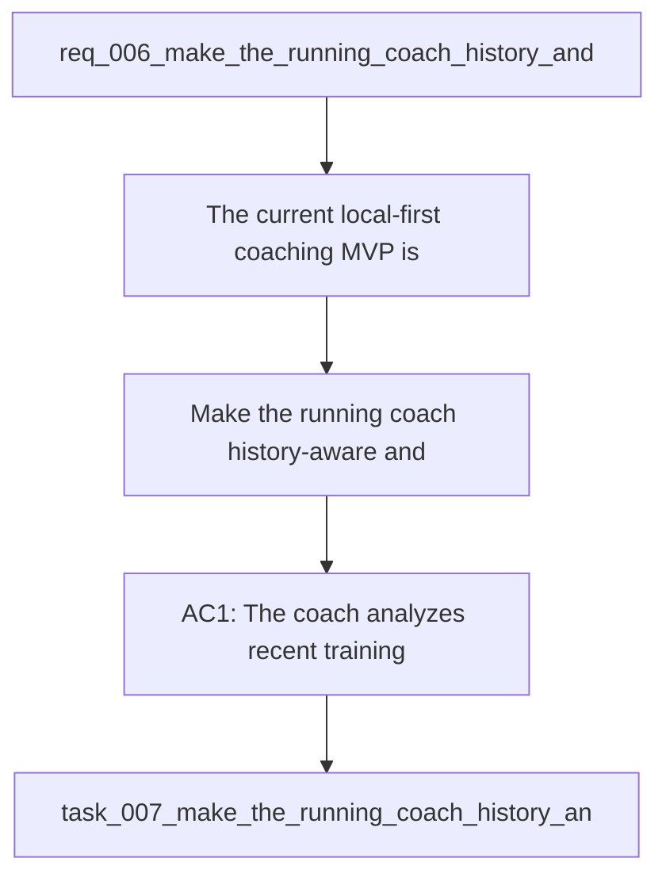

## item_007_make_the_running_coach_history_and_pace_aware - Make the running coach history-aware and pace-aware
> From version: 0.1.0
> Schema version: 1.0
> Status: Done
> Understanding: 98
> Confidence: 96
> Progress: 100%
> Complexity: High
> Theme: Health
> Reminder: Update status/understanding/confidence/progress and linked task references when you edit this doc.

# Problem
- The current local-first coaching MVP is technically functional but still produces generic advice and generic weekly plans.
- The coach does not yet analyze past training deeply enough, does not leverage observed pace evidence strongly enough, and does not turn recent race results into individualized session prescriptions.
- Real user feedback shows that the missing value is now coaching intelligence, not CLI plumbing.
- The next delivery slice should therefore make the coach truly history-aware, pace-aware, and more specific in the sessions it prescribes.

# Scope
- In: analyze recent training and benchmark performances before building the plan.
- In: use observed local pace signals from races and strong sessions to derive training paces when evidence is sufficient.
- In: combine `21-day`, `90-day`, and `365-day` historical windows to reason about recent form, training structure, and race references.
- In: identify a training phase or coaching priority from the user's recent history and injury context.
- In: detect multiple goals and choose or ask for one principal objective before prescribing the week.
- In: produce more specific workouts with structure, such as:
- easy runs with duration and pace ceiling
- threshold or tempo blocks
- interval sessions with reps, recoveries, and pace guidance
- long runs with progression guidance
- return-to-quality progressions after reduced training or injury
- In: explain clearly which historical signals drove the recommendation.
- Out: medical diagnosis, polished UI work, full macro-periodization, and cloud-only AI paths.

# Acceptance criteria
- AC1: The coach analyzes recent training history and recent benchmark performances before generating the weekly plan.
- AC2: The coach uses observed local running data to derive individualized pace targets when evidence is sufficient.
- AC3: The coach explicitly identifies a training phase or coaching priority derived from recent history and injury context.
- AC4: When multiple goals are detected, the coach selects or asks for the principal objective before generating the weekly plan.
- AC5: The generated weekly sessions are more specific than generic labels and include concrete workout structure when appropriate.
- AC6: The coach explains which historical signals influenced the recommendation, including recent races, recent activity density, and observed quality-session evidence when available.
- AC7: If the data is insufficient for reliable pace prescription, the coach explicitly falls back to effort-based guidance instead of pretending precision.
- AC8: Tests cover at least one recent-race case and one return-from-injury or reduced-load case.
- AC9: The implementation remains local-first and does not require any paid cloud API token.

# AC Traceability
- AC1 -> Delivery slice: add explicit history and benchmark analysis before plan generation. Proof: inspect prompt bundle or generated analysis output.
- AC2 -> Delivery slice: derive pace-aware guidance from observed local data. Proof: validate at least one recent-race scenario with specific pace output.
- AC3 -> Delivery slice: add training-phase inference. Proof: generated analysis names a phase or coaching priority from local history.
- AC4 -> Delivery slice: handle goal conflicts. Proof: a multi-goal prompt triggers principal-objective selection or clarification.
- AC5 -> Delivery slice: enrich session structure. Proof: generated weekly sessions include concrete reps, blocks, or pace cues where appropriate.
- AC6 -> Delivery slice: explain signal usage. Proof: output references the historical signals behind the recommendation.
- AC7 -> Delivery slice: explicit fallback behavior. Proof: sparse-data case yields effort guidance with uncertainty rather than fake pace precision.
- AC8 -> Delivery slice: regression coverage. Proof: run targeted tests for recent-race and return-from-injury scenarios.
- AC9 -> Delivery slice: preserve local-first implementation. Proof: no paid external AI dependency is introduced.

# Decision framing
- Product framing: Required
- Product signals: engagement loop, pricing and packaging
- Product follow-up: Consider a product brief before expanding the coach toward a broader training product.
- Architecture framing: Required
- Architecture signals: contracts and integration, data model and persistence
- Architecture follow-up: Reuse the existing ADR baseline and add a focused ADR only if the pace-inference or coaching-contract logic becomes a durable system boundary.

# Links
- Product brief(s): (none yet)
- Architecture decision(s): `adr_000_choose_local_first_garmin_data_sync_and_storage_architecture`
- Request: `req_006_make_the_running_coach_history_and_pace_aware`
- Primary task(s): `task_007_make_the_running_coach_history_and_pace_aware`

# AI Context
- Summary: Improve the running coach so it uses actual history, benchmark performances, and pace evidence to generate individualized weekly sessions.
- Keywords: running, coaching, pace, history, benchmark, recent race, training phase, local-first, garmin, workout structure
- Use when: Use when implementing the next coaching-quality slice beyond the current generic MVP.
- Skip when: Skip when the work is about auth sync, ingestion plumbing, or UI-only improvements.

# Priority
- Impact: High. This is the next major quality gap between a technically working coach and a useful one.
- Urgency: High. User feedback shows the current output is still too generic to be trusted as a real coaching aid.

# Notes
- Derived from request `req_006_make_the_running_coach_history_and_pace_aware`.
- Source file: `logics\request\req_006_make_the_running_coach_history_and_pace_aware.md`.
- This slice should improve coaching quality first, before adding more surfaces or UI layers.
- Delivered by `task_007_make_the_running_coach_history_and_pace_aware`.
- Outcome: the coach now uses multi-window history, benchmark extraction, pace inference, and principal-objective handling to generate more analytical and specific weekly sessions.
- Derived from `logics/request/req_006_make_the_running_coach_history_and_pace_aware.md`.
