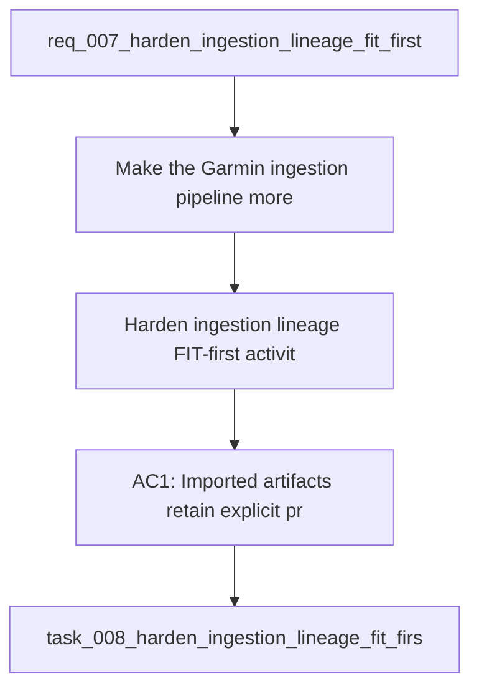

## item_008_harden_ingestion_lineage_fit_first_activity_parsing_and_coaching_feature_coverage_reporting - Harden ingestion lineage, FIT-first activity parsing, and coaching feature coverage reporting
> From version: 0.1.0
> Schema version: 1.0
> Status: Done
> Understanding: 96
> Confidence: 93
> Progress: 100%
> Complexity: High
> Theme: Health
> Reminder: Update status/understanding/confidence/progress and linked request/task references when you edit this doc.

# Problem
- Make the Garmin ingestion pipeline more robust by tracking provenance and lineage for every imported artifact.
- Prefer FIT-based activity parsing as the most stable source of activity truth, while keeping Garmin export JSON as context and fallback.
- Make it obvious, after each import, which data is only present in raw form, which data is normalized, which data is available as features, and which data actually feeds coaching decisions.
- Reduce the risk that the coach silently works with partial, stale, or misinterpreted data.
- - The repository already has a local-first Garmin foundation with raw artifact preservation, normalized DuckDB storage, and a coaching CLI.
- - Real-data validation already exposed the need for clearer handling of source shapes, unit mismatches, and partial coverage.

# Scope
- In: one coherent delivery slice from the source request.
- Out: unrelated sibling slices that should stay in separate backlog items instead of widening this doc.

# Acceptance criteria
- AC1: Imported artifacts retain explicit provenance and lineage metadata linking source files to normalized records.
- AC2: Activity parsing prefers FIT inputs when available and falls back to other export shapes only when necessary.
- AC3: The pipeline still works on the current local Garmin export fixtures and on the copied real export.
- AC4: Duplicate or repeated imports remain deterministic and do not create duplicate normalized records.
- AC5: A coverage report is generated after import that distinguishes raw, normalized, feature-level, and coach-used data coverage.
- AC6: The coach can consume the new coverage report to avoid overclaiming unavailable signals.
- AC7: At least one test covers a FIT-first activity path and one test covers a missing-FIT fallback path.
- AC8: At least one test covers lineage/provenance fields or artifact identity handling.
- AC9: The implementation remains local-first and does not require any paid cloud API token.

# AC Traceability
- AC1 -> Scope: Imported artifacts retain explicit provenance and lineage metadata linking source files to normalized records.. Proof: capture validation evidence in this doc.
- AC2 -> Scope: Activity parsing prefers FIT inputs when available and falls back to other export shapes only when necessary.. Proof: capture validation evidence in this doc.
- AC3 -> Scope: The pipeline still works on the current local Garmin export fixtures and on the copied real export.. Proof: capture validation evidence in this doc.
- AC4 -> Scope: Duplicate or repeated imports remain deterministic and do not create duplicate normalized records.. Proof: capture validation evidence in this doc.
- AC5 -> Scope: A coverage report is generated after import that distinguishes raw, normalized, feature-level, and coach-used data coverage.. Proof: capture validation evidence in this doc.
- AC6 -> Scope: The coach can consume the new coverage report to avoid overclaiming unavailable signals.. Proof: capture validation evidence in this doc.
- AC7 -> Scope: At least one test covers a FIT-first activity path and one test covers a missing-FIT fallback path.. Proof: capture validation evidence in this doc.
- AC8 -> Scope: At least one test covers lineage/provenance fields or artifact identity handling.. Proof: capture validation evidence in this doc.
- AC9 -> Scope: The implementation remains local-first and does not require any paid cloud API token.. Proof: capture validation evidence in this doc.

# Decision framing
- Product framing: Consider
- Product signals: engagement loop
- Product follow-up: Review whether a product brief is needed before scope becomes harder to change.
- Architecture framing: Required
- Architecture signals: data model and persistence, contracts and integration, state and sync
- Architecture follow-up: Create or link an architecture decision before irreversible implementation work starts.

# Links
- Product brief(s): (none yet)
- Architecture decision(s): `adr_000_choose_local_first_garmin_data_sync_and_storage_architecture`
- Request: `req_007_harden_ingestion_lineage_fit_first_activity_parsing_and_coaching_feature_coverage_reporting`
- Primary task(s): `task_008_harden_ingestion_lineage_fit_first_activity_parsing_and_coaching_feature_coverage_reporting`

# AI Context
- Summary: Harden Garmin ingestion with explicit lineage, FIT-first parsing for activities, and a coverage report that shows what data...
- Keywords: ingestion, lineage, provenance, fit, activity parsing, coverage report, deduplication, local-first, garmin
- Use when: Use when improving the reliability and trustworthiness of the Garmin data substrate before expanding coaching logic.
- Skip when: Skip when the work is only about UI, marketing, or unrelated feature areas.
# References
- `logics/skills/logics-ui-steering/SKILL.md`

# Priority
- Impact:
- Urgency:

# Notes
- Derived from request `req_007_harden_ingestion_lineage_fit_first_activity_parsing_and_coaching_feature_coverage_reporting`.
- Source file: `logics\request\req_007_harden_ingestion_lineage_fit_first_activity_parsing_and_coaching_feature_coverage_reporting.md`.
- Keep this backlog item as one bounded delivery slice; create sibling backlog items for the remaining request coverage instead of widening this doc.
- Request context seeded into this backlog item from `logics\request\req_007_harden_ingestion_lineage_fit_first_activity_parsing_and_coaching_feature_coverage_reporting.md`.
- Task `task_008_harden_ingestion_lineage_fit_first_activity_parsing_and_coaching_feature_coverage_reporting` was finished via `logics_flow.py finish task` on 2026-04-09.
- Derived from `logics/request/req_007_harden_ingestion_lineage_fit_first_activity_parsing_and_coaching_feature_coverage_reporting.md`.
