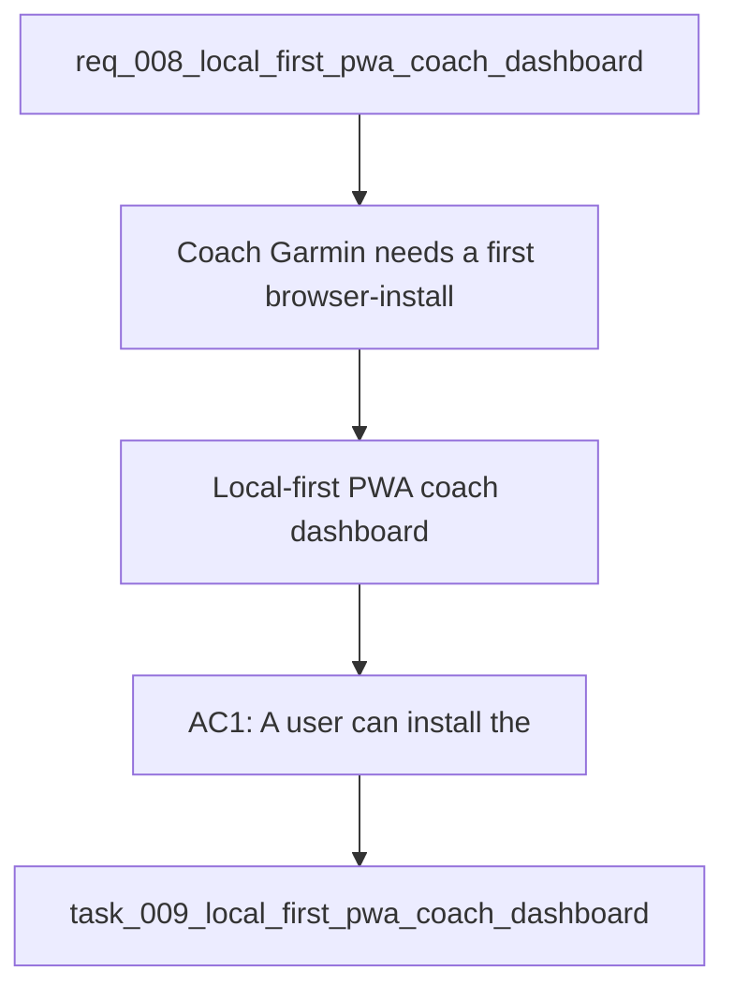

## item_009_local_first_pwa_coach_dashboard - Local-first PWA coach dashboard
> From version: 0.1.0
> Schema version: 1.0
> Status: Done
> Understanding: 97%
> Confidence: 94%
> Progress: 100%
> Complexity: High
> Theme: UI
> Reminder: Update status, understanding, confidence, progress, and linked request/task references when you edit this doc.

# Problem
Coach Garmin needs a first browser-installable product surface that keeps the current local-first data foundation, adds a chat-first coaching experience, and exposes a simple dashboard for health, import, and analysis status.

The current CLI coach works, but it is not yet a product surface that a user can install, open, and understand quickly from a browser.

# Scope
- In: installable PWA shell for Coach Garmin.
- In: chat surface for goal intake, clarification questions, and coaching replies.
- In: local storage directory selection for app data and caches.
- In: AI provider selection with Ollama default and Gemini/OpenAI optional.
- In: compact dashboard with app health, import status, and several analysis metrics.
- In: offline-first behavior for the first version, with local data access and cached state.
- Out: native Android features, multi-user cloud sync, and a full analytics rewrite.
- Out: replacing the existing local data pipeline or rewriting the coach logic from scratch.

# Acceptance criteria
- AC1: A user can install the app as a PWA on desktop from the browser.
- AC2: The app opens to a chat surface that can ask coaching questions and accept a running goal.
- AC3: The user can choose a local storage directory from settings.
- AC4: The user can choose the AI backend from Ollama, Gemini, or OpenAI, with Ollama as the default.
- AC5: The dashboard shows app health, latest import status, and multiple recent analysis metrics.
- AC6: The app stays offline-first by default and does not require a paid cloud API to open or inspect local data.
- AC7: The app can surface import and analysis status without requiring the user to dig through logs.
- AC8: The first version is clean enough to serve as the base for a later Android APK path.

# AC Traceability
- AC1 -> Scope: installable PWA shell for Coach Garmin. Proof: install flow works in desktop browser.
- AC2 -> Scope: chat surface for goal intake, clarification questions, and coaching replies. Proof: chat can ask and answer coaching prompts.
- AC3 -> Scope: local storage directory selection for app data and caches. Proof: settings persist the chosen directory.
- AC4 -> Scope: AI provider selection with Ollama default and Gemini/OpenAI optional. Proof: provider switch works and fallback is clear.
- AC5 -> Scope: compact dashboard with app health, import status, and analysis metrics. Proof: dashboard renders the expected cards and values.
- AC6 -> Scope: offline-first behavior for the first version. Proof: local data remains inspectable without a paid cloud API.
- AC7 -> Scope: local data access and cached state. Proof: import and analysis status are visible in-app.
- AC8 -> Scope: base for a later Android APK path. Proof: core shell and state model stay wrapper-friendly.

# Decision framing
- Product framing: Required
- Product signals: pricing and packaging, experience scope
- Product follow-up: Create or link a product brief before implementation moves deeper into delivery.
- Architecture framing: Required
- Architecture signals: data model and persistence, contracts and integration, state and sync
- Architecture follow-up: Create or link an architecture decision before irreversible implementation work starts.

# Links
- Product brief(s): (none yet)
- Architecture decision(s): (none yet)
- Request: `req_008_local_first_pwa_coach_dashboard`
- Primary task(s): `task_009_local_first_pwa_coach_dashboard`

# AI Context
- Summary: Build an installable offline-first PWA for Coach Garmin with chat, local directory storage, AI provider settings, and a compact status dashboard.
- Keywords: local-first, pwa, coach, chat, dashboard, storage, provider, ollama, gemini, openai, garmin
- Use when: Use when planning the first browser-installable product surface on top of the existing Garmin coaching stack.
- Skip when: Skip when the work is limited to backend ingestion, raw parsing, or CLI-only coaching.

# Priority
- Impact: High
- Urgency: High

# Notes
- Derived from request `req_008_local_first_pwa_coach_dashboard`.
- Source file: `logics/request/req_008_local_first_pwa_coach_dashboard.md`.
- Keep this backlog item as one bounded delivery slice; if implementation grows, split sibling backlog items instead of widening this doc.
- Derived from `logics/request/req_008_local_first_pwa_coach_dashboard.md`.
