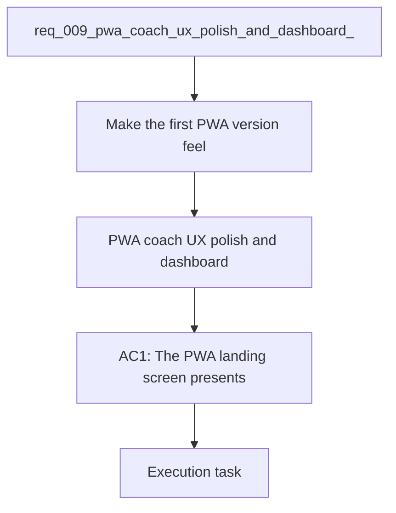

## item_010_pwa_coach_ux_polish_and_dashboard_enrichment - PWA coach UX polish and dashboard enrichment
> From version: 0.1.0
> Schema version: 1.0
> Status: Done
> Understanding: 96%
> Confidence: 93%
> Progress: 100%
> Complexity: High
> Theme: UI
> Reminder: Update status/understanding/confidence/progress and linked request/task references when you edit this doc.

# Problem
The local-first PWA coach is now functional and installable, but first user feedback shows that the layout is not yet well balanced. The first screen still feels too technical, the provider status pill is too dominant, it is not obvious whether data has already been imported, the app gives too little feedback while the model is inferring, and the dashboard is too thin for serious running analysis.

# Scope
- In: one coherent delivery slice from the source request.
- Out: unrelated sibling slices that should stay in separate backlog items instead of widening this doc.

# Acceptance criteria
- AC1: The PWA landing screen presents a clearer premium coaching identity, with a better title and more balanced visual hierarchy.
- AC2: The provider status is displayed in a compact way that does not dominate the layout.
- AC3: The app clearly indicates whether Garmin data has already been imported and where the active local workspace lives.
- AC4: While the LLM or another long-running action is working, the UI shows a clear busy state or progress indicator.
- AC5: The user does not need to repeatedly re-enter the local import directory when a workspace is already known and available.
- AC6: The dashboard shows richer coaching metrics, including training load, weekly volume, heart rate / pace context, resting heart rate, sleep duration, and estimated max heart rate when available.
- AC7: The dashboard exposes at least one trend-oriented view or summary that helps interpret the latest data, not just raw status badges.
- AC8: The app remains local-first and continues to work without requiring a paid cloud API just to inspect local data.

# AC Traceability
- AC1 -> Scope: The PWA landing screen presents a clearer premium coaching identity, with a better title and more balanced visual hierarchy.. Proof: capture validation evidence in this doc.
- AC2 -> Scope: The provider status is displayed in a compact way that does not dominate the layout.. Proof: capture validation evidence in this doc.
- AC3 -> Scope: The app clearly indicates whether Garmin data has already been imported and where the active local workspace lives.. Proof: capture validation evidence in this doc.
- AC4 -> Scope: While the LLM or another long-running action is working, the UI shows a clear busy state or progress indicator.. Proof: capture validation evidence in this doc.
- AC5 -> Scope: The user does not need to repeatedly re-enter the local import directory when a workspace is already known and available.. Proof: capture validation evidence in this doc.
- AC6 -> Scope: The dashboard shows richer coaching metrics, including training load, weekly volume, heart rate / pace context, resting heart rate, sleep duration, and estimated max heart rate when available.. Proof: capture validation evidence in this doc.
- AC7 -> Scope: The dashboard exposes at least one trend-oriented view or summary that helps interpret the latest data, not just raw status badges.. Proof: capture validation evidence in this doc.
- AC8 -> Scope: The app remains local-first and continues to work without requiring a paid cloud API just to inspect local data.. Proof: capture validation evidence in this doc.

# Decision framing
- Product framing: Required
- Product signals: pricing and packaging, experience scope
- Product follow-up: Create or link a product brief before implementation moves deeper into delivery.
- Architecture framing: Required
- Architecture signals: data model and persistence, contracts and integration, state and sync
- Architecture follow-up: Create or link an architecture decision before irreversible implementation work starts.

# Links
- Product brief(s): `prod_000_local_first_pwa_coach_dashboard`
- Architecture decision(s): `adr_001_choose_local_pwa_storage_and_provider_integration`
- Request: `req_009_pwa_coach_ux_polish_and_dashboard_enrichment`
- Primary task(s): `task_010_pwa_coach_ux_polish_and_dashboard_enrichment`

# AI Context
- Summary: Refine the local-first PWA coach UI so the first impression is balanced, the loading state is obvious, data...
- Keywords: pwa, coach, ux, dashboard, loading state, import state, training load, weekly volume, heart rate, sleep, local-first
- Use when: Use when improving the first browser-installable coaching experience so it feels clear, responsive, and analytically useful.
- Skip when: Skip when the work is limited to backend ingestion, raw parsing, or provider integration only.
# References
- `logics/skills/logics-ui-steering/SKILL.md`

# Priority
- Impact: High
- Urgency: High

# Notes
- Derived from request `req_009_pwa_coach_ux_polish_and_dashboard_enrichment`.
- Source file: `logics\request\req_009_pwa_coach_ux_polish_and_dashboard_enrichment.md`.
- Keep this backlog item as one bounded delivery slice; create sibling backlog items for the remaining request coverage instead of widening this doc.
- Request context seeded into this backlog item from `logics\request\req_009_pwa_coach_ux_polish_and_dashboard_enrichment.md`.
- Task `task_010_pwa_coach_ux_polish_and_dashboard_enrichment` was finished via `logics_flow.py finish task` on 2026-04-12.
