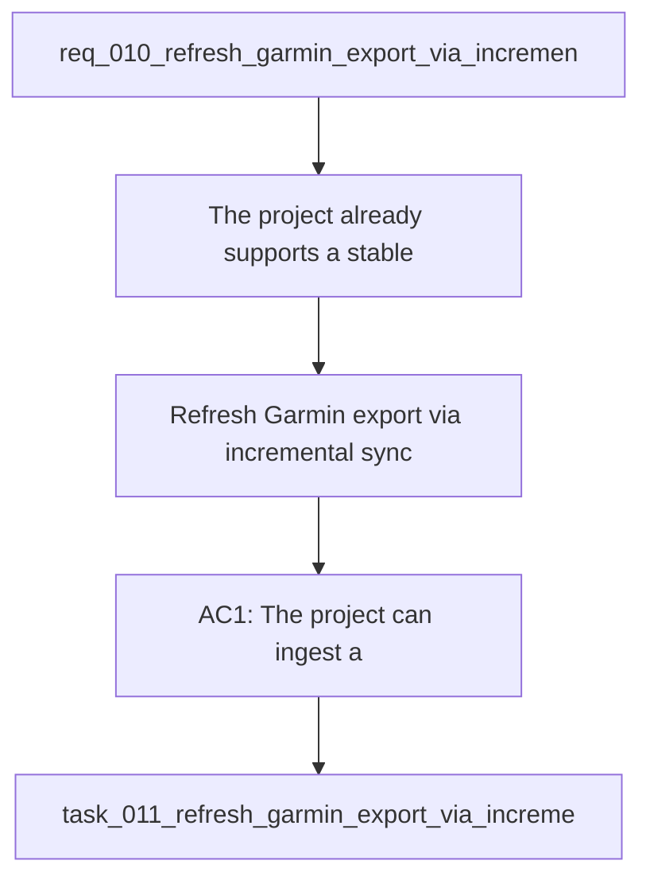

## item_011_refresh_garmin_export_via_incremental_sync_and_harden_training_data_foundation - Refresh Garmin export via incremental sync and harden training data foundation
> From version: 0.1.0
> Schema version: 1.0
> Status: Done
> Understanding: 96
> Confidence: 93
> Progress: 100%
> Complexity: High
> Theme: Health
> Reminder: Update status/understanding/confidence/progress and linked request/task references when you edit this doc.

# Problem
The project already supports a stable local Garmin ZIP export import and local analytics, but the data foundation still needs a stronger freshness story and a cleaner split between operational sync state and training analytics. The current problem is not the existence of local data; it is how to keep a trusted baseline export current with later Garmin data without turning the sync layer into a fragile all-or-nothing auth path.

This slice focuses on the data foundation needed by the coach:
- keep the ZIP export as the baseline source of truth
- refresh it with later Garmin data when available
- preserve provenance and traceability
- store sync state separately from analytics
- support pace and benchmark intelligence for coaching

# Scope
- In: one coherent delivery slice that hardens the Garmin export refresh foundation.
- In: baseline ZIP import plus incremental local refresh from newer Garmin data.
- In: local sync state in SQLite.
- In: analytics and derived training features in DuckDB.
- In: experimental auth backend support behind an adapter boundary.
- In: pace and benchmark intelligence from recent training history and recent race or workout data.
- Out: readiness/body battery/recovery time, which are intentionally deferred to a later wave.
- Out: unrelated UI polish work and unrelated mobile packaging work.

# Acceptance criteria
- AC1: The project can ingest a local Garmin ZIP export as the baseline source of truth.
- AC2: The project can refresh or extend that baseline with newer Garmin data and activities when available.
- AC3: The sync flow has an explicit state layer that records what was already seen, what was refreshed, and what remains pending.
- AC4: The project supports both Garmin-provided load and a derived local load model.
- AC5: The coach can access pace and benchmark intelligence from recent training history and recent race or workout data.
- AC6: SQLite is used for operational state if needed, and DuckDB remains the primary analytics engine.
- AC7: The incremental refresh path remains local-first and does not require a cloud dependency to function at baseline.
- AC8: Tests cover at least one baseline ZIP import case, one incremental refresh case, and one coaching-relevant pace or benchmark signal case.
- AC9: The implementation preserves provenance and traceability across baseline and refreshed data.

# AC Traceability
- AC1 -> baseline ZIP import and local source of truth. Proof: capture validation evidence in the task.
- AC2 -> incremental refresh from newer Garmin data. Proof: capture validation evidence in the task.
- AC3 -> explicit sync state and checkpoints. Proof: capture validation evidence in the task.
- AC4 -> dual load model. Proof: capture validation evidence in the task.
- AC5 -> pace and benchmark engine. Proof: capture validation evidence in the task.
- AC6 -> SQLite state and DuckDB analytics split. Proof: capture validation evidence in the task.
- AC7 -> local-first refresh path. Proof: capture validation evidence in the task.
- AC8 -> import, refresh, and coaching-relevant tests. Proof: capture validation evidence in the task.
- AC9 -> provenance across baseline and refreshed data. Proof: capture validation evidence in the task.

# Decision framing
- Product framing: Consider.
- Product signals: freshness loop, coaching usefulness, incremental trust.
- Product follow-up: Keep the scope centered on a trustworthy data foundation before expanding coaching features again.
- Architecture framing: Required.
- Architecture signals: data model and persistence, runtime and boundaries, state and sync, delivery and operations.
- Architecture follow-up: Keep SQLite and DuckDB responsibilities explicit before implementation.

# Links
- Product brief(s): `logics/product/prod_000_local_first_pwa_coach_dashboard.md`
- Architecture decision(s): `logics/architecture/adr_001_choose_local_pwa_storage_and_provider_integration.md`
- Request: `logics/request/req_010_refresh_garmin_export_via_incremental_sync_and_harden_training_data_foundation.md`
- Primary task(s): `task_011_refresh_garmin_export_via_incremental_sync_and_harden_training_data_foundation`

# AI Context
- Summary: Keep the ZIP export as the baseline Garmin source of truth, add incremental refreshes from newer Garmin data, and harden the training foundation with SQLite sync state, DuckDB analytics, pace, and benchmark intelligence.
- Keywords: garmin, sync, incremental refresh, zip export, sqlite, duckdb, pace, benchmark, provenance, local-first
- Use when: Use when the project needs a robust local Garmin data foundation that can be refreshed without breaking the baseline export model.
- Skip when: Skip when the work is only about UI polish, chat wording, or unrelated product packaging.

# Priority
- Impact: High
- Urgency: High

# Notes
- Derived from request `req_010_refresh_garmin_export_via_incremental_sync_and_harden_training_data_foundation`.
- Keep this backlog item as one bounded delivery slice.
- If future discovery shows readiness/body battery/recovery should be added, split that into a separate backlog item rather than widening this one.
- Task `task_011_refresh_garmin_export_via_incremental_sync_and_harden_training_data_foundation` was finished via `logics_flow.py finish task` on 2026-04-12.
- Derived from `logics/request/req_010_refresh_garmin_export_via_incremental_sync_and_harden_training_data_foundation.md`.
