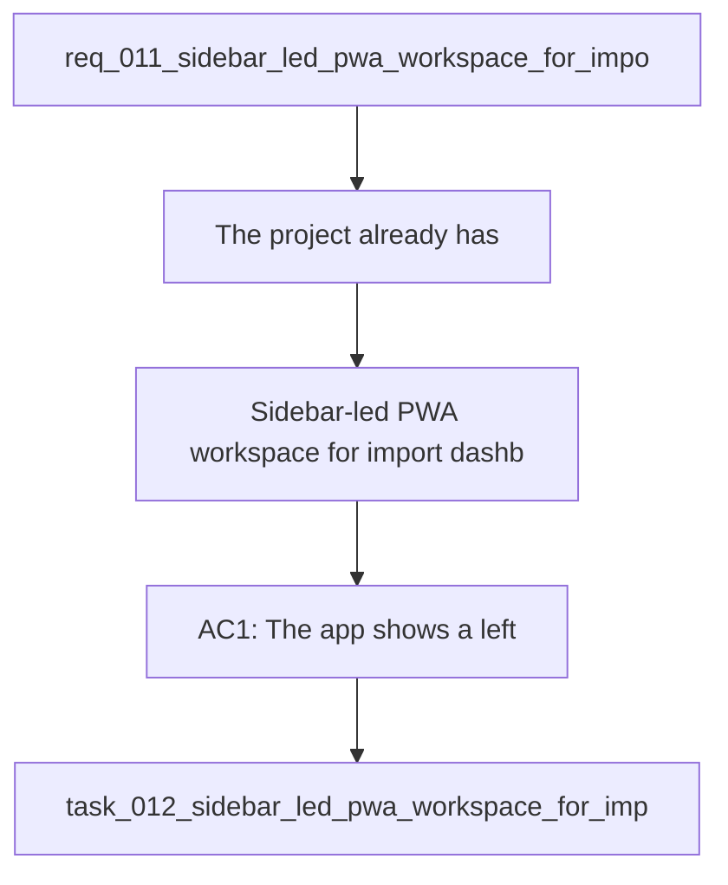

## item_012_sidebar_led_pwa_workspace_for_import_dashboard_coach_terminal_and_settings - Sidebar-led PWA workspace for import, dashboard, coach, terminal, and settings
> From version: 0.1.0
> Schema version: 1.0
> Status: Done
> Understanding: 96
> Confidence: 93
> Progress: 100%
> Complexity: High
> Theme: UI
> Reminder: Update status/understanding/confidence/progress and linked request/task references when you edit this doc.

# Problem
- The project already has:
- - a local-first Garmin data foundation

# Scope
- In: one coherent delivery slice from the source request.
- Out: unrelated sibling slices that should stay in separate backlog items instead of widening this doc.

# Acceptance criteria
- AC1: The app shows a left sidebar navigation with Import, Dashboard, Chat, Terminal, and Settings in that order.
- AC2: Import is the default landing section when the app opens.
- AC3: The main workspace occupies the dominant right-hand area and switches content based on the selected section.
- AC4: The Import section clearly shows whether local Garmin data exists and what the latest date is.
- AC5: The Dashboard shows 6 to 9 primary cards and each card can be opened or enlarged for closer inspection.
- AC6: The Chat section makes data availability, analyzed state, provider selection, and active objective visible and editable where relevant.
- AC7: The Terminal section exposes logs or action output with selectable log levels above it.
- AC8: The Settings section includes at least theme selection, terminal visibility behavior, and other useful technical options.
- AC9: The app clearly indicates when data is available locally and when a refresh may be needed.
- AC10: The design remains sober, readable, and suitable for frequent daily use.

# AC Traceability
- AC1 -> Scope: The app shows a left sidebar navigation with Import, Dashboard, Chat, Terminal, and Settings in that order.. Proof: capture validation evidence in this doc.
- AC2 -> Scope: Import is the default landing section when the app opens.. Proof: capture validation evidence in this doc.
- AC3 -> Scope: The main workspace occupies the dominant right-hand area and switches content based on the selected section.. Proof: capture validation evidence in this doc.
- AC4 -> Scope: The Import section clearly shows whether local Garmin data exists and what the latest date is.. Proof: capture validation evidence in this doc.
- AC5 -> Scope: The Dashboard shows 6 to 9 primary cards and each card can be opened or enlarged for closer inspection.. Proof: capture validation evidence in this doc.
- AC6 -> Scope: The Chat section makes data availability, analyzed state, provider selection, and active objective visible and editable where relevant.. Proof: capture validation evidence in this doc.
- AC7 -> Scope: The Terminal section exposes logs or action output with selectable log levels above it.. Proof: capture validation evidence in this doc.
- AC8 -> Scope: The Settings section includes at least theme selection, terminal visibility behavior, and other useful technical options.. Proof: capture validation evidence in this doc.
- AC9 -> Scope: The app clearly indicates when data is available locally and when a refresh may be needed.. Proof: capture validation evidence in this doc.
- AC10 -> Scope: The design remains sober, readable, and suitable for frequent daily use.. Proof: capture validation evidence in this doc.

# Decision framing
- Product framing: Required
- Product signals: navigation and discoverability, experience scope
- Product follow-up: Create or link a product brief before implementation moves deeper into delivery.
- Architecture framing: Required
- Architecture signals: data model and persistence, contracts and integration, state and sync
- Architecture follow-up: Create or link an architecture decision before irreversible implementation work starts.

# Links
- Product brief(s): `prod_000_local_first_pwa_coach_dashboard`
- Architecture decision(s): `adr_001_choose_local_pwa_storage_and_provider_integration`
- Request: `req_011_sidebar_led_pwa_workspace_for_import_dashboard_coach_terminal_and_settings`
- Primary task(s): `task_012_sidebar_led_pwa_workspace_for_import_dashboard_coach_terminal_and_settings`

# AI Context
- Summary: Redesign the local-first PWA into a sidebar-led workspace with Import, Dashboard, Chat, Terminal, and Settings as the main...
- Keywords: pwa, sidebar, navigation, workspace, import, dashboard, coach, terminal, settings, local-first, ui, ux
- Use when: Use when the app needs a stronger information architecture and clearer daily workflow around data import, analysis, coaching, and debugging.
- Skip when: Skip when the change is only about charts, model behavior, or data normalization.
# References
- `logics/skills/logics-ui-steering/SKILL.md`

# Priority
- Impact:
- Urgency:

# Notes
- Derived from request `req_011_sidebar_led_pwa_workspace_for_import_dashboard_coach_terminal_and_settings`.
- Source file: `logics\request\req_011_sidebar_led_pwa_workspace_for_import_dashboard_coach_terminal_and_settings.md`.
- Keep this backlog item as one bounded delivery slice; create sibling backlog items for the remaining request coverage instead of widening this doc.
- Request context seeded into this backlog item from `logics\request\req_011_sidebar_led_pwa_workspace_for_import_dashboard_coach_terminal_and_settings.md`.
- Derived from `logics/request/req_011_sidebar_led_pwa_workspace_for_import_dashboard_coach_terminal_and_settings.md`.
