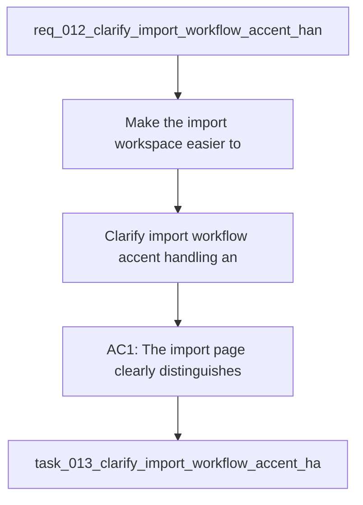

## item_013_clarify_import_workflow_accent_handling_and_refresh_actions - Clarify import workflow, accent handling, and refresh actions
> From version: 0.1.0
> Schema version: 1.0
> Status: Done
> Understanding: 98%
> Confidence: 95%
> Progress: 100%
> Complexity: Medium
> Theme: UI
> Reminder: Update status/understanding/confidence/progress and linked request/task references when you edit this doc.

# Problem
- Make the import workspace easier to understand, especially the difference between source Garmin data, local working workspace, last import, and refresh.
- Fix the remaining accent and encoding issues in the PWA labels, statuses, and import workflow copy.
- Reorganize the import page so the main actions and status signals read in a clear order.
- Make the four import actions understandable:
- import Garmin
- sync Garmin Connect
- reuse the last workspace
- refresh
- Keep the Garmin source path input visible near the import button, but move the local workspace path input out of this page and into Settings.
- Keep the terminology consistent across the sidebar, dashboard, terminal, and settings.
- The current PWA already exposes a local-first Garmin workflow, but the import section mixes status information, source selection, freshness, and action buttons in a way that is hard to read.
- The UI currently shows a mix of local workspace state, last import state, and source path selection, but their meaning is not obvious enough.

# Scope
- In: one coherent delivery slice from the source request.
- Out: unrelated sibling slices that should stay in separate backlog items instead of widening this doc.

# Acceptance criteria
- AC1: The import page clearly distinguishes between source Garmin folder, local working workspace, and last import metadata.
- AC2: The import page explains the difference between the four main actions:
- import Garmin
- sync Garmin Connect
- reuse the last workspace
- refresh
- AC3: The import page and related labels no longer show broken accent characters or mojibake in the main workflow text.
- AC4: The freshness signal is understandable, including the age of the latest local activity and whether the workspace looks stale.
- AC5: The primary action order reads naturally from top to bottom and reduces ambiguity about what to do next.
- AC6: The coach and dashboard continue to work with the updated import workflow wording and layout.
- AC7: Automated checks cover the main import labels, the action semantics, and the accent-sensitive strings.
- AC8: The Garmin Connect sync action may fail gracefully without blocking the import page or the rest of the app.

# AC Traceability
- AC1 -> Scope: The import page clearly distinguishes between source Garmin folder, local working workspace, and last import metadata. Proof: capture validation evidence in this doc.
- AC2 -> Scope: The import page explains the difference between the four main actions. Proof: capture validation evidence in this doc.
- AC3 -> Scope: The import page and related labels no longer show broken accent characters or mojibake in the main workflow text. Proof: capture validation evidence in this doc.
- AC4 -> Scope: The freshness signal is understandable, including the age of the latest local activity and whether the workspace looks stale. Proof: capture validation evidence in this doc.
- AC5 -> Scope: The primary action order reads naturally from top to bottom and reduces ambiguity about what to do next. Proof: capture validation evidence in this doc.
- AC6 -> Scope: The coach and dashboard continue to work with the updated import workflow wording and layout. Proof: capture validation evidence in this doc.
- AC7 -> Scope: Automated checks cover the main import labels, the action semantics, and the accent-sensitive strings. Proof: capture validation evidence in this doc.
- AC8 -> Scope: The Garmin Connect sync action may fail gracefully without blocking the import page or the rest of the app. Proof: capture validation evidence in this doc.

# Decision framing
- Product framing: Consider
- Product signals: experience scope
- Product follow-up: Review whether a product brief is needed before scope becomes harder to change.
- Architecture framing: Required
- Architecture signals: data model and persistence, contracts and integration, state and sync, security and identity
- Architecture follow-up: Create or link an architecture decision before irreversible implementation work starts.

# Links
- Product brief(s): [prod_001_import_workflow_clarity_and_non_blocking_garmin_sync](../product/prod_001_import_workflow_clarity_and_non_blocking_garmin_sync.md)
- Architecture decision(s): [adr_002_place_workspace_in_settings_and_add_non_blocking_garmin_sync](../architecture/adr_002_place_workspace_in_settings_and_add_non_blocking_garmin_sync.md)
- Request: `req_012_clarify_import_workflow_accent_handling_and_refresh_actions`
- Primary task(s): [task_013_clarify_import_workflow_accent_handling_and_refresh_actions](../tasks/task_013_clarify_import_workflow_accent_handling_and_refresh_actions.md)

# AI Context
- Summary: Improve the import page so source folder, freshness, import actions, and non-blocking Garmin Connect sync are obvious, while...
- Keywords: import, workflow, workspace, source folder, refresh, freshness, accents, ui, local-first, pwa
- Use when: Use when refining the import experience and cleaning up accent-sensitive UI text.
- Skip when: Skip when the work targets coach logic, analytics models, or backend sync algorithms.
# References
- `logics/skills/logics-ui-steering/SKILL.md`

# Priority
- Impact:
- Urgency:

# Notes
- Derived from request `req_012_clarify_import_workflow_accent_handling_and_refresh_actions`.
- Source file: `logics\request\req_012_clarify_import_workflow_accent_handling_and_refresh_actions.md`.
- Keep this backlog item as one bounded delivery slice; create sibling backlog items for the remaining request coverage instead of widening this doc.
- Request context seeded into this backlog item from `logics\request\req_012_clarify_import_workflow_accent_handling_and_refresh_actions.md`.
- Derived from `logics/request/req_012_clarify_import_workflow_accent_handling_and_refresh_actions.md`.
