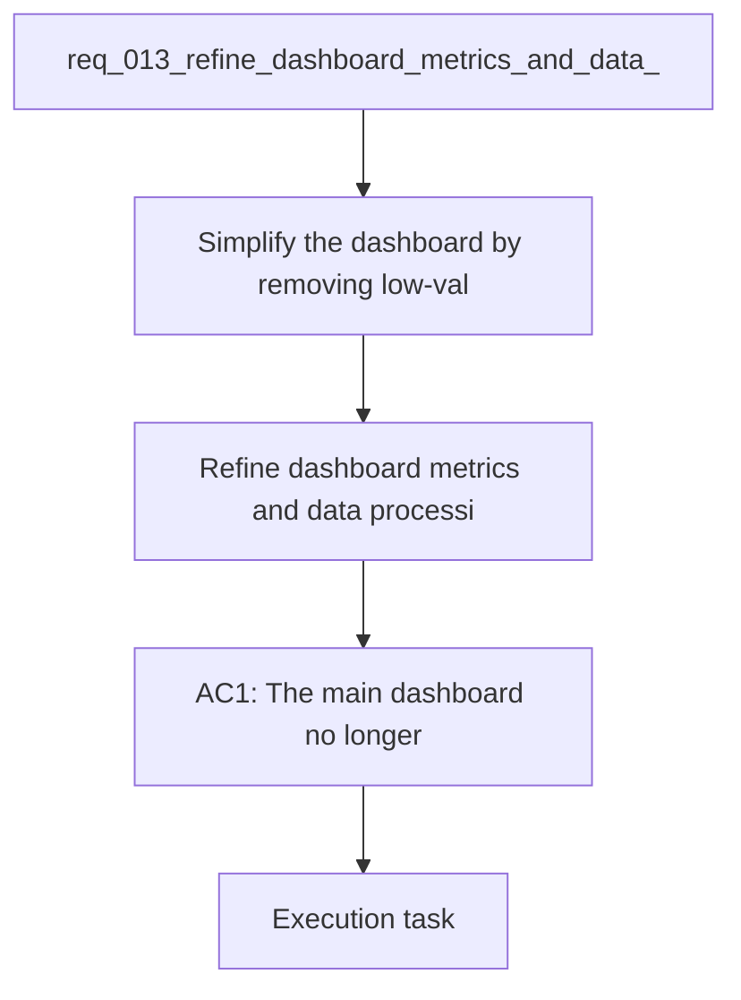

## item_014_refine_dashboard_metrics_and_data_processing_for_pace_hr_cadence_coach_analytics - Refine dashboard metrics and data processing for pace HR cadence coach analytics
> From version: 0.1.0
> Schema version: 1.0
> Status: Done
> Understanding: 98%
> Confidence: 95%
> Progress: 100%
> Complexity: High
> Theme: Health
> Reminder: Update status/understanding/confidence/progress and linked request/task references when you edit this doc.

# Problem
- Simplify the dashboard by removing low-value cards and keeping only the metrics that help the coach make better running decisions.
- Replace the current pace/HR card with a monotonic smoothed pace-vs-heart-rate curve built from recent running points and filtered steady segments.
- Add cadence trend and cadence evolution so the user can see progress toward a higher cadence target.
- Improve the processing pipeline so derived metrics are robust against interval spikes, warmup/cooldown noise, and very short unstable segments.
- Use a longer analysis window when needed, up to roughly 3 months, because the evolution is not always obvious on short windows.
- Keep coverage, import plumbing, and other debug-only signals out of the main dashboard unless they are genuinely useful for the user.
- The current PWA dashboard already shows volume, load, load ratio, sleep, HRV, pace/HR, sortie longue, and several utility cards.
- User feedback says several of those cards are not helpful in their current form.

# Scope
- In: one coherent delivery slice from the source request.
- Out: unrelated sibling slices that should stay in separate backlog items instead of widening this doc.

# Links
- Product brief: `prod_002_refine_dashboard_metrics_and_data_processing_for_running_analytics`
- Architecture decision: `adr_003_choose_monotone_pace_hr_curve_and_cadence_first_dashboard_metrics`
- Request: `req_013_refine_dashboard_metrics_and_data_processing_for_pace_hr_cadence_coach_analytics`

# Acceptance criteria
- AC1: The main dashboard no longer shows low-value cards that do not help the running coach decision flow.
- AC2: The dashboard contains a clear pace versus heart rate curve built from filtered recent running data.
- AC3: The pace versus heart rate curve uses a nearest-value plus monotonic smoothing treatment that resists outliers and unstable interval-like points.
- AC4: The dashboard surfaces cadence trend or cadence evolution as a first-class metric.
- AC5: Load and sleep are displayed with understandable high and low references or context, not as isolated raw labels.
- AC6: Coverage and other technical diagnostics are available outside the main user-facing dashboard.
- AC7: Tests cover the dashboard metric selection and the data filtering used for the regression or trend views.
- AC8: The implementation remains local-first and does not require a paid cloud service to compute or display the metrics.

# AC Traceability
- AC1 -> Scope: The main dashboard no longer shows low-value cards that do not help the running coach decision flow.. Proof: capture validation evidence in this doc.
- AC2 -> Scope: The dashboard contains a clear pace versus heart rate curve built from filtered recent running data.. Proof: capture validation evidence in this doc.
- AC3 -> Scope: The pace versus heart rate curve uses a nearest-value plus monotonic smoothing treatment that resists outliers and unstable interval-like points.. Proof: capture validation evidence in this doc.
- AC4 -> Scope: The dashboard surfaces cadence trend or cadence evolution as a first-class metric.. Proof: capture validation evidence in this doc.
- AC5 -> Scope: Load and sleep are displayed with understandable high and low references or context, not as isolated raw labels.. Proof: capture validation evidence in this doc.
- AC6 -> Scope: Coverage and other technical diagnostics are available outside the main user-facing dashboard.. Proof: capture validation evidence in this doc.
- AC7 -> Scope: Tests cover the dashboard metric selection and the data filtering used for the regression or trend views.. Proof: capture validation evidence in this doc.
- AC8 -> Scope: The implementation remains local-first and does not require a paid cloud service to compute or display the metrics.. Proof: capture validation evidence in this doc.

# Decision framing
- Product framing: Required
- Product signals: navigation and discoverability, experience scope
- Product follow-up: Create or link a product brief before implementation moves deeper into delivery.
- Architecture framing: Required
- Architecture signals: data model and persistence, contracts and integration, state and sync, security and identity
- Architecture follow-up: Create or link an architecture decision before irreversible implementation work starts.

# Links
- Product brief(s): `prod_002_refine_dashboard_metrics_and_data_processing_for_running_analytics`
- Architecture decision(s): `adr_003_choose_monotone_pace_hr_curve_and_cadence_first_dashboard_metrics`
- Request: `req_013_refine_dashboard_metrics_and_data_processing_for_pace_hr_cadence_coach_analytics`
- Primary task(s): `task_014_refine_dashboard_metrics_and_data_processing_for_pace_hr_cadence_coach_analytics`

# AI Context
- Summary: Rework the running dashboard and data processing so the coach sees actionable metrics, a monotonic pace and heart...
- Keywords: dashboard, pace, heart rate, cadence, curve, load, sleep, HRV, running, data processing, local-first
- Use when: Use when refining running analytics and the treatment of Garmin data for coaching decisions.
- Skip when: Skip when the work is about Garmin auth, sync plumbing, or shell navigation.
# Priority
- Impact:
- Urgency:

# Notes
- Derived from request `req_013_refine_dashboard_metrics_and_data_processing_for_pace_hr_cadence_coach_analytics`.
- Source file: `logics\request\req_013_refine_dashboard_metrics_and_data_processing_for_pace_hr_cadence_coach_analytics.md`.
- Keep this backlog item as one bounded delivery slice; create sibling backlog items for the remaining request coverage instead of widening this doc.
- Request context seeded into this backlog item from `logics\request\req_013_refine_dashboard_metrics_and_data_processing_for_pace_hr_cadence_coach_analytics.md`.
- Implemented in the local PWA dashboard and analytics pipeline with monotone pace/HR, cadence trend, and reference bands for load and sleep.
