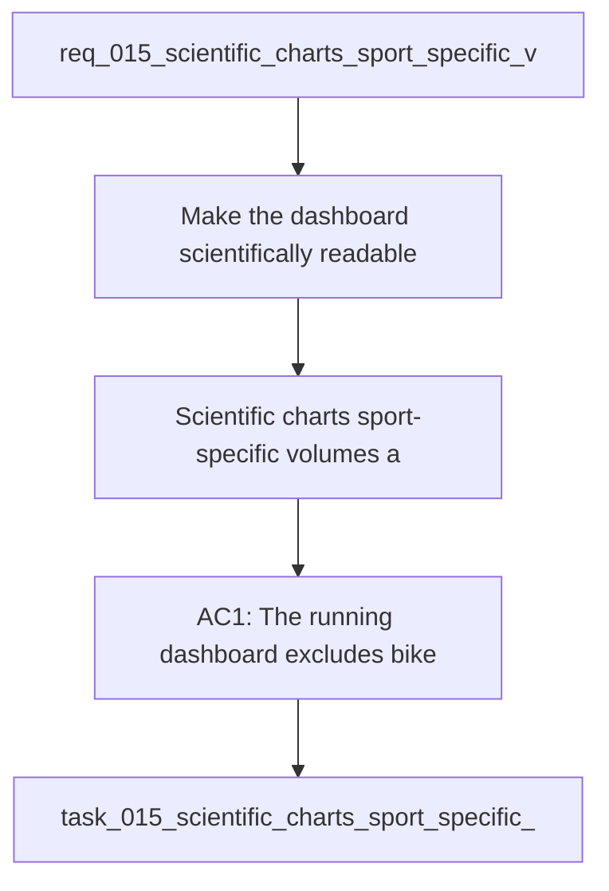

## item_015_scientific_charts_sport_specific_volumes_and_data_recalculation_controls - Scientific charts sport-specific volumes and data recalculation controls
> From version: 0.1.0
> Schema version: 1.0
> Status: Done
> Understanding: 96%
> Confidence: 94%
> Progress: 100%
> Complexity: High
> Theme: Health
> Reminder: Update status/understanding/confidence/progress and linked request/task references when you edit this doc.

# Problem
- Make the dashboard scientifically readable with axes, ticks, values, and hover tooltips on curves.
- Separate running volume from cycling and strength work so the running dashboard stays trustworthy.
- Add a visible weekly cycling volume graph without mixing it into the running metrics.
- Add a non-blocking recalculation / reprocessing action so derived data can be refreshed after filtering or source changes.
- Surface additional curves when useful, including charge ratio, sleep, and resting heart rate, in a readable chart style.
- Current build: `20260414-navfix16`.
- The existing dashboard build is active, but some metrics still feel misleading because mixed-sport volume can leak into running views.

# Scope
- In: one coherent delivery slice from the source request.
- Out: unrelated sibling slices that should stay in separate backlog items instead of widening this doc.

# Acceptance criteria
- AC1: The running dashboard excludes bike and strength volume from running totals.
- AC2: A separate weekly bike volume graph is available and does not contaminate the running metrics.
- AC3: The main charts use scientific plotting conventions, including axes, ticks, readable labels, and hover values.
- AC4: Pace/FC, charge ratio, sleep, and resting HR can be rendered as readable trend or curve charts when the data is available.
- AC5: A recalculation / reprocessing action is available and does not block the UI while derived data is refreshed.
- AC6: The dashboard remains local-first and continues to work with local data when sync or auth is unavailable.

# AC Traceability
- AC1 -> Scope: The running dashboard excludes bike and strength volume from running totals.. Proof: capture validation evidence in this doc.
- AC2 -> Scope: A separate weekly bike volume graph is available and does not contaminate the running metrics.. Proof: capture validation evidence in this doc.
- AC3 -> Scope: The main charts use scientific plotting conventions, including axes, ticks, readable labels, and hover values.. Proof: capture validation evidence in this doc.
- AC4 -> Scope: Pace/FC, charge ratio, sleep, and resting HR can be rendered as readable trend or curve charts when the data is available.. Proof: capture validation evidence in this doc.
- AC5 -> Scope: A recalculation / reprocessing action is available and does not block the UI while derived data is refreshed.. Proof: capture validation evidence in this doc.
- AC6 -> Scope: The dashboard remains local-first and continues to work with local data when sync or auth is unavailable.. Proof: capture validation evidence in this doc.

# Decision framing
- Product framing: Required
- Product signals: navigation and discoverability, experience scope
- Product follow-up: Create or link a product brief before implementation moves deeper into delivery.
- Architecture framing: Required
- Architecture signals: data model and persistence, contracts and integration, state and sync, security and identity
- Architecture follow-up: Create or link an architecture decision before irreversible implementation work starts.

# Links
- Product brief(s): `prod_003_scientific_dashboard_charts_and_sport_specific_volume_filtering`
- Architecture decision(s): `adr_004_scientific_charts_for_sport_specific_volumes_and_data_recalculation`
- Request: `req_015_scientific_charts_sport_specific_volumes_and_data_recalculation_controls`
- Primary task(s): `task_015_scientific_charts_sport_specific_volumes_and_data_recalculation_controls`

# AI Context
- Summary: Improve the dashboard so sport-specific metrics are separated, charts are scientifically readable, and derived data can be recalculated...
- Keywords: scientific, charts, axes, ticks, hover, running, cycling, sport-specific, recalculation, dashboard
- Use when: Use when refining the dashboard presentation and data processing pipeline for trustworthy running analytics.
- Skip when: Skip when the work targets Garmin auth, shell navigation, or unrelated UI surfaces.
# References
- `logics/skills/logics-ui-steering/SKILL.md`

# Priority
- Impact:
- Urgency:

# Notes
- Derived from request `req_015_scientific_charts_sport_specific_volumes_and_data_recalculation_controls`.
- Source file: `logics\request\req_015_scientific_charts_sport_specific_volumes_and_data_recalculation_controls.md`.
- Keep this backlog item as one bounded delivery slice; create sibling backlog items for the remaining request coverage instead of widening this doc.
- Request context seeded into this backlog item from `logics\request\req_015_scientific_charts_sport_specific_volumes_and_data_recalculation_controls.md`.
- Derived from `logics/request/req_015_scientific_charts_sport_specific_volumes_and_data_recalculation_controls.md`.
