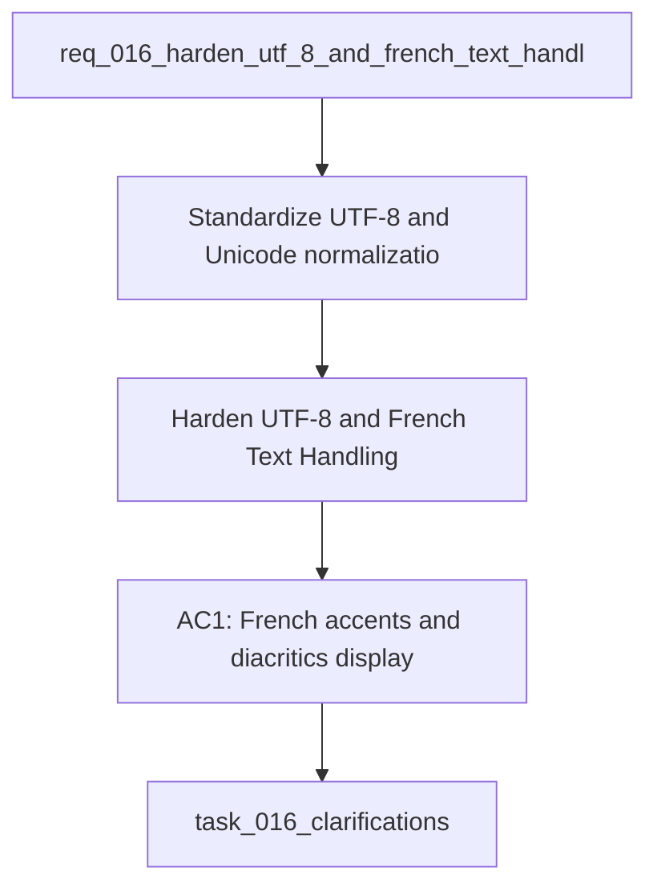

## item_016_clarifications - Harden UTF-8 and French Text Handling End to End
> From version: 0.0.0
> Schema version: 1.0
> Status: Done
> Understanding: 96%
> Confidence: 95%
> Progress: 100%
> Complexity: High
> Theme: General
> Reminder: Update status/understanding/confidence/progress and linked request/task references when you edit this doc.

# Problem
- Standardize UTF-8 and Unicode normalization across the app so French accents, diacritics, and punctuation survive every read, write, and render path.
- Remove mojibake and broken characters from the PWA, CLI, diagnostics, logs, launcher, and generated reports without needing one-off fixes for each screen.
- Make text handling predictable across Windows batch files, PowerShell, Python, browser HTML and JS, JSON, markdown, and stored local data.
- Add regression tests and debug signals that catch encoding drift early, especially for French strings and round-trip persistence.
- Keep the solution local-first and low-friction so future text bugs are prevented by default rather than patched manually.
- Define a single default text policy for the repo: normalize incoming user text, preserve UTF-8 internally, and emit readable French text in every user-facing surface.
- The project has repeatedly shown character corruption such as `Données`, `prêt`, `Analyse: prête`, and other mojibake patterns in the PWA, diagnostics, logs, launcher flow, and generated text outputs.
- Some fixes already exist in isolated places, but the handling is still fragmented enough that text bugs keep reappearing in different surfaces.

# Scope
- In: one coherent delivery slice from the source request.
- Out: unrelated sibling slices that should stay in separate backlog items instead of widening this doc.

# Acceptance criteria
- AC1: French accents and diacritics display correctly in the PWA, terminal logs, diagnostics, and generated text outputs.
- AC2: User-entered text is normalized consistently before persistence so round trips preserve readable French characters.
- AC3: Batch files, PowerShell launchers, Python outputs, JSON, markdown, and HTML pages all use a coherent UTF-8 path end to end.
- AC4: The project includes regression tests or validation checks that fail when mojibake or encoding regressions reappear.
- AC5: The resulting behavior prevents recurring manual fixes for the same family of accent and encoding bugs.
- AC6: Known French strings in the UI and debug surfaces remain readable after a full reload, cache refresh, and local persistence round trip.
- AC7: The launcher, logs, and browser shell expose enough diagnostics to show where a text corruption originated when one still appears.
- AC8: New or edited text-bearing files in the active workflow do not reintroduce raw mojibake artifacts in committed output.

# AC Traceability
- AC1 -> Scope: French accents and diacritics display correctly in the PWA, terminal logs, diagnostics, and generated text outputs.. Proof: capture validation evidence in this doc.
- AC2 -> Scope: User-entered text is normalized consistently before persistence so round trips preserve readable French characters.. Proof: capture validation evidence in this doc.
- AC3 -> Scope: Batch files, PowerShell launchers, Python outputs, JSON, markdown, and HTML pages all use a coherent UTF-8 path end to end.. Proof: capture validation evidence in this doc.
- AC4 -> Scope: The project includes regression tests or validation checks that fail when mojibake or encoding regressions reappear.. Proof: capture validation evidence in this doc.
- AC5 -> Scope: The resulting behavior prevents recurring manual fixes for the same family of accent and encoding bugs.. Proof: capture validation evidence in this doc.
- AC6 -> Scope: Known French strings in the UI and debug surfaces remain readable after a full reload, cache refresh, and local persistence round trip.. Proof: capture validation evidence in this doc.
- AC7 -> Scope: The launcher, logs, and browser shell expose enough diagnostics to show where a text corruption originated when one still appears.. Proof: capture validation evidence in this doc.
- AC8 -> Scope: New or edited text-bearing files in the active workflow do not reintroduce raw mojibake artifacts in committed output.. Proof: capture validation evidence in this doc.

# Decision framing
- Product framing: Not needed
- Product signals: (none detected)
- Product follow-up: No product brief follow-up is expected based on current signals.
- Architecture framing: Required
- Architecture signals: data model and persistence, contracts and integration, state and sync
- Architecture follow-up: Create or link an architecture decision before irreversible implementation work starts.

# Links
- Product brief(s): (none yet)
- Architecture decision(s): [adr_005_choose_end_to_end_utf_8_and_nfc_text_policy](../architecture/adr_005_choose_end_to_end_utf_8_and_nfc_text_policy.md)
- Request: `req_016_harden_utf_8_and_french_text_handling_end_to_end`
- Primary task(s): [task_016_clarifications](../tasks/task_016_clarifications.md), [task_017_french_text_encoding_regression_tests_and_diagnostics](../tasks/task_017_french_text_encoding_regression_tests_and_diagnostics.md)

# AI Context
- Summary: Harden UTF-8 and French text handling end to end so accents and French strings survive every UI, log...
- Keywords: utf-8, unicode, nfc, french, accents, mojibake, encoding, logs, pwa, windows
- Use when: Use when fixing recurring character corruption, broken accents, or inconsistent text rendering in the Coach Garmin app and tooling.
- Skip when: Skip when the work is unrelated to text handling, encoding, or French string preservation.
# References
- `logics/skills/logics-ui-steering/SKILL.md`

# Priority
- Impact:
- Urgency:

# Notes
- Derived from request `req_016_harden_utf_8_and_french_text_handling_end_to_end`.
- Source file: `logics\request\req_016_harden_utf_8_and_french_text_handling_end_to_end.md`.
- Keep this backlog item as one bounded delivery slice; create sibling backlog items for the remaining request coverage instead of widening this doc.
- Request context seeded into this backlog item from `logics\request\req_016_harden_utf_8_and_french_text_handling_end_to_end.md`.
- Delivery completed in task `task_016_clarifications` and `task_017_french_text_encoding_regression_tests_and_diagnostics`.
