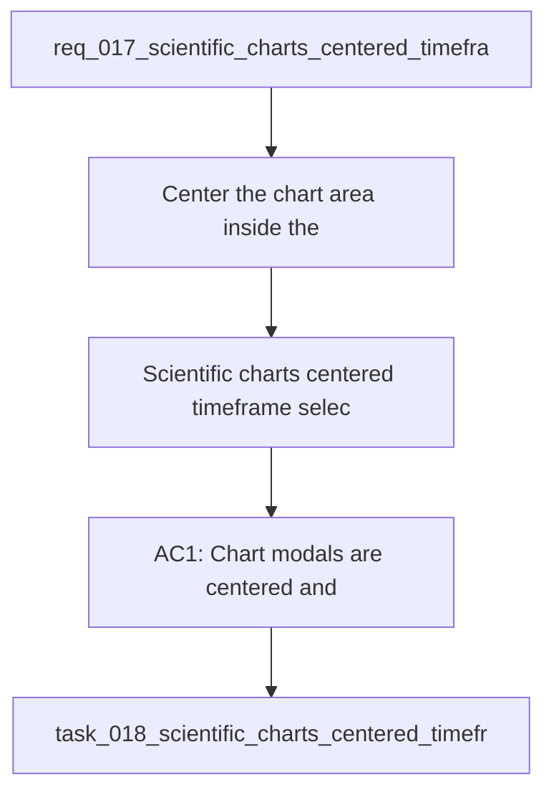

## item_017_scientific_charts_centered_timeframe_selector_and_french_text_fixes - Scientific charts centered, timeframe selector, and French text fixes
> From version: 0.0.0
> Schema version: 1.0
> Status: Obsolete
> Understanding: 96%
> Confidence: 93%
> Progress: 100%
> Complexity: Medium
> Theme: General
> Reminder: Update status/understanding/confidence/progress and linked request/task references when you edit this doc.

# Problem
- Center the chart area inside the modal and improve the visual balance of graph panels.
- Add a chart timeframe selector with 1 month, 3 months, and 1 year views.
- Fix French text rendering in chart titles, axis labels, legends, and helper copy.
- Keep axes, ticks, grid, and hover values visible and readable in the enlarged charts.
- - The current graph layout feels too offset and leaves too much unused space.
- - The current time coverage appears inconsistent with the displayed label, so the user needs explicit window control.

# Scope
- In: one coherent delivery slice from the source request.
- Out: unrelated sibling slices that should stay in separate backlog items instead of widening this doc.

# Acceptance criteria
- AC1: Chart modals are centered and the main plot area visually dominates the available space.
- AC2: Each chart can switch between 1 month, 3 months, and 1 year windows.
- AC3: The selected window updates the data shown on the chart and its labels.
- AC4: French text is rendered correctly in titles, legends, axes, helper copy, and diagnostics.
- AC5: Axes, ticks, grid, and hover values remain visible in enlarged chart views.

# AC Traceability
- AC1 -> Scope: Chart modals are centered and the main plot area visually dominates the available space.. Proof: capture validation evidence in this doc.
- AC2 -> Scope: Each chart can switch between 1 month, 3 months, and 1 year windows.. Proof: capture validation evidence in this doc.
- AC3 -> Scope: The selected window updates the data shown on the chart and its labels.. Proof: capture validation evidence in this doc.
- AC4 -> Scope: French text is rendered correctly in titles, legends, axes, helper copy, and diagnostics.. Proof: capture validation evidence in this doc.
- AC5 -> Scope: Axes, ticks, grid, and hover values remain visible in enlarged chart views.. Proof: capture validation evidence in this doc.

# Decision framing
- Product framing: Consider
- Product signals: experience scope
- Product follow-up: Review whether a product brief is needed before scope becomes harder to change.
- Architecture framing: Consider
- Architecture signals: data model and persistence
- Architecture follow-up: Review whether an architecture decision is needed before implementation becomes harder to reverse.

# Links
- Product brief(s): `prod_004_scientific_chart_centering_and_timeframe_selector`
- Architecture decision(s): (none yet)
- Request: `req_017_scientific_charts_centered_timeframe_selector_and_french_text_fixes`
- Primary task(s): `task_018_scientific_charts_centered_timeframe_selector_and_french_text_fixes`

# AI Context
- Summary: Scientific charts centered, timeframe selector, and French text fixes
- Keywords: charts, centered, timeframe, selector, French text, axes, ticks, hover
- Use when: Use when framing chart layout, timeframe selection, and French text rendering fixes.
- Skip when: Skip when the work targets another feature, repository, or workflow stage.
# References
- `logics/skills/logics-ui-steering/SKILL.md`

# Priority
- Impact:
- Urgency:

# Notes
- Derived from request `req_017_scientific_charts_centered_timeframe_selector_and_french_text_fixes`.
- Source file: `logics\request\req_017_scientific_charts_centered_timeframe_selector_and_french_text_fixes.md`.
- Keep this backlog item as one bounded delivery slice; create sibling backlog items for the remaining request coverage instead of widening this doc.
- Request context seeded into this backlog item from `logics\request\req_017_scientific_charts_centered_timeframe_selector_and_french_text_fixes.md`.
- Marked `Obsolete` on `2026-04-25` because the scope was absorbed by later delivery slices:
  - `item_018_dynamic_chart_timeframes_and_cadence_unit_correction`
  - `item_023_refine_volume_relative_load_and_heart_rate_zone_chart_semantics`
  - `item_024_repair_wellness_raw_views_cadence_and_combined_pace_cadence_hr_chart`
  - `item_025_refine_dashboard_zone_controls_load_semantics_session_typing_and_metric_documentation`
  - `item_026_finish_adr_005_source_text_cleanup_and_reconcile_dashboard_logics_continuity`
