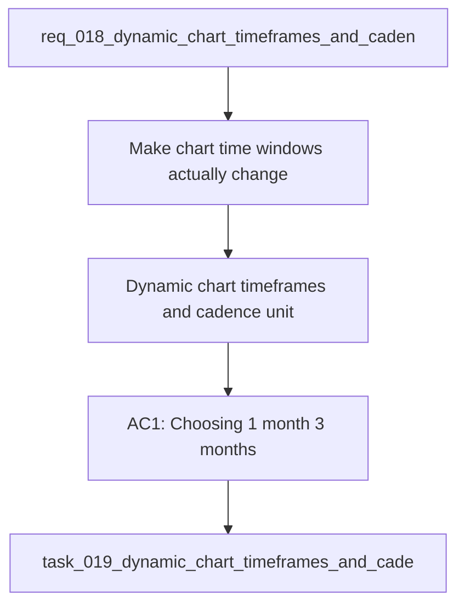

## item_018_dynamic_chart_timeframes_and_cadence_unit_correction - Dynamic chart timeframes and cadence unit correction
> From version: 20260414-navfix26
> Schema version: 1.0
> Status: Done
> Understanding: 95%
> Confidence: 93%
> Progress: 100%
> Complexity: High
> Theme: UI
> Reminder: Update status/understanding/confidence/progress and linked request/task references when you edit this doc.

# Problem
- Make chart time windows actually change the data shown in the graph.
- Make the y-axis scale adapt to the selected time window so the plotted area uses the available vertical space well.
- Investigate and fix cadence so it is consistently treated as steps per minute, not a distance metric or a mixed unit.
- The dashboard already exposes timeframe buttons for 1 month, 3 months, and 1 year, but the graph rendering still appears partially static.
- Some charts look visually compressed because the plotted range does not fully adapt to the selected window.

# Scope
- In: one coherent delivery slice from the source request.
- Out: unrelated sibling slices that should stay in separate backlog items instead of widening this doc.

# Acceptance criteria
- AC1: Choosing 1 month, 3 months, or 1 year changes the actual dataset used by the chart, not only the label.
- AC2: The graph y-axis rescales to the selected time window and uses the available chart height effectively.
- AC3: Cadence is traced back to a step-rate source and displayed as steps per minute, with any distance-unit confusion removed or explained.
- AC4: Charts keep French text correctly rendered in titles, axes, labels, legends, and helper copy after reloads and cache refreshes.
- AC5: The pace / cadence / FC related graphs expose enough diagnostics to explain when data are missing, filtered, or not yet stable.

# AC Traceability
- AC1 -> Scope: Choosing 1 month, 3 months, or 1 year changes the actual dataset used by the chart, not only the label.. Proof: capture validation evidence in this doc.
- AC2 -> Scope: The graph y-axis rescales to the selected time window and uses the available chart height effectively.. Proof: capture validation evidence in this doc.
- AC3 -> Scope: Cadence is traced back to a step-rate source and displayed as steps per minute, with any distance-unit confusion removed or explained.. Proof: capture validation evidence in this doc.
- AC4 -> Scope: Charts keep French text correctly rendered in titles, axes, labels, legends, and helper copy after reloads and cache refreshes.. Proof: capture validation evidence in this doc.
- AC5 -> Scope: The pace / cadence / FC related graphs expose enough diagnostics to explain when data are missing, filtered, or not yet stable.. Proof: capture validation evidence in this doc.

# Decision framing
- Product framing: Consider
- Product signals: experience scope
- Product follow-up: Review whether a product brief is needed before scope becomes harder to change.
- Architecture framing: Required
- Architecture signals: data model and persistence, state and sync, delivery and operations
- Architecture follow-up: Create or link an architecture decision before irreversible implementation work starts.

# Links
- Product brief(s): (none yet)
- Architecture decision(s): `adr_006_choose_dynamic_chart_windows_and_cadence_normalization`
- Request: `req_018_dynamic_chart_timeframes_and_cadence_unit_correction`
- Primary task(s): `task_019_dynamic_chart_timeframes_and_cadence_unit_correction`

# AI Context
- Summary: Make graph time windows dynamic and fix cadence unit handling.
- Keywords: chart, timeframe, y-axis, autoscale, cadence, step rate, spm, French text
- Use when: Use when refining chart windowing, axis scaling, or cadence normalization.
- Skip when: Skip when the work targets another feature, repository, or workflow stage.
# References
- `logics/skills/logics-ui-steering/SKILL.md`

# Priority
- Impact:
- Urgency:

# Notes
- Derived from request `req_018_dynamic_chart_timeframes_and_cadence_unit_correction`.
- Source file: `logics\request\req_018_dynamic_chart_timeframes_and_cadence_unit_correction.md`.
- Keep this backlog item as one bounded delivery slice; create sibling backlog items for the remaining request coverage instead of widening this doc.
- Request context seeded into this backlog item from `logics\request\req_018_dynamic_chart_timeframes_and_cadence_unit_correction.md`.
- Derived from `logics/request/req_018_dynamic_chart_timeframes_and_cadence_unit_correction.md`.
