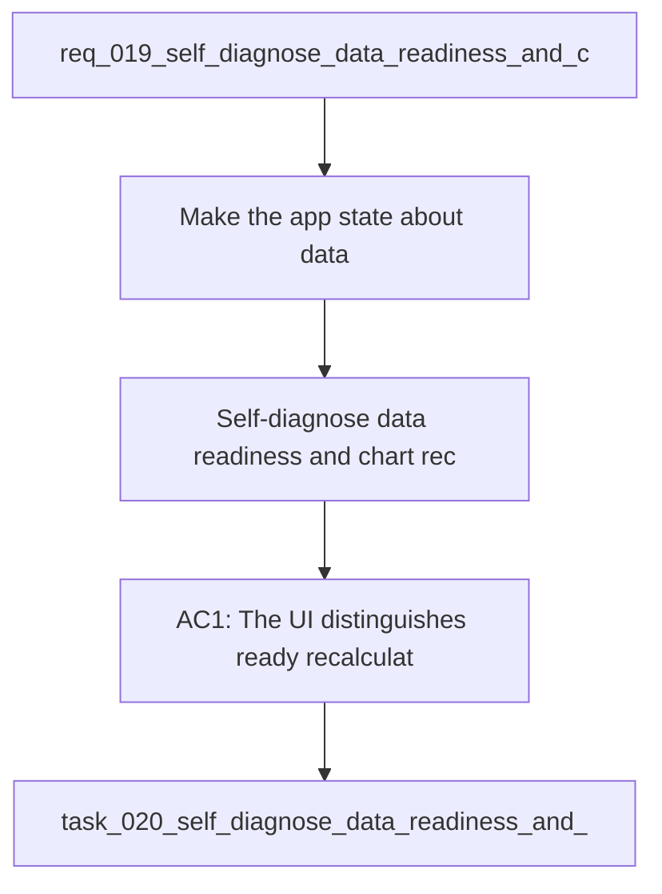

## item_019_self_diagnose_data_readiness_and_chart_recovery - Self-diagnose data readiness and chart recovery
> From version: 20260414-navfix26
> Schema version: 1.0
> Status: Done
> Understanding: 94%
> Confidence: 91%
> Progress: 100%
> Complexity: High
> Theme: General
> Reminder: Update status/understanding/confidence/progress and linked request/task references when you edit this doc.

# Problem
- Make the app state about data readiness explicit instead of a generic "analysis ready" label.
- Surface when the workspace needs a recalculation, when charts have partial data, and when data are genuinely ready.
- Prevent chart previews and modal opens from turning empty data into a JS error or a broken boot state.
- Show why a chart is unavailable when the underlying points are missing, filtered, or not yet stable.
- - On reload, the app can show "analysis ready" even when some derived series are missing or stale.
- - After a recalculation, some chart previews may still not render, even though the workspace itself looks available.

# Scope
- In: one coherent delivery slice from the source request.
- Out: unrelated sibling slices that should stay in separate backlog items instead of widening this doc.

# Acceptance criteria
- AC1: The UI distinguishes ready, recalculation required, partial data, and unavailable states with explicit labels.
- AC2: Reloading the app with stale or incomplete data shows a clear "recalculation required" or equivalent state instead of a generic ready state.
- AC3: Opening an empty or incomplete chart shows an explanation of missing inputs or filters instead of triggering a JS error.
- AC4: Recalculating data refreshes the derived chart payloads and the preview/modals follow the refreshed state.
- AC5: The app keeps running even when a chart has no exploitable points.

# AC Traceability
- AC1 -> Scope: The UI distinguishes ready, recalculation required, partial data, and unavailable states with explicit labels.. Proof: capture validation evidence in this doc.
- AC2 -> Scope: Reloading the app with stale or incomplete data shows a clear "recalculation required" or equivalent state instead of a generic ready state.. Proof: capture validation evidence in this doc.
- AC3 -> Scope: Opening an empty or incomplete chart shows an explanation of missing inputs or filters instead of triggering a JS error.. Proof: capture validation evidence in this doc.
- AC4 -> Scope: Recalculating data refreshes the derived chart payloads and the preview/modals follow the refreshed state.. Proof: capture validation evidence in this doc.
- AC5 -> Scope: The app keeps running even when a chart has no exploitable points.. Proof: capture validation evidence in this doc.

# Decision framing
- Product framing: Consider
- Product signals: experience scope
- Product follow-up: Review whether a product brief is needed before scope becomes harder to change.
- Architecture framing: Consider
- Architecture signals: data model and persistence
- Architecture follow-up: Review whether an architecture decision is needed before implementation becomes harder to reverse.

# Links
- Product brief(s): (none yet)
- Architecture decision(s): `logics/architecture/adr_004_scientific_charts_for_sport_specific_volumes_and_data_recalculation.md`
- Request: `req_019_self_diagnose_data_readiness_and_chart_recovery`
- Primary task(s): `task_020_self_diagnose_data_readiness_and_chart_recovery`

# AI Context
- Summary: Self-diagnose data readiness and chart recovery
- Keywords: data readiness, recalculation, chart recovery, empty state, JS error, diagnostics
- Use when: Use when the app needs to explain stale, partial, or missing chart data and avoid empty-chart crashes.
- Skip when: Skip when the work targets another feature, repository, or workflow stage.
# References
- `logics/skills/logics-ui-steering/SKILL.md`

# Priority
- Impact:
- Urgency:

# Notes
- Derived from request `req_019_self_diagnose_data_readiness_and_chart_recovery`.
- Source file: `logics\request\req_019_self_diagnose_data_readiness_and_chart_recovery.md`.
- Keep this backlog item as one bounded delivery slice; create sibling backlog items for the remaining request coverage instead of widening this doc.
- Request context seeded into this backlog item from `logics\request\req_019_self_diagnose_data_readiness_and_chart_recovery.md`.
- Task `task_020_self_diagnose_data_readiness_and_chart_recovery` was finished via `logics_flow.py finish task` on 2026-04-15.
