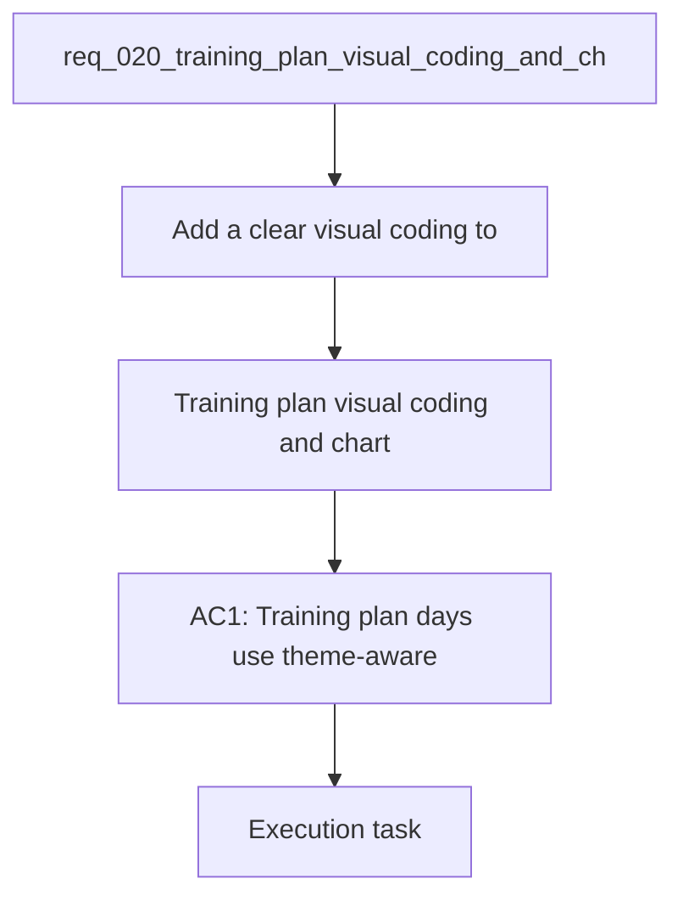

## item_020_training_plan_visual_coding_and_chart_fidelity_repairs - Training plan visual coding and chart fidelity repairs
> From version: 20260415-navfix29
> Schema version: 1.0
> Status: Done
> Understanding: 96%
> Confidence: 93%
> Progress: 100%
> Complexity: High
> Theme: UI
> Reminder: Update status/understanding/confidence/progress and linked request/task references when you edit this doc.

# Problem
- Add a clear visual coding to training-plan days so rest, easy runs, and specific sessions are readable at a glance.
- Repair chart interactions and rendering so hover, timeframe changes, modal layouts, and detail sections behave consistently.
- Improve chart data quality and presentation for running volume, bike volume, resting HR, sleep, HRV, pace / FC, and cadence.
- Eliminate remaining French text and accent corruption in chart titles, legends, axes, and helper copy.
- - Training plans are currently readable functionally, but not visually structured enough to distinguish:
- - rest days

# Scope
- In: one coherent delivery slice from the source request.
- Out: unrelated sibling slices that should stay in separate backlog items instead of widening this doc.

# Acceptance criteria
- AC1: Training plan days use theme-aware visual coding:
- rest day = green family
- easy run = blue family
- quality or long session = orange family
- AC2: The visual coding works across the existing theme system without breaking contrast or readability.
- AC3: Hover tooltips on charts always show meaningful values, labels, and details instead of an empty black box.
- AC4: Switching `1 mois / 3 mois / 1 an` while a chart modal is open refreshes the active modal immediately, without needing to close and reopen it.
- AC5: All main chart modals expose the same explanation structure as the most complete HRV modal:
- calculation
- provenance
- reading
- references
- AC6: Running and bike volume charts render zero-heavy periods in a less cluttered way, either by hiding redundant zero emphasis or by reducing visual noise while preserving true zero data.
- AC7: Resting HR, sleep, and HRV charts preserve realistic day-to-day variability instead of appearing over-smoothed.
- AC8: The `pace / cadence / FC` chart renders at a readable size and uses the modal space correctly.
- AC9: The `allure / FC` curve becomes denser or explains clearly why enough usable points are still missing.
- AC10: Cadence is traced back to the correct running step-rate source and displayed in steps per minute, with implausible low values investigated and corrected.
- AC11: French text and accented characters render correctly in figure titles, axes, legends, tooltips, helper text, and modal sections.

# AC Traceability
- AC1 -> Scope: Training plan days use theme-aware visual coding:. Proof: capture validation evidence in this doc.
- AC2 -> Scope: rest day = green family. Proof: capture validation evidence in this doc.
- AC3 -> Scope: easy run = blue family. Proof: capture validation evidence in this doc.
- AC4 -> Scope: quality or long session = orange family. Proof: capture validation evidence in this doc.
- AC2 -> Scope: The visual coding works across the existing theme system without breaking contrast or readability.. Proof: capture validation evidence in this doc.
- AC3 -> Scope: Hover tooltips on charts always show meaningful values, labels, and details instead of an empty black box.. Proof: capture validation evidence in this doc.
- AC4 -> Scope: Switching `1 mois / 3 mois / 1 an` while a chart modal is open refreshes the active modal immediately, without needing to close and reopen it.. Proof: capture validation evidence in this doc.
- AC5 -> Scope: All main chart modals expose the same explanation structure as the most complete HRV modal:. Proof: capture validation evidence in this doc.
- AC6 -> Scope: calculation. Proof: capture validation evidence in this doc.
- AC7 -> Scope: provenance. Proof: capture validation evidence in this doc.
- AC8 -> Scope: reading. Proof: capture validation evidence in this doc.
- AC9 -> Scope: references. Proof: capture validation evidence in this doc.
- AC6 -> Scope: Running and bike volume charts render zero-heavy periods in a less cluttered way, either by hiding redundant zero emphasis or by reducing visual noise while preserving true zero data.. Proof: capture validation evidence in this doc.
- AC7 -> Scope: Resting HR, sleep, and HRV charts preserve realistic day-to-day variability instead of appearing over-smoothed.. Proof: capture validation evidence in this doc.
- AC8 -> Scope: The `pace / cadence / FC` chart renders at a readable size and uses the modal space correctly.. Proof: capture validation evidence in this doc.
- AC9 -> Scope: The `allure / FC` curve becomes denser or explains clearly why enough usable points are still missing.. Proof: capture validation evidence in this doc.
- AC10 -> Scope: Cadence is traced back to the correct running step-rate source and displayed in steps per minute, with implausible low values investigated and corrected.. Proof: capture validation evidence in this doc.
- AC11 -> Scope: French text and accented characters render correctly in figure titles, axes, legends, tooltips, helper text, and modal sections.. Proof: capture validation evidence in this doc.

# Decision framing
- Product framing: Reuse existing chart and dashboard framing.
- Product signals: experience scope, dashboard readability, plan presentation
- Product follow-up: Reuse and refine existing product briefs if chart fidelity or plan visual encoding needs clearer product language.
- Architecture framing: Reuse existing chart and cadence decisions.
- Architecture signals: chart interaction contract, metric normalization, analytics-to-UI payload shape
- Architecture follow-up: Reuse and refine existing ADRs if the cadence source or chart refresh contract changes materially.

# Links
- Product brief(s): `prod_003_scientific_dashboard_charts_and_sport_specific_volume_filtering`, `prod_004_scientific_chart_centering_and_timeframe_selector`
- Architecture decision(s): `adr_004_scientific_charts_for_sport_specific_volumes_and_data_recalculation`, `adr_006_choose_dynamic_chart_windows_and_cadence_normalization`
- Request: `req_020_training_plan_visual_coding_and_chart_fidelity_repairs`
- Primary task(s): `task_021_training_plan_visual_coding_and_chart_fidelity_repairs`

# AI Context
- Summary: Repair chart fidelity, tooltip behavior, cadence sourcing, and training-plan visual coding.
- Keywords: training plan colors, chart tooltip, modal refresh, chart fidelity, cadence spm, pace fc, hrv, utf-8, french text
- Use when: Use when refining the visual quality, data correctness, or interaction behavior of dashboard charts and training plan presentation.
- Skip when: Skip when the work targets another feature, repository, or workflow stage.
# References
- `logics/skills/logics-ui-steering/SKILL.md`

# Priority
- Impact: High
- Urgency: High

# Notes
- Derived from request `req_020_training_plan_visual_coding_and_chart_fidelity_repairs`.
- Source file: `logics\request\req_020_training_plan_visual_coding_and_chart_fidelity_repairs.md`.
- Keep this backlog item as one bounded delivery slice; create sibling backlog items for the remaining request coverage instead of widening this doc.
- Request context seeded into this backlog item from `logics\request\req_020_training_plan_visual_coding_and_chart_fidelity_repairs.md`.
