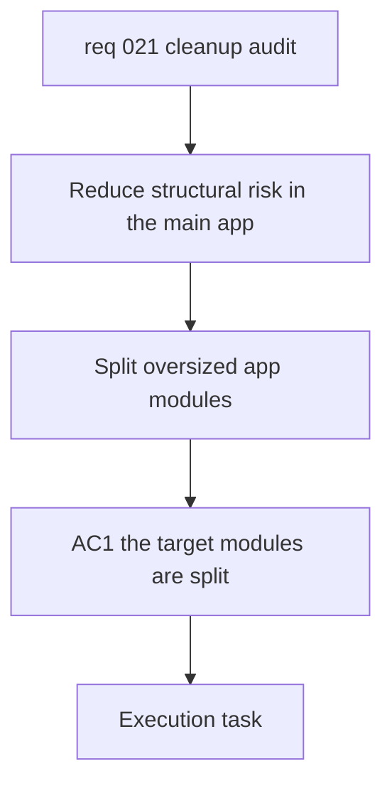

## item_021_clean_up_oversized_app_modules_with_bounded_refactors - Clean up oversized app modules with bounded refactors
> From version: 0.1.0
> Schema version: 1.0
> Status: Done
> Understanding: 96%
> Confidence: 93%
> Progress: 100%
> Complexity: Medium
> Theme: General
> Reminder: Update status/understanding/confidence/progress and linked request/task references when you edit this doc.

# Problem
- The main app still has a few large orchestration modules that are harder to review and change safely.
- The current audit does not show a functional regression, but structure remains a delivery risk for the next feature waves.
- The cleanup should reduce file concentration without changing current CLI, PWA, coach, analytics, or sync behavior.

# Scope
- In scope: bounded refactors of the remaining oversized app modules.
- In scope: preserve stable public entrypoints and move dense logic into coherent support or domain modules.
- In scope: focus on `coach_garmin/analytics.py`, `coach_garmin/pwa_service_support.py`, and `coach_garmin/coach_chat.py`.
- In scope: small coupled fixes only when required to preserve behavior during the refactor.
- Out of scope: Logics hygiene cleanup, new product features, or broad naming churn.

# Acceptance criteria
- AC1: `coach_garmin/analytics.py`, `coach_garmin/pwa_service_support.py`, and `coach_garmin/coach_chat.py` are each reduced through coherent extractions rather than cosmetic moves.
- AC2: Public import surfaces and behavior remain stable for existing CLI, PWA, coach, analytics, and sync entrypoints.
- AC3: Existing automated tests still pass after the refactor.
- AC4: The refactor leaves the repository in a clean, commit-ready state with validation evidence recorded.

# AC Traceability
- AC1 -> Extract domain-specific helpers or orchestration subflows into bounded modules. Proof: diff plus updated module boundaries.
- AC2 -> Keep thin facades or stable imports where callers or tests rely on them. Proof: existing entrypoints and tests continue to work.
- AC3 -> Run the targeted and full automated test suite. Proof: captured test commands and passing results.
- AC4 -> Verify `git status` is clean after the wave. Proof: final repo state recorded in the task report.

# Decision framing
- Product framing: Not required for this slice.
- Architecture framing: Required.
- Architecture signals: runtime boundaries, import seams, orchestration layering, test patch points.
- Architecture follow-up: only create an ADR if the refactor changes a lasting boundary or facade rule.

# Links
- Product brief(s): (none yet)
- Architecture decision(s): (none yet)
- Request: `req_021_clean_up_oversized_app_modules_and_stale_logics_hygiene`
- Primary task(s): `task_022_clean_up_oversized_app_modules_with_bounded_refactors`

# AI Context
- Summary: Reduce structural maintenance risk by splitting the largest remaining app modules without changing behavior.
- Keywords: cleanup, refactor, module boundaries, analytics, pwa, coach chat, facade, orchestration
- Use when: Use when executing the code-structure cleanup slice from req_021.
- Skip when: Skip when the work targets Logics metadata hygiene rather than app code.

# Priority
- Impact: Medium
- Urgency: Medium

# Notes
- Derived from request `req_021_clean_up_oversized_app_modules_and_stale_logics_hygiene`.
- Source file: `logics/request/req_021_clean_up_oversized_app_modules_and_stale_logics_hygiene.md`.
- Executed via `task_022_clean_up_oversized_app_modules_with_bounded_refactors` and completed on `2026-04-16`.
