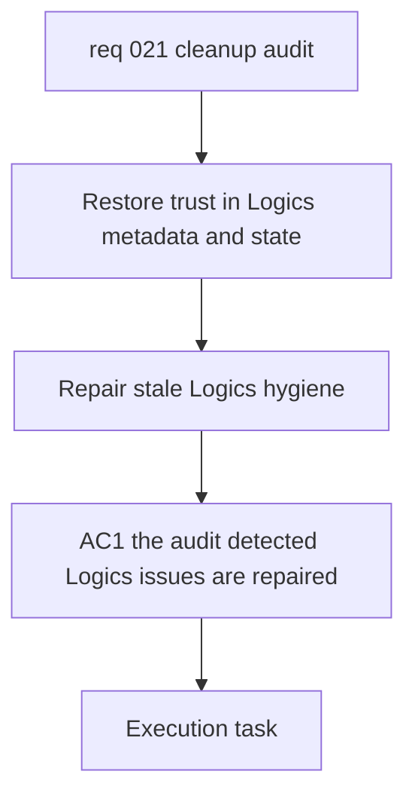

## item_022_repair_stale_logics_hygiene_and_indicator_coherence - Repair stale Logics hygiene and indicator coherence
> From version: 0.1.0
> Schema version: 1.0
> Status: Done
> Understanding: 96%
> Confidence: 93%
> Progress: 100%
> Complexity: Medium
> Theme: General
> Reminder: Update status/understanding/confidence/progress and linked request/task references when you edit this doc.

# Problem
- The latest audit still shows stale Logics hygiene and inconsistent workflow metadata.
- Some request docs remain noisy or contradictory, which reduces trust in the workflow during future delivery waves.
- This slice should repair the documentation state without changing product behavior or reopening old feature decisions.

# Scope
- In scope: clean stale indicators, placeholder-like remnants, and legacy metadata drift highlighted by the audit.
- In scope: correct coherent request/backlog/task metadata where the current state is clearly inconsistent.
- In scope: focus first on the audit-visible issues, including `req_010`, `req_011`, and `req_014`.
- In scope: preserve historical traceability while clarifying archived or legacy docs.
- Out of scope: app code refactors, feature work, or rewriting Logics docs for style only.

# Acceptance criteria
- AC1: The audit-detected Logics inconsistencies are repaired in the targeted docs.
- AC2: Contradictory indicators such as `Status: Done` with `Progress: 0` are corrected where the intended state is clear.
- AC3: Legacy or archived docs retain traceability but no longer read like active delivery items.
- AC4: The cleanup is validated with a Logics audit or equivalent commands, and the resulting repo state is clean.

# AC Traceability
- AC1 -> Update the audit-visible request docs called out by the latest review. Proof: corrected metadata in the targeted files.
- AC2 -> Reconcile stale status and progress indicators where the state is unambiguous. Proof: before/after doc state.
- AC3 -> Clarify archived or precursor docs without deleting traceability links. Proof: archived docs remain linked but no longer misleading.
- AC4 -> Run Logics validation commands after the cleanup. Proof: captured commands and outcomes.

# Decision framing
- Product framing: Not required for this slice.
- Architecture framing: Not required for this slice.

# Links
- Product brief(s): (none yet)
- Architecture decision(s): (none yet)
- Request: `req_021_clean_up_oversized_app_modules_and_stale_logics_hygiene`
- Primary task(s): `task_023_repair_stale_logics_hygiene_and_indicator_coherence`

# AI Context
- Summary: Repair stale Logics metadata and indicator coherence so the workflow remains trustworthy after the audit.
- Keywords: logics, hygiene, indicators, request, backlog, task, archived, placeholder, audit
- Use when: Use when executing the documentation hygiene slice from req_021.
- Skip when: Skip when the work is about code refactors instead of workflow metadata.

# Priority
- Impact: Medium
- Urgency: Low

# Notes
- Derived from request `req_021_clean_up_oversized_app_modules_and_stale_logics_hygiene`.
- Source file: `logics/request/req_021_clean_up_oversized_app_modules_and_stale_logics_hygiene.md`.
- Executed via `task_023_repair_stale_logics_hygiene_and_indicator_coherence` and completed on `2026-04-16`.
