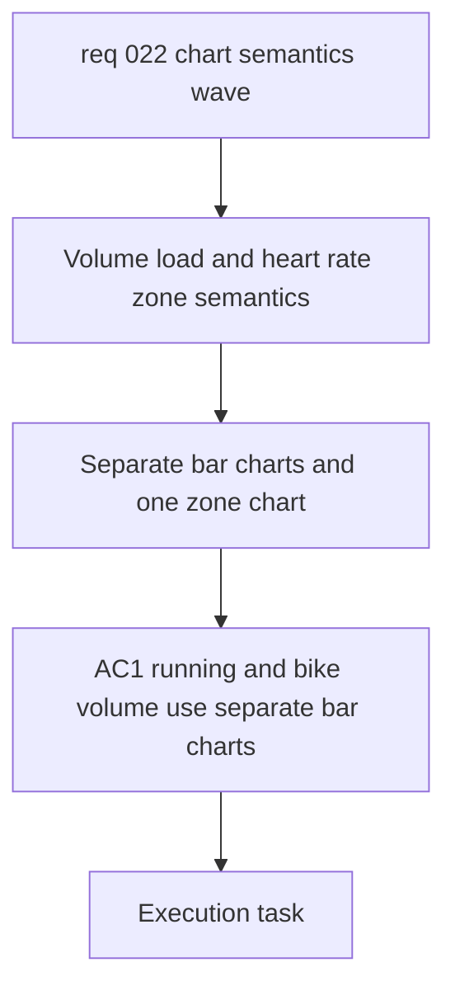

## item_023_refine_volume_relative_load_and_heart_rate_zone_chart_semantics - Refine volume, relative load, and heart-rate zone chart semantics
> From version: 20260416-chart31
> Schema version: 1.0
> Status: Done
> Understanding: 97%
> Confidence: 94%
> Progress: 100%
> Complexity: Medium
> Theme: UI
> Reminder: Update status/understanding/confidence/progress and linked request/task references when you edit this doc.

# Problem
- Running and bike volume charts still use a visual form that implies continuity where the metric is actually accumulated by day or week.
- The relative load chart is not yet explained with enough scientific context for calculation, provenance, reading, and references.
- The heart-rate zone area is noisy because it duplicates charts instead of centering one clearer scientific view with a simple context switch.

# Scope
- In scope: replace the current running and bike volume chart semantics with separate bar-based views.
- In scope: keep running and bike on separate charts while sharing a coherent visual grammar.
- In scope: switch volume aggregation to daily bars for `1 mois` and `3 mois`, then weekly bars for `1 an`.
- In scope: strengthen the relative load modal with calculation, provenance, reading, and references.
- In scope: reduce the heart-rate zone UI to one chart with a switch between `all activities` and `running`.
- In scope: explain the surviving heart-rate zone chart in BPM with correct French text.
- Out of scope: cadence repair, the combined pace / cadence / HR graph, and wellness raw-versus-smoothed behavior.

# Acceptance criteria
- AC1: Running and bike volume use separate bar-based charts rather than sparse connected lines.
- AC2: Volume charts stay readable across `1 mois`, `3 mois`, and `1 an`, with daily bars for the shorter windows and weekly bars for the yearly window.
- AC3: Running and bike remain on separate charts and are not merged into one comparison graph.
- AC4: The relative load modal exposes:
  - calculation
  - provenance
  - reading
  - references
- AC5: Only one heart-rate zone chart remains visible in the UI, with a clear switch between `all activities` and `running`.
- AC6: The surviving heart-rate zone chart explains the zones in BPM and renders French accents correctly.

# AC Traceability
- AC1 -> Replace line semantics with bar semantics on both separate volume charts. Proof: UI diff and chart rendering evidence.
- AC2 -> Implement the locked timeframe aggregation strategy. Proof: `1 mois`, `3 mois`, and `1 an` chart behavior.
- AC3 -> Keep the two sport charts independent. Proof: no merged run-bike chart in the resulting UI.
- AC4 -> Add the full scientific explanation block to relative load. Proof: modal content and copy review.
- AC5 -> Collapse duplicated zone charts into one switchable chart. Proof: UI state and interaction validation.
- AC6 -> Clarify zone thresholds in BPM with correct French text. Proof: chart labels and helper copy.

# Decision framing
- Product framing: Not required for this slice.
- Architecture framing: Useful.
- Architecture signals: chart component semantics, timeframe aggregation, explanation block composition, mode switching.
- Architecture follow-up: create an ADR only if the chart rendering contract or shared modal explanation structure changes in a lasting way.

# Links
- Product brief(s): `prod_003_scientific_dashboard_charts_and_sport_specific_volume_filtering`, `prod_004_scientific_chart_centering_and_timeframe_selector`
- Architecture decision(s): `adr_004_scientific_charts_for_sport_specific_volumes_and_data_recalculation`, `adr_005_choose_end_to_end_utf_8_and_nfc_text_policy`, `adr_006_choose_dynamic_chart_windows_and_cadence_normalization`
- Request: `req_022_refine_scientific_chart_semantics_unsmoothed_wellness_views_and_cadence_zone_repairs`
- Primary task(s): `task_024_refine_volume_relative_load_and_heart_rate_zone_chart_semantics`

# AI Context
- Summary: Replace misleading volume chart semantics, enrich relative load explanations, and simplify heart-rate zones into one clearer chart.
- Keywords: volume bars, histogram, running volume, bike volume, relative load, heart rate zones, bpm, switch, french text
- Use when: Use when implementing the chart semantics and explanation slice from req_022.
- Skip when: Skip when the work targets cadence, raw wellness signals, or the combined pace cadence HR graph.

# Priority
- Impact: High
- Urgency: Medium

# Notes
- Derived from request `req_022_refine_scientific_chart_semantics_unsmoothed_wellness_views_and_cadence_zone_repairs`.
- Source file: `logics/request/req_022_refine_scientific_chart_semantics_unsmoothed_wellness_views_and_cadence_zone_repairs.md`.
- Executed by `task_024_refine_volume_relative_load_and_heart_rate_zone_chart_semantics` on `2026-04-16`.
