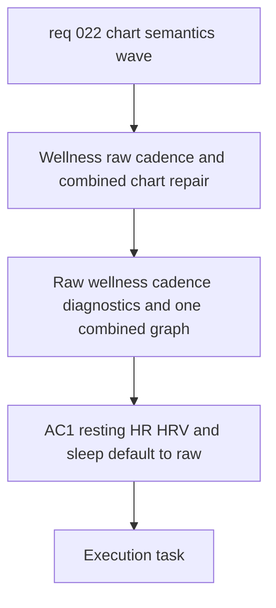

## item_024_repair_wellness_raw_views_cadence_and_combined_pace_cadence_hr_chart - Repair wellness raw views, cadence, and the combined pace / cadence / HR chart
> From version: 20260416-chart31
> Schema version: 1.0
> Status: Done
> Understanding: 97%
> Confidence: 94%
> Progress: 100%
> Complexity: High
> Theme: UI
> Reminder: Update status/understanding/confidence/progress and linked request/task references when you edit this doc.

# Problem
- Resting HR, HRV, and sleep currently look over-smoothed and hide the real day-to-day signal the user wants to inspect.
- HRV explanations and reference blocks still show French accent corruption, which weakens trust in the scientific layer.
- The cadence chart appears broken: too few visible points, implausible axis bounds, and unclear sourcing.
- The current pace / cadence / HR triple view is not readable enough and needs to become one coherent scientific graph with three visible y-axes.

# Scope
- In scope: default resting HR, HRV, and sleep to raw data.
- In scope: optionally keep a smoothing toggle only if both raw and smoothed states behave clearly and predictably.
- In scope: fix French accents and UTF-8 rendering in HRV explanations, chart references, and related scientific helper copy.
- In scope: investigate cadence source fields, normalized values, detected unit, and y-axis bounds.
- In scope: add a cadence diagnostic surface that shows raw source value, normalized value, detected unit, and plotting bounds.
- In scope: redesign the pace / cadence / HR view into one graph with three visible y-axes and hover detail.
- Out of scope: volume chart semantics, relative load explanation structure, and the heart-rate zone switcher slice.

# Acceptance criteria
- AC1: Resting HR, HRV, and sleep default to raw day-to-day data rather than a smoothed series.
- AC2: If a smoothing toggle remains, both raw and smoothed modes are explicit, stable, and visually correct.
- AC3: HRV explanations, reference blocks, and related scientific copy render French accents correctly.
- AC4: The cadence chart shows plausible step-rate values in `spm`, with corrected y-axis bounds and more trustworthy plotted density.
- AC5: A cadence diagnostic surface exists and exposes:
  - raw source value
  - normalized value
  - detected unit
  - plotting min or max bounds
- AC6: The pace / cadence / HR display becomes one coherent graph with three visible y-axes and hover-driven detail.
- AC7: Validation on the current local dataset confirms the cadence fix and the raw wellness display behavior.

# AC Traceability
- AC1 -> Remove smoothing as the default presentation for wellness charts. Proof: rendered chart state on load.
- AC2 -> Keep or add a clear raw-versus-smoothed control only if both modes are correct. Proof: UI interaction and rendering checks.
- AC3 -> Repair UTF-8 and NFC handling in the affected scientific copy. Proof: visible text review in HRV-related surfaces.
- AC4 -> Rework cadence sourcing and axis bounds until the plotted values are plausible. Proof: chart output on local data.
- AC5 -> Add a diagnostic view or debug payload for cadence. Proof: exposed source, normalized, unit, and bounds data.
- AC6 -> Replace the broken triple presentation with one combined chart and three visible y-axes. Proof: UI rendering and hover behavior.
- AC7 -> Validate against the current dataset. Proof: captured screenshots, test evidence, or deterministic chart data checks.

# Decision framing
- Product framing: Not required for this slice.
- Architecture framing: Useful.
- Architecture signals: smoothing defaults, debug surface design, chart axis composition, text encoding at render time.
- Architecture follow-up: create an ADR only if this slice establishes a durable chart-debug contract or a persistent raw-versus-smoothed preference model.

# Links
- Product brief(s): `prod_003_scientific_dashboard_charts_and_sport_specific_volume_filtering`, `prod_004_scientific_chart_centering_and_timeframe_selector`
- Architecture decision(s): `adr_004_scientific_charts_for_sport_specific_volumes_and_data_recalculation`, `adr_005_choose_end_to_end_utf_8_and_nfc_text_policy`, `adr_006_choose_dynamic_chart_windows_and_cadence_normalization`
- Request: `req_022_refine_scientific_chart_semantics_unsmoothed_wellness_views_and_cadence_zone_repairs`
- Primary task(s): `task_025_repair_wellness_raw_views_cadence_and_combined_pace_cadence_hr_chart`

# AI Context
- Summary: Default wellness charts to raw signals, repair HRV text, fix cadence, and rebuild the combined pace cadence HR graph.
- Keywords: hrv, resting hr, sleep, raw signal, smoothing, cadence, spm, diagnostics, pace cadence hr, three axes, utf-8
- Use when: Use when implementing the data-quality and scientific rendering slice from req_022.
- Skip when: Skip when the work targets volume semantics, relative load explanations, or the heart-rate zone switcher slice.

# Priority
- Impact: High
- Urgency: High

# Notes
- Derived from request `req_022_refine_scientific_chart_semantics_unsmoothed_wellness_views_and_cadence_zone_repairs`.
- Source file: `logics/request/req_022_refine_scientific_chart_semantics_unsmoothed_wellness_views_and_cadence_zone_repairs.md`.
- Executed by `task_025_repair_wellness_raw_views_cadence_and_combined_pace_cadence_hr_chart` on `2026-04-16`.
