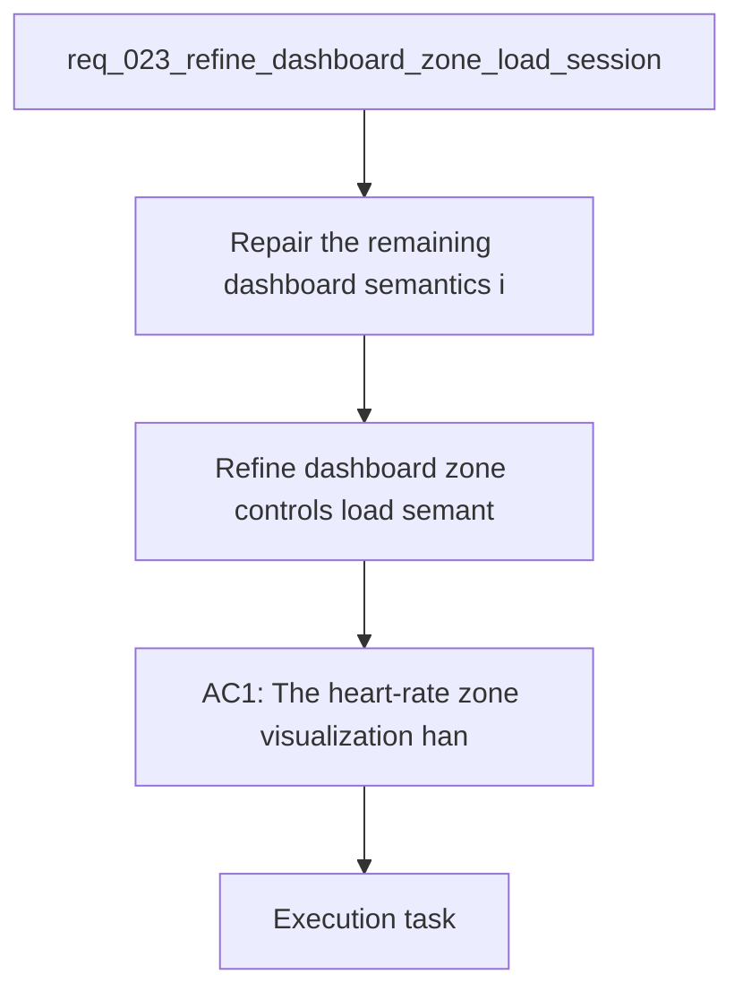

## item_025_refine_dashboard_zone_controls_load_semantics_session_typing_and_metric_documentation - Refine dashboard zone controls, load semantics, session typing, and metric documentation
> From version: d4506d3
> Schema version: 1.0
> Status: Done
> Understanding: 98%
> Confidence: 95%
> Progress: 100%
> Complexity: High
> Theme: Analytics
> Reminder: Update status/understanding/confidence/progress and linked request/task references when you edit this doc.

# Problem
- Repair the remaining dashboard semantics issues around heart-rate zones, relative load, and missing non-relative load so the graphs match the underlying coaching meaning.
- Add explicit session-type classification for running sessions and expose its distribution over `1 mois`, `3 mois`, and `1 an`.
- Add optional 7-day smoothing for sleep and HRV without losing access to the raw signal.
- Document the analytics formulas, provenance, and extraction rules used to derive dashboard metrics from raw data.
- The current dashboard has already improved chart structure, cadence handling, and scientific explanations, but several coaching semantics are still not trustworthy enough.

# Scope
- In:
  - heart-rate zone period semantics
  - relative and non-relative load semantics
  - running session typing and period distributions
  - raw versus optional 7-day smoothing for sleep and HRV
  - one technical documentation artifact for metric calculations and provenance
- Out:
  - auth or Garmin Connect work
  - import workflow changes
  - unrelated chart layout or theme work not needed to make these metrics trustworthy

# Acceptance criteria
- AC1: The heart-rate zone visualization handles `1 mois / 3 mois / 1 an` coherently:
  - either the selected period changes the displayed data
  - or the period control is removed from that chart if the concept is not meaningful there
- AC2: The combined pace / cadence / HR graph removes the low/high cadence band overlay if it reduces readability more than it adds signal.
- AC3: Sleep and HRV expose:
  - a raw view
  - and an optional 7-day moving-average view
- AC4: The relative-load metric is audited and either:
  - corrected
  - or explicitly redefined and explained
- AC5: A non-relative load chart is visible again in the dashboard or in its detailed modals.
- AC6: Running activities are classified into session types with a documented heuristic or rule set.
- AC7: The dashboard shows the distribution of running session types over `1 mois`, `3 mois`, and `1 an`.
- AC8: The new running session-type visualization makes it possible to distinguish the recent mix of:
  - easy jog
  - quality
  - long run
- AC9: A dedicated documentation artifact explains for each key dashboard metric:
  - raw source
  - extraction logic
  - transformation
  - smoothing if any
  - formula
  - interpretation
- AC10: The documentation and UI stay consistent with `ADR 005`, so French text and accented characters remain correct.

# AC Traceability
- AC1 -> Scope: The heart-rate zone visualization handles `1 mois / 3 mois / 1 an` coherently:. Proof: capture validation evidence in this doc.
- AC2 -> Scope: either the selected period changes the displayed data. Proof: capture validation evidence in this doc.
- AC3 -> Scope: or the period control is removed from that chart if the concept is not meaningful there. Proof: capture validation evidence in this doc.
- AC2 -> Scope: The combined pace / cadence / HR graph removes the low/high cadence band overlay if it reduces readability more than it adds signal.. Proof: capture validation evidence in this doc.
- AC3 -> Scope: Sleep and HRV expose:. Proof: capture validation evidence in this doc.
- AC4 -> Scope: a raw view. Proof: capture validation evidence in this doc.
- AC5 -> Scope: and an optional 7-day moving-average view. Proof: capture validation evidence in this doc.
- AC4 -> Scope: The relative-load metric is audited and either:. Proof: capture validation evidence in this doc.
- AC6 -> Scope: corrected. Proof: capture validation evidence in this doc.
- AC7 -> Scope: or explicitly redefined and explained. Proof: capture validation evidence in this doc.
- AC5 -> Scope: A non-relative load chart is visible again in the dashboard or in its detailed modals.. Proof: capture validation evidence in this doc.
- AC6 -> Scope: Running activities are classified into session types with a documented heuristic or rule set.. Proof: capture validation evidence in this doc.
- AC7 -> Scope: The dashboard shows the distribution of running session types over `1 mois`, `3 mois`, and `1 an`.. Proof: capture validation evidence in this doc.
- AC8 -> Scope: The new running session-type visualization makes it possible to distinguish the recent mix of:. Proof: capture validation evidence in this doc.
- AC9 -> Scope: easy jog. Proof: capture validation evidence in this doc.
- AC10 -> Scope: quality. Proof: capture validation evidence in this doc.
- AC11 -> Scope: long run. Proof: capture validation evidence in this doc.
- AC9 -> Scope: A dedicated documentation artifact explains for each key dashboard metric:. Proof: capture validation evidence in this doc.
- AC12 -> Scope: raw source. Proof: capture validation evidence in this doc.
- AC13 -> Scope: extraction logic. Proof: capture validation evidence in this doc.
- AC14 -> Scope: transformation. Proof: capture validation evidence in this doc.
- AC15 -> Scope: smoothing if any. Proof: capture validation evidence in this doc.
- AC16 -> Scope: formula. Proof: capture validation evidence in this doc.
- AC17 -> Scope: interpretation. Proof: capture validation evidence in this doc.
- AC10 -> Scope: The documentation and UI stay consistent with `ADR 005`, so French text and accented characters remain correct.. Proof: capture validation evidence in this doc.

# Decision framing
- Product framing: Required
- Product signals: navigation and discoverability, experience scope
- Product follow-up: Create or link a product brief before implementation moves deeper into delivery.
- Architecture framing: Required
- Architecture signals: data model and persistence, security and identity
- Architecture follow-up: Create or link an architecture decision before irreversible implementation work starts.

# Links
- Product brief(s): `prod_003_scientific_dashboard_charts_and_sport_specific_volume_filtering`, `prod_004_scientific_chart_centering_and_timeframe_selector`
- Architecture decision(s): `adr_004_scientific_charts_for_sport_specific_volumes_and_data_recalculation`, `adr_005_choose_end_to_end_utf_8_and_nfc_text_policy`, `adr_006_choose_dynamic_chart_windows_and_cadence_normalization`
- Request: `req_023_refine_dashboard_zone_load_session_typing_and_metric_documentation`
- Primary task(s): `task_026_refine_dashboard_zone_load_session_typing_and_metric_documentation`
<!-- When creating a task from this item, add: Derived from `this file path` in the task # Links section -->

# AI Context
- Summary: Refine dashboard semantics around heart-rate zones, load, session classification, and analytics documentation.
- Keywords: heart-rate zones, relative load, load chart, sleep smoothing, hrv smoothing, session typing, easy run, quality, long run, analytics formulas, dashboard documentation
- Use when: Use when scoping a dashboard analytics wave that must improve both metric trustworthiness and metric explainability.
- Skip when: Skip when the work is about auth, import orchestration, or unrelated shell UX.
# References
- `logics/skills/logics-ui-steering/SKILL.md`

# Priority
- Impact: High
- Urgency: Medium

# Notes
- Derived from request `req_023_refine_dashboard_zone_load_session_typing_and_metric_documentation`.
- Source file: `logics\request\req_023_refine_dashboard_zone_load_session_typing_and_metric_documentation.md`.
- Keep this backlog item as one bounded delivery slice; create sibling backlog items for the remaining request coverage instead of widening this doc.
- Request context seeded into this backlog item from `logics\request\req_023_refine_dashboard_zone_load_session_typing_and_metric_documentation.md`.
