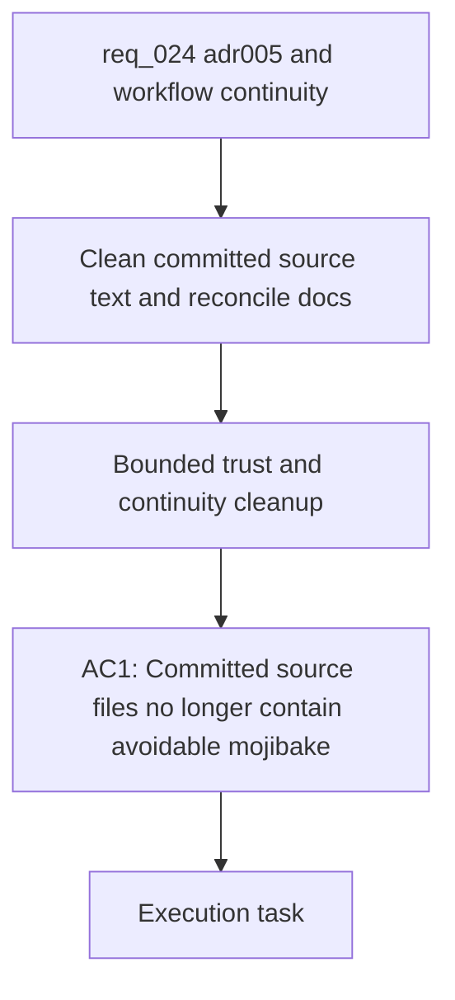

## item_026_finish_adr_005_source_text_cleanup_and_reconcile_dashboard_logics_continuity - Finish ADR 005 source text cleanup and reconcile dashboard Logics continuity
> From version: 20ee215
> Schema version: 1.0
> Status: Done
> Understanding: 95%
> Confidence: 93%
> Progress: 100%
> Complexity: High
> Theme: General
> Reminder: Update status/understanding/confidence/progress and linked request/task references when you edit this doc.

# Problem
- The repository still contains committed source text that should have been corrected directly at the source under ADR 005, especially on active PWA and analytics-facing paths.
- The dashboard Logics chain no longer fully matches the actual delivery state after the overlapping chart and analytics waves `017`, `018`, `022`, `023`, `024`, `025`, and `026`.
- This leaves two trust gaps at once:
  - some user-facing text is still correct only because runtime repair masks bad source strings
  - some workflow docs still imply open or inconsistent work even when later waves already absorbed part of the scope
- The repository needs one bounded cleanup slice that restores trust in both the text sources and the dashboard delivery metadata without widening product scope.

# Scope
- In:
  - clean committed mojibake or broken French text in active source files where the correct text is already known
  - review runtime text-repair hooks and keep them only where they still serve as justified fallback protection
  - reconcile request/backlog/task continuity for the dashboard waves around `017`, `018`, `022`, `023`, `024`, `025`, and `026`
  - refresh `logics/INDEX.md` and `logics/RELATIONSHIPS.md` if they become stale after the reconciliation
- Out:
  - new dashboard features
  - unrelated refactors
  - rewriting git history
  - deleting delivery traceability just to make the workflow look cleaner

# Acceptance criteria
- AC1: Committed source files no longer contain avoidable mojibake or broken French strings on active user-facing or workflow-facing paths when the text can be corrected directly at the source.
- AC2: Edited text-bearing files preserve `UTF-8 + NFC` handling in line with ADR 005, including PWA copy, diagnostics, logs, docs, JSON-related outputs, and launcher-facing text when touched.
- AC3: Runtime text-repair code is reduced to justified fallback behavior and is no longer carrying known source regressions as the primary fix path.
- AC4: Validation covers both targeted encoding regressions and the relevant existing automated test suite for the affected surfaces.
- AC5: The dashboard request/backlog/task chain is reconciled so documents around `017`, `018`, `022`, `023`, `024`, `025`, and `026` accurately distinguish delivered work, absorbed scope, and any real remainder.
- AC6: Workflow reconciliation preserves historical traceability instead of flattening the story into a misleading single closure.
- AC7: `logics/INDEX.md` and `logics/RELATIONSHIPS.md` are refreshed if they are left stale by the cleanup.
- AC8: The resulting repo state makes the post-cleanup remainder explicit, if any still exists after the reconciliation.

# AC Traceability
- AC1 -> Scope: clean committed mojibake or broken French text in active source files where the correct text is already known. Proof: corrected source files and targeted search results.
- AC2 -> Scope: review runtime text-repair hooks and keep them only where they still serve as justified fallback protection. Proof: code review and diff of text-repair paths.
- AC3 -> Scope: clean committed mojibake or broken French text in active source files where the correct text is already known. Proof: corrected source files and runtime behavior after source cleanup.
- AC4 -> Scope: clean committed mojibake or broken French text in active source files where the correct text is already known. Proof: targeted encoding checks plus relevant automated tests.
- AC5 -> Scope: reconcile request/backlog/task continuity for the dashboard waves around `017`, `018`, `022`, `023`, `024`, `025`, and `026`. Proof: updated linked docs with coherent indicators and links.
- AC6 -> Scope: reconcile request/backlog/task continuity for the dashboard waves around `017`, `018`, `022`, `023`, `024`, `025`, and `026`. Proof: retained references and explicit closure or remainder notes.
- AC7 -> Scope: refresh `logics/INDEX.md` and `logics/RELATIONSHIPS.md` if they become stale after the reconciliation. Proof: regenerated derived docs when needed.
- AC8 -> Scope: reconcile request/backlog/task continuity for the dashboard waves around `017`, `018`, `022`, `023`, `024`, `025`, and `026`. Proof: clear final notes about remaining work or confirmed closure.

# Decision framing
- Product framing: Consider
- Product signals: experience scope
- Product follow-up: Reuse the linked product briefs; no new product brief is expected unless the reconciliation exposes a still-open dashboard UX slice that lacks framing.
- Architecture framing: Required
- Architecture signals: data model and persistence, state and sync
- Architecture follow-up: Reuse ADR 005 and ADR 006 as the governing decisions for text integrity and dashboard window semantics during this cleanup wave.

# Links
- Product brief(s): `prod_003_scientific_dashboard_charts_and_sport_specific_volume_filtering`, `prod_004_scientific_chart_centering_and_timeframe_selector`
- Architecture decision(s): `adr_005_choose_end_to_end_utf_8_and_nfc_text_policy`, `adr_006_choose_dynamic_chart_windows_and_cadence_normalization`
- Request: `req_024_finish_adr_005_source_text_cleanup_and_reconcile_dashboard_logics_continuity`
- Primary task(s): `task_027_finish_adr_005_source_text_cleanup_and_reconcile_dashboard_logics_continuity`
<!-- When creating a task from this item, add: Derived from `this file path` in the task # Links section -->

# AI Context
- Summary: Execute the trust and continuity cleanup wave for ADR 005 source text and dashboard Logics reconciliation.
- Keywords: adr 005, utf-8, nfc, mojibake, source cleanup, workflow reconciliation, dashboard history, logics continuity
- Use when: Use when implementing the cleanup wave that corrects source text and reconciles dashboard delivery docs without adding feature scope.
- Skip when: Skip when the work is about a new dashboard capability, Garmin auth, or unrelated code cleanup.

# Priority
- Impact: High
- Urgency: Medium

# Notes
- Derived from request `req_024_finish_adr_005_source_text_cleanup_and_reconcile_dashboard_logics_continuity`.
- Source file: `logics/request/req_024_finish_adr_005_source_text_cleanup_and_reconcile_dashboard_logics_continuity.md`.
- Keep this backlog item bounded: if reconciliation uncovers a genuine new feature remainder, create a sibling backlog item rather than overloading this cleanup slice.
- Completed on `2026-04-25` through `task_027_finish_adr_005_source_text_cleanup_and_reconcile_dashboard_logics_continuity`.
