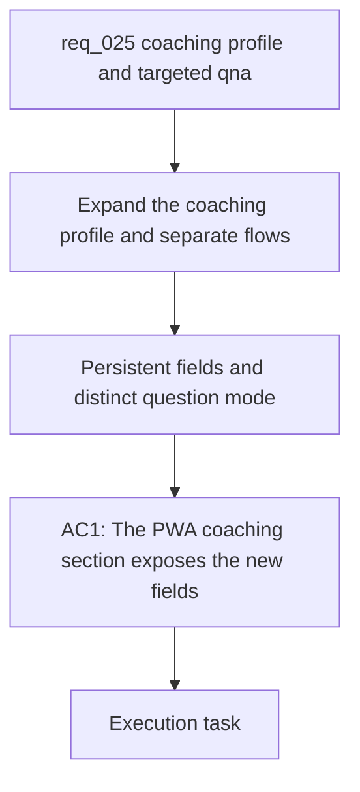

## item_027_expand_coaching_inputs_persist_constraints_and_add_targeted_training_questions_flow - Expand coaching inputs, persist constraints, and add a targeted training questions flow
> From version: 20260416-navfix30
> Schema version: 1.0
> Status: Done
> Understanding: 95%
> Confidence: 93%
> Progress: 100%
> Complexity: High
> Theme: Health
> Reminder: Update status/understanding/confidence/progress and linked request/task references when you edit this doc.

# Problem
- The current coaching composer is too narrow for practical planning changes because it centers almost everything on one goal field plus a generic constraint path.
- The user needs a richer persistent coaching profile with separate free-form fields so small planning adjustments do not require rewriting the entire context.
- The current coaching journey still reflects an older clarification-first flow, while the new expected behavior is to collect enough useful context directly in the form and generate the plan without a separate clarification step.
- The coaching surface also lacks a distinct targeted question mode that can answer a precise training question from recent data and the latest saved plan without regenerating a new plan by default.

# Scope
- In:
  - add separate free-form persisted fields for `blessure`, `fatigue`, `maladie`, `emploi du temps`, `disponibilité`, `température`, `déplacements`, and `autres sports`
  - keep `objective` as the only mandatory planning field
  - persist and prefill the expanded coaching profile through the local coaching storage path
  - remove the dedicated `Poser les questions` action from the main PWA coaching flow
  - place `Générer le planning` after the objective and constraints fields
  - add a free-form targeted training question field with its action placed after that field
  - make the targeted question flow answer in the visible transcript only for the first slice
  - send recent local data, the current coaching profile, and the latest saved plan when available to the targeted question flow
  - allow the targeted question flow to answer even when no previous plan exists, with an explicit missing-plan fallback
  - preserve `UTF-8 + NFC` French text quality across UI, payloads, storage, and prompts
- Out:
  - long-range periodization redesign
  - calendar sync or external agenda integrations
  - a dedicated persisted Q and A archive for the first slice
  - medical diagnosis features
  - turning the targeted question action into hidden plan regeneration

# Acceptance criteria
- AC1: The PWA coaching section exposes:
  - one mandatory `objective` field
  - distinct free-form fields for `blessure`, `fatigue`, `maladie`, `emploi du temps`, `disponibilité`, `température`, `déplacements`, and `autres sports`
  - one free-form field for the targeted training question
- AC2: All added non-objective fields are optional and are treated as null or empty-by-design when not filled.
- AC3: The expanded coaching fields are saved locally and prefilled on the next load so the operator can edit the profile incrementally.
- AC4: The plan-generation flow uses the mandatory objective plus all non-null saved constraints and does not require a separate clarification round.
- AC5: The dedicated `Poser les questions` action is removed from the main PWA coaching journey.
- AC6: The `Générer le planning` action appears after the objective and constraint fields, and the targeted question action appears after the targeted question field.
- AC7: The targeted question action sends the current coaching profile, recent local data, and the latest saved plan when available, then answers in the transcript without regenerating a replacement weekly plan by default.
- AC8: If no previous plan exists, the targeted question flow still returns a useful answer from the current coaching profile and recent data while stating that no saved plan context was available.
- AC9: The targeted question answer is transcript-only in this first slice and does not create a dedicated persisted Q and A archive.
- AC10: The implementation keeps plan generation and targeted question answering separate at the UI, API, and persistence levels.
- AC11: Validation covers local persistence, prefill behavior, null handling, direct plan generation without clarification, and targeted question behavior with and without a saved plan.
- AC12: All changed user-facing and workflow-facing strings preserve correct French accents in line with ADR 005.

# AC Traceability
- AC1 -> Scope: add separate free-form persisted fields for the requested health and non-health constraints plus the targeted question field. Proof: rendered coach form and bound input state.
- AC2 -> Scope: keep `objective` as the only mandatory planning field. Proof: empty optional fields do not block flow.
- AC3 -> Scope: persist and prefill the expanded coaching profile through the local coaching storage path. Proof: saved profile and restored UI values.
- AC4 -> Scope: remove the clarification-first dependency and generate the plan from the expanded form. Proof: successful direct plan generation from entered context.
- AC5 -> Scope: remove the dedicated `Poser les questions` action from the main PWA coaching flow. Proof: updated UI and event wiring.
- AC6 -> Scope: reorder the main coach actions around the new fields. Proof: rendered composer layout and interaction order.
- AC7 -> Scope: send recent local data, the current coaching profile, and the latest saved plan when available to the targeted question flow. Proof: request payload and transcript answer behavior.
- AC8 -> Scope: allow the targeted question flow to answer even when no previous plan exists. Proof: explicit fallback answer path.
- AC9 -> Scope: keep the targeted question flow transcript-only for the first slice. Proof: no dedicated persisted Q and A artifact is written.
- AC10 -> Scope: keep plan generation and targeted question answering separate at the UI, API, and persistence levels. Proof: distinct handlers and no unintended plan overwrite.
- AC11 -> Scope: cover persistence, prefill, null handling, and both coach branches in validation. Proof: targeted automated tests and checks.
- AC12 -> Scope: preserve `UTF-8 + NFC` French text quality across touched surfaces. Proof: reviewed strings and relevant regression checks.

# Decision framing
- Product framing: Required
- Product signals: engagement loop, experience scope
- Product follow-up: Reuse the current PWA product brief; add a new brief only if the coaching surface expands into a broader planning product beyond this bounded slice.
- Architecture framing: Required
- Architecture signals: data model and persistence, contracts and integration, state and sync
- Architecture follow-up: Reuse ADR 005 for text guarantees; add a focused ADR only if the split between plan generation and targeted question answering introduces an irreversible contract or persistence boundary.

# Links
- Product brief(s): `prod_000_local_first_pwa_coach_dashboard`
- Architecture decision(s): `adr_005_choose_end_to_end_utf_8_and_nfc_text_policy`
- Request: `req_025_expand_coaching_inputs_persist_constraints_and_add_targeted_training_questions_flow`
- Primary task(s): `task_028_expand_coaching_inputs_persist_constraints_and_add_targeted_training_questions_flow`
<!-- When creating a task from this item, add: Derived from `this file path` in the task # Links section -->

# AI Context
- Summary: Expand the persistent coaching profile and add a separate targeted training question flow without keeping the old clarification-first UX.
- Keywords: coaching, pwa, profile, constraints, injury, fatigue, illness, availability, plan generation, targeted question, local persistence
- Use when: Use when implementing the next major coaching UX wave in the PWA and backend.
- Skip when: Skip when the work is only about analytics cards, Garmin sync, or unrelated UI polish.

# Priority
- Impact: High
- Urgency: High

# Notes
- Derived from request `req_025_expand_coaching_inputs_persist_constraints_and_add_targeted_training_questions_flow`.
- Source file: `logics/request/req_025_expand_coaching_inputs_persist_constraints_and_add_targeted_training_questions_flow.md`.
- Keep this backlog item bounded: if implementation reveals that planning generation and targeted question answering should ship separately, split the item into sibling delivery slices rather than widening the first task.
- Delivered through `task_028_expand_coaching_inputs_persist_constraints_and_add_targeted_training_questions_flow`.
- The final PWA button copy was normalized during implementation to:
  - `Enregistrer le contexte`
  - `Générer le planning`
  - `Poser la question`
