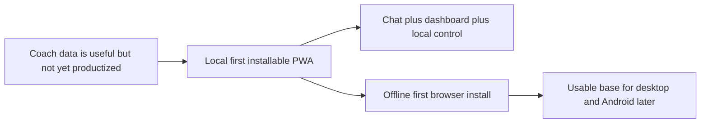

## prod_000_local_first_pwa_coach_dashboard - Local-first PWA coach dashboard
> Date: 2026-04-11
> Status: Active
> Related request: `req_008_local_first_pwa_coach_dashboard`
> Related backlog: `item_009_local_first_pwa_coach_dashboard`
> Related task: `task_009_local_first_pwa_coach_dashboard`
> Related architecture: [adr_001_choose_local_pwa_storage_and_provider_integration](../architecture/adr_001_choose_local_pwa_storage_and_provider_integration.md)
> Reminder: Update status, linked refs, scope, decisions, success signals, and open questions when you edit this doc.

# Overview
Coach Garmin should ship first as a local-first, installable PWA that feels like a real product surface, not just a browser page.
The user should be able to chat, clarify goals, inspect app health, and understand recent import and training signals without leaving the app.
The product should stay offline-first by default and keep the local data foundation as the source of truth.
This version is meant to become the stable base for later desktop packaging and eventually Android.

# Product problem
The project already has a strong local Garmin pipeline and a useful CLI coach, but the experience is still too technical to be a first-class product.
The user needs a simple way to open the coach in a browser, ask questions, keep data local, and see whether the app is healthy and the data is fresh.

# Target users and situations
- A runner who wants to use Garmin data for coaching without losing privacy or control.
- A developer-friendly power user who can tolerate local setup but wants a cleaner daily interface.
- A future mobile user who may later want the same product surface on Android.

# Goals
- Make the first PWA version installable and understandable in under a minute.
- Keep the coach chat as the main experience.
- Make local data storage and AI provider choice visible and intentional.
- Surface enough dashboard information to build trust in the app state and data freshness.

# Non-goals
- Replace the existing analytics engine.
- Solve Android packaging in the first slice.
- Build a large BI-style dashboard.
- Hide local data choices behind opaque defaults.

# Scope and guardrails
- In: installable PWA shell, chat surface, local storage selection, AI provider selection, compact dashboard.
- In: offline-first default behavior with local browsing of app state and imported data.
- Out: native mobile features, multi-user cloud sync, deep analytics overhauls, or a large settings matrix.

# Key product decisions
- The PWA should be the first product surface because it gives the fastest path to installability and cross-device reach.
- The default backend should be Ollama because the product is meant to remain useful without paying for cloud AI.
- The local storage directory should be chosen explicitly because the product depends on transparent data ownership.
- The dashboard should stay small and operational instead of becoming a separate analytics product.

# Success signals
- A user can install the app and reach chat within one browser session.
- The user can clearly see where local data lives and which AI provider is active.
- The app reports health, import status, and recent analysis without needing console logs.
- The product can later be wrapped for desktop or mobile without rewriting the core UI.

# References
- `logics/request/req_008_local_first_pwa_coach_dashboard.md`
- `logics/backlog/item_009_local_first_pwa_coach_dashboard.md`
- `logics/tasks/task_009_local_first_pwa_coach_dashboard.md`
# Open questions
- Which dashboard metrics are the most valuable at a glance for a runner?
- Should the first release prioritize desktop install UX or offline browsing UX?
- Which later wrapper path should be optimized first after the PWA: Electron for desktop or Capacitor for Android?
