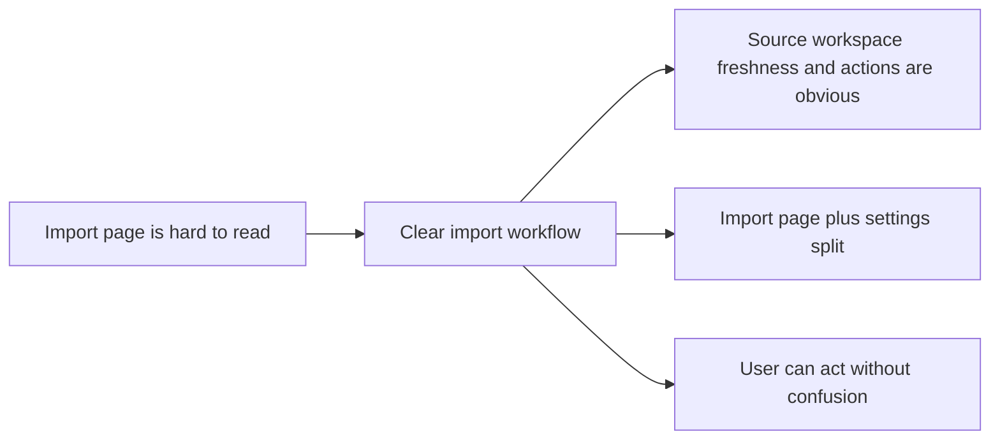

## prod_001_import_workflow_clarity_and_non_blocking_garmin_sync - Import workflow clarity and non-blocking Garmin sync
> Date: 2026-04-13
> Status: Active
> Related request: [req_012_clarify_import_workflow_accent_handling_and_refresh_actions](../request/req_012_clarify_import_workflow_accent_handling_and_refresh_actions.md)
> Related backlog: [item_013_clarify_import_workflow_accent_handling_and_refresh_actions](../backlog/item_013_clarify_import_workflow_accent_handling_and_refresh_actions.md)
> Related task: [task_013_clarify_import_workflow_accent_handling_and_refresh_actions](../tasks/task_013_clarify_import_workflow_accent_handling_and_refresh_actions.md)
> Related architecture: [adr_002_place_workspace_in_settings_and_add_non_blocking_garmin_sync](../architecture/adr_002_place_workspace_in_settings_and_add_non_blocking_garmin_sync.md)
> Reminder: Update status, linked refs, scope, decisions, success signals, and open questions when you edit this doc.

# Overview
Make the import screen easy to understand at a glance.
The user should immediately see where Garmin source files live, how fresh the local workspace is, and what each action does.
The local workspace path should live in Settings, while the import page keeps the Garmin source path near the import action.
Garmin Connect sync should be offered as a non-blocking action that can fail gracefully without stopping the app.

# Product problem
The current import experience mixes source selection, workspace selection, freshness, and action buttons in a way that is too hard to parse quickly.
The user should not need to infer whether they are importing from a local Garmin export, reusing an existing workspace, or trying a sync that may fail.
The product needs a clearer first impression so the import workflow feels trustworthy instead of technical.

# Target users and situations
- A runner who wants to manage Garmin data locally without losing track of freshness or source.
- A power user who wants clear state, explicit actions, and minimal ambiguity.
- A developer-minded user who still wants the product to read like a product, not a debug screen.

# Goals
- Make the import flow understandable in seconds.
- Make the source Garmin path visible where it matters most.
- Move the workspace path to Settings so the import page stays focused.
- Show freshness and last import state without forcing the user to inspect logs.
- Offer Garmin Connect sync as a visible but non-blocking action.

# Non-goals
- Redesign the analytics dashboard.
- Change the underlying import engine.
- Hide the local workspace model behind an opaque browser-only store.
- Turn Garmin Connect sync into a mandatory step.

# Scope and guardrails
- In: Import page wording, action ordering, source path placement, freshness messaging, and non-blocking sync affordance.
- In: Settings placement for the workspace path and other technical configuration.
- In: Accent and encoding cleanup for labels involved in the import flow.
- Out: New analytics algorithms or data model changes.
- Out: Deep redesign of the coach chat or dashboard.

# Key product decisions
- Keep the Garmin source path close to the import action so the user sees what will be ingested.
- Move the local workspace path into Settings because it is configuration, not an immediate import decision.
- Treat Garmin Connect sync as an optional best-effort action that should never block the rest of the app.
- Make freshness and last import visible enough that the user can decide whether to import, sync, or simply reuse the workspace.

# Success signals
- The user can explain the difference between source, workspace, import, refresh, and sync after one glance at the screen.
- The import page has fewer ambiguous controls and fewer broken-looking accented strings.
- The user can start from the right action without needing terminal logs.
- Garmin Connect sync failures are reported clearly without breaking the product flow.

# References
- (none yet)
# Open questions
- Should the import page keep a separate sync button or fold sync into a grouped action row?
- Should the freshness summary prioritize last activity age or last sync age?
- Should the source path input stay inline or become a compact advanced field once the labels are clearer?
