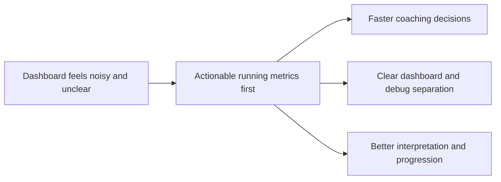

## prod_002_refine_dashboard_metrics_and_data_processing_for_running_analytics - Refine dashboard metrics and data processing for running analytics
> Date: 2026-04-14
> Status: Active
> Related request: `req_013_refine_dashboard_metrics_and_data_processing_for_pace_hr_cadence_coach_analytics`
> Related backlog: `item_014_refine_dashboard_metrics_and_data_processing_for_pace_hr_cadence_coach_analytics`
> Related task: `task_014_refine_dashboard_metrics_and_data_processing_for_pace_hr_cadence_coach_analytics`
> Related architecture: `adr_003_choose_monotone_pace_hr_curve_and_cadence_first_dashboard_metrics`
> Reminder: Update status, linked refs, scope, decisions, success signals, and open questions when you edit this doc.

# Overview
Make the running dashboard useful at a glance by centering it on actionable metrics rather than generic summaries.
Keep the main view focused on weekly volume, load with reference bands, sleep with context, pace-versus-heart-rate shape, and cadence progression.
Move debug-only or explanatory metrics out of the main dashboard so the coach feels clear, not crowded.
The expected outcome is faster interpretation, less ambiguity, and better coaching decisions from recent Garmin data.

# Product problem
The running dashboard was mixing useful coaching signals with low-value or ambiguous cards.
That made it harder to answer a simple question quickly: what does my recent running data say I should do next?

# Target users and situations
- A runner using the local-first Coach Garmin PWA on a desktop or laptop.
- A user who imports Garmin data locally and wants a clear coaching overview before opening the coach chat.

# Goals
- Surface the few metrics that genuinely influence running decisions.
- Make freshness, load, sleep, pace/HR, and cadence understandable at a glance.
- Reduce confusion caused by technical or unlabeled signals in the main dashboard.

# Non-goals
- Reworking Garmin auth or sync plumbing in this product slice.
- Building a medical or injury-risk product.
- Replacing the coach conversation flow with a full analytics workstation.

# Scope and guardrails
- In: the dashboard main view, its trend cards, and the terminology shown around the key running signals.
- In: the distinction between user-facing signals and debug-only diagnostics.
- Out: the broader auth/sync stack and unrelated shell navigation work.

# Key product decisions
- Keep the main dashboard focused on actionable running metrics.
- Present pace-versus-heart-rate as a visible monotone relationship, not a generic regression label.
- Treat cadence as a first-class coaching signal, not an accessory stat.
- Show load and sleep with norms or reference bands rather than raw numbers alone.
- Keep coverage and implementation diagnostics available, but not prominent in the user-facing dashboard.

# Success signals
- Fewer dashboard cards that the user cannot interpret quickly.
- The user can read the dashboard and understand freshness, load, cadence, pace/HR, and sleep without opening the coach chat.
- The dashboard supports better coaching decisions from recent data rather than displaying more numbers for their own sake.

# References
- `req_013_refine_dashboard_metrics_and_data_processing_for_pace_hr_cadence_coach_analytics`
- `item_014_refine_dashboard_metrics_and_data_processing_for_pace_hr_cadence_coach_analytics`
- `task_014_refine_dashboard_metrics_and_data_processing_for_pace_hr_cadence_coach_analytics`
- `Panorama technique pour coach_garmin.pdf`

# Open questions
- Should HRV stay visible in a compact recovery card, or remain a debug/context-only signal for now?
