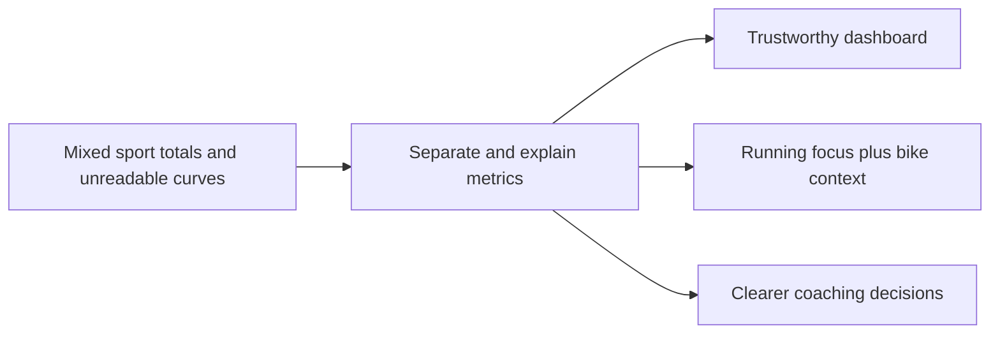

## prod_003_scientific_dashboard_charts_and_sport_specific_volume_filtering - Scientific dashboard charts and sport-specific volume filtering
> Date: 2026-04-14
> Status: Active
> Related request: `req_014_scientific_dashboard_charts_and_sport_specific_volume_filtering`
> Related backlog: `item_015_scientific_charts_sport_specific_volumes_and_data_recalculation_controls`
> Related task: [task_015_scientific_charts_sport_specific_volumes_and_data_recalculation_controls](../tasks/task_015_scientific_charts_sport_specific_volumes_and_data_recalculation_controls.md)
> Related architecture: `adr_004_scientific_charts_for_sport_specific_volumes_and_data_recalculation`
> Reminder: Update status, linked refs, scope, decisions, success signals, and open questions when you edit this doc.

# Overview
Make the dashboard trustworthy by separating running from non-running effort and by rendering curves in a readable scientific style.
The user should see the right sport volume in the right place, understand the curve immediately, and be able to refresh derived data when needed.
The outcome is clearer decision-making and fewer misleading metric totals.

# Product problem
The current dashboard can blur sport boundaries and make charts too hard to read.
That causes mistrust in the numbers and makes it harder to know whether the user is improving or simply seeing mixed activity volume.

# Target users and situations
- A runner using Coach Garmin locally on a desktop.
- A user who also cycles or does strength training and wants the dashboard to keep the running signal clean.

# Goals
- Keep running totals clean and sport-specific.
- Make the main charts readable enough to use as decision tools.
- Give the user a visible way to refresh derived metrics when the data needs recalculation.

# Non-goals
- Building a separate full cycling product.
- Turning the dashboard into a generic BI tool.
- Replacing the coach chat with a report builder.

# Scope and guardrails
- In: scientific chart rendering, sport-specific volume separation, and a recalculation action.
- In: the dashboard signals that should stay on the running side of the product.
- Out: Garmin auth changes, sync hardening, and unrelated shell/navigation work.

# Key product decisions
- Keep bike visible, but separate from running totals.
- Prefer clear axes, ticks, and hover values over decorative mini-charts.
- Expose a recalculation action instead of making the user wonder why a curve is stale.

# Success signals
- The user can tell at a glance which volume is running and which is cycling.
- Curves become readable enough to inspect values and trends without guessing.
- A stale dashboard can be refreshed without blocking the app.

# References
- `logics/request/req_014_scientific_dashboard_charts_and_sport_specific_volume_filtering.md`
- `logics/backlog/item_015_scientific_charts_sport_specific_volumes_and_data_recalculation_controls.md`
- `logics/architecture/adr_004_scientific_charts_for_sport_specific_volumes_and_data_recalculation.md`
# Open questions
- Should the bike graph live next to the running dashboard or inside a distinct sport subsection?
