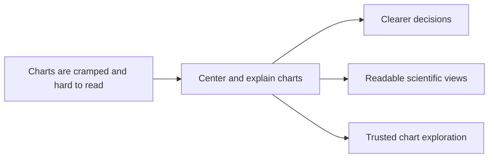

## prod_004_scientific_chart_centering_and_timeframe_selector - Scientific chart centering and timeframe selector
> Date: 2026-04-14
> Status: Active
> Related request: `req_017_scientific_charts_centered_timeframe_selector_and_french_text_fixes`
> Related backlog: `item_017_scientific_charts_centered_timeframe_selector_and_french_text_fixes`
> Related task: (none yet)
> Related architecture: (none yet)
> Reminder: Update status, linked refs, scope, decisions, success signals, and open questions when you edit this doc.

# Overview
Make chart exploration feel trustworthy, readable, and self-explanatory.
The user should be able to center a chart, switch between 1 month, 3 months, and 1 year, and immediately understand what the axes and labels mean.
The outcome is a dashboard that feels scientific instead of cramped or ambiguous, with French text rendered correctly throughout.

# Product problem
The current charts can feel squeezed, inconsistent, and difficult to interpret over time.
Important values are not always easy to inspect, and the user cannot always choose the right time window to match the question they are asking.
French labels and helper text also need to remain readable everywhere so the dashboard feels polished and trustworthy.

# Target users and situations
- A runner who wants to inspect recent trends without losing readability.
- A user who needs to compare short and long time windows depending on training context.

# Goals
- Make the main charts feel centered and readable in their viewing surface.
- Let the user switch chart analysis between 1 month, 3 months, and 1 year.
- Keep French text correct and legible in chart titles, axes, legends, and helper copy.

# Non-goals
- Reworking the whole analytics pipeline.
- Introducing a new visual language for the entire app.
- Adding unrelated dashboard sections that do not help chart interpretation.

# Scope and guardrails
- In: chart centering, timeframe selection, and French text clarity for chart surfaces.
- In: chart views that stay easy to inspect with labels, axes, and hover values.
- Out: model changes, Garmin sync changes, and unrelated UI sections.

# Key product decisions
- Prefer chart clarity over density when the user opens a detailed view.
- Give the user a visible timeframe choice so the view matches the coaching question.
- Keep text readable in French everywhere the chart explains itself.

# Success signals
- The user can read the chart title, axis, and legend without decoding broken text.
- The user can switch between 1 month, 3 months, and 1 year and see an immediate difference.
- A chart opened in detail feels centered, stable, and easier to compare.

# References
- `logics/request/req_017_scientific_charts_centered_timeframe_selector_and_french_text_fixes.md`
- `logics/backlog/item_017_scientific_charts_centered_timeframe_selector_and_french_text_fixes.md`

# Open questions
- Should every chart expose the same timeframe choices, or only the charts that benefit from long-range comparison?
