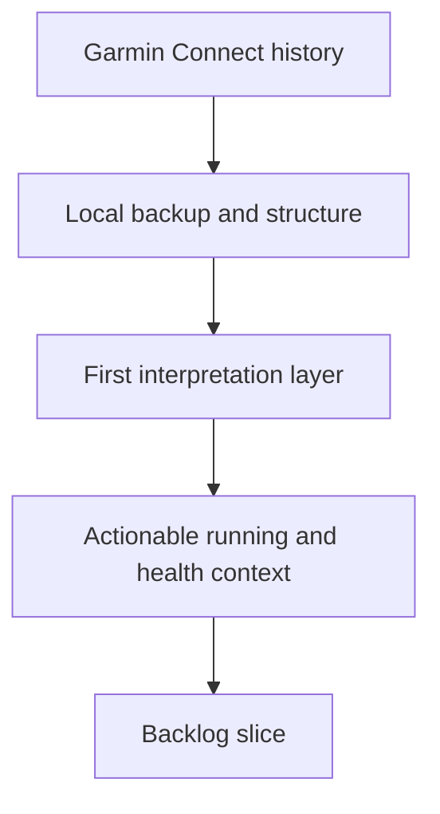

## req_000_backup_garmin_connect_data_and_build_first_interpretation_layer - Backup Garmin Connect data and build first interpretation layer
> From version: 0.1.0
> Schema version: 1.0
> Status: Ready
> Understanding: 95
> Confidence: 92
> Complexity: High
> Theme: Health
> Reminder: Update status/understanding/confidence and references when you edit this doc.

# Needs
- Create a reliable local backup workflow for the user's Garmin Connect data, covering as much historical data as realistically possible.
- Store the extracted data in a local format that preserves raw source fidelity and also prepares later analysis.
- Build a first interpretation layer that turns raw Garmin data into understandable signals for running and broader health/lifestyle coaching.
- Keep the solution repeatable so future syncs can refresh the local dataset without rebuilding everything manually.

# Context
- The primary source is Garmin Connect, which can expose training, activity, wellness, and health-related information.
- The user wants a local-first copy of personal data before building richer analysis and advice workflows on top of it.
- The intended downstream value is not only archival backup, but also practical interpretation for running guidance and daily life insights.
- The data is sensitive because it may include health indicators, activity history, sleep, recovery, heart metrics, and other private signals.
- The extraction path may depend on what Garmin officially exposes through exports, APIs, device sync artifacts, or browser-authenticated endpoints.
- The first delivery should prioritize broad extraction coverage, storage structure, and semantic organization over advanced coaching quality.
- The first delivery should be a reusable data foundation rather than a one-off personal script with tightly coupled assumptions.
- The user explicitly prefers decisions and later advice to rely first on raw or minimally transformed signals, with Garmin-derived indicators treated as optional secondary context because they may embed opaque biases.

# Scope
- In scope: identify a viable extraction approach for near-complete Garmin Connect history, define local storage strategy, and define a first-pass processing layer that groups and interprets core datasets.
- In scope: preserve provenance so each stored dataset can be traced back to its Garmin source and extraction timestamp.
- In scope: prepare downstream use cases such as running load review, recovery trends, sleep/activity correlation, and health signal summaries.
- Out of scope for the first request: medically validated recommendations, production-grade dashboards, multi-user support, and irreversible cloud publishing of personal data.
- Out of scope for the first request: any promise to extract data Garmin does not actually make accessible.

# Constraints
- The solution should prefer official or durable extraction paths when possible.
- Personal health data must remain local-only in the first version, with no external storage or external AI processing.
- The workflow should be rerunnable and resilient to partial failures, duplicate imports, and changing Garmin payloads.
- Raw exported data should remain accessible even after normalization or enrichment layers are introduced.
- The first sync mode should be manual and user-triggered.
- The first interpretation layer should remain deterministic and explainable, without AI dependencies.
- The interpretation layer should privilege raw source fields and transparent derived metrics over vendor-computed scores whenever both exist.

# Desired outcomes
- The user can trigger a local backup that captures the broadest feasible set of Garmin Connect data.
- The repository contains a clear storage model for raw data, normalized data, and derived insights.
- A first analysis layer can summarize useful signals instead of forcing later consumers to parse every raw payload directly.
- The project is ready for later features such as coaching prompts, longitudinal trend analysis, and health/running recommendations.
- The first advice outputs should prioritize running, then recovery and broader life/routine signals.
- Vendor-provided aggregate indicators can be stored when available, but should not be the primary analytical foundation.

# Acceptance criteria
- AC1: The request identifies the target Garmin data domains to back up, including activities and health/wellness signals, with explicit note that final coverage depends on source accessibility.
- AC2: The request defines the expected output layers: raw backup, normalized storage, and derived interpretation artifacts.
- AC3: The request describes success as a rerunnable local workflow rather than a one-off manual export.
- AC4: The request states privacy and data-handling constraints for sensitive personal information.
- AC5: The request defines at least one initial interpretation goal for running and at least one for broader health/lifestyle data.
- AC6: The request is specific enough to be promoted into backlog items for extraction, storage design, and first analytics/insight generation.
- AC7: The request lists the key open questions that still need user answers before implementation details are finalized.

# Definition of Ready (DoR)
- [ ] Problem statement is explicit and user impact is clear.
- [ ] Scope boundaries (in/out) are explicit.
- [ ] Acceptance criteria are testable.
- [ ] Dependencies and known risks are listed.

# Risks and dependencies
- Garmin Connect access patterns may change over time and may require authenticated sessions or manual export fallbacks.
- Some health datasets may be incomplete, device-dependent, region-dependent, or unavailable historically.
- Advice quality will depend on data completeness, temporal consistency, and the interpretation rules chosen for the first version.
- Local-only storage reduces privacy risk but raises expectations for backup discipline, disk organization, and local tooling reliability.
- Some Garmin-derived readiness or recovery scores may be useful as context, but they should be modeled as advisory fields rather than trusted ground truth.

# Clarifications
- Priority datasets for the first milestone: activities, sleep, heart rate, HRV, stress, Body Battery, steps, and intensity minutes.
- Delivery target: build a reusable base structure first, not just a one-user script.
- Interpretation strategy: no AI in the first version; start with deterministic summaries, rules, and aggregations.
- Advice priority: focus first on running guidance, then recovery and broader life-context signals.
- Privacy constraint: keep data local in the first version.
- Storage direction: choose a pragmatic local structure with raw source preservation plus a normalized analytical layer. Current recommendation: keep raw exports/payloads as-is and normalize into DuckDB tables for later analysis.
- Historical coverage target: get the broadest practical history possible without disproportionate complexity or fragile extraction flows.
- Sync mode target: manual, on demand.
- Extraction strategy confirmed: hybrid approach combining official export paths and authenticated automation when needed.
- Insight priorities confirmed: prioritize training load, fatigue/recovery, sleep quality, cardio consistency, running progression, overreaching signals, and lifestyle/performance correlations.
- Additional recovery-oriented fields such as training readiness and recovery time can be included when Garmin exposes them, but they should remain secondary to raw data and transparent computations.
- Analytical preference confirmed: trust raw or minimally transformed measurements first, then use Garmin-computed indicators only as supplementary signals.

# Open questions
- Define the exact formulas and thresholds for the first-wave derived indicators in the interpretation layer.
- Decide which Garmin vendor-computed indicators should be persisted for reference versus excluded from core analysis.

# Companion docs
- Product brief(s): (none yet)
- Architecture decision(s): `adr_000_choose_local_first_garmin_data_sync_and_storage_architecture`

# AI Context
- Summary: Build a local-first Garmin Connect backup workflow and a first semantic layer that organizes and interprets running and health data for future coaching use.
- Keywords: garmin, connect, backup, export, sync, health, running, metrics, local, interpretation
- Use when: Use when framing extraction scope, storage structure, privacy constraints, and first-pass insight generation for Garmin Connect data.
- Skip when: Skip when the work targets unrelated product areas or later-stage implementation details that belong in backlog/tasks.
# Backlog
- `item_000_backup_garmin_connect_data_and_build_first_interpretation_layer`
