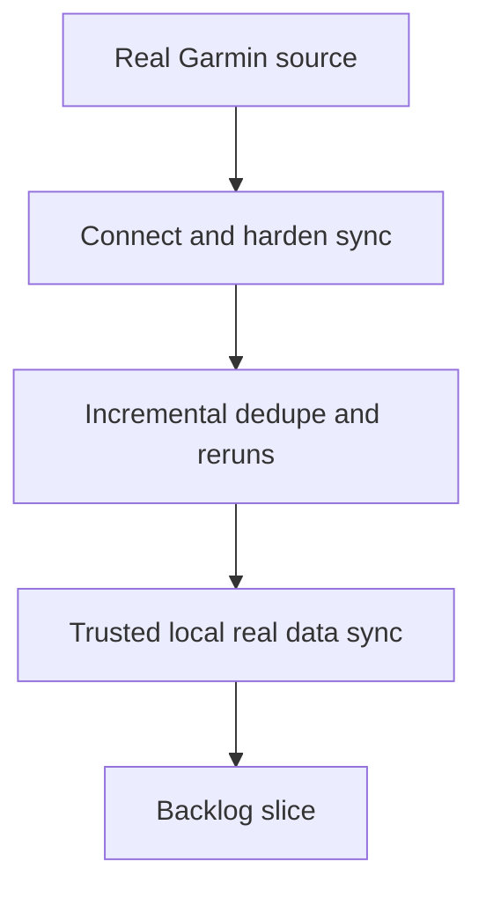

## req_001_connect_local_pipeline_to_a_real_garmin_source_and_harden_incremental_sync_on_user_data - Connect local pipeline to a real Garmin source and harden incremental sync on user data
> From version: 0.1.0
> Schema version: 1.0
> Status: Ready
> Understanding: 96
> Confidence: 91
> Complexity: High
> Theme: Health
> Reminder: Update status/understanding/confidence and references when you edit this doc.

# Needs
- Connect the current local-first Garmin pipeline to a real user data source instead of fixtures only.
- Support a reliable incremental sync workflow that can be rerun on real data without creating duplicate logical records.
- Validate the current storage, provenance, and normalization contracts against actual Garmin export shapes or authenticated retrieval payloads.
- Preserve the raw-first analytical philosophy while making ingestion robust enough for day-to-day personal use.

# Context
- The repository already contains a first local-first pipeline with manual import, raw artifact storage, DuckDB normalization, deterministic metrics, and fixture-based validation.
- The next step is to replace the synthetic/controlled path with ingestion from a real Garmin source and user-owned datasets.
- A prior request and delivery slice already established the architectural direction for local-only storage, raw preservation, provenance, and deterministic interpretation.
- The user wants privacy preserved locally and prefers raw or minimally transformed Garmin signals over vendor-computed aggregate scores.
- Real Garmin data may arrive through official exports, authenticated retrieval, or a hybrid of both, and actual payloads are expected to vary more than fixture data.
- Incremental sync behavior is now a primary concern: repeated syncs must be trustworthy, explainable, and safe on real data.
- The user now explicitly prefers an authenticated API/session-driven path as the first real-source implementation target rather than a manual export fallback.

# Scope
- In scope: connect the pipeline to at least one real Garmin data source path and validate ingestion against actual user data.
- In scope: define and implement incremental sync semantics for reruns, partial refreshes, and duplicate prevention on real datasets.
- In scope: harden dataset mapping and normalization against real Garmin payload variability for the priority datasets already targeted by the project.
- In scope: validate provenance, raw retention, normalized records, and deterministic outputs on real user-owned data while preserving local-only handling.
- Out of scope for this request: polished dashboards, conversational coaching, cloud sync, multi-user architecture, or medically validated interpretations.
- Out of scope for this request: promising full Garmin coverage if some datasets remain inaccessible or unstable in practice.

# Constraints
- Personal data must remain local-only during sync, storage, validation, and analysis.
- The implementation should target an authenticated Garmin API/session path first.
- Incremental sync must be safe to rerun and must avoid duplicate logical records even when raw files or payloads overlap across runs.
- The system should continue preserving raw source artifacts and provenance metadata for audit and reprocessing.
- Session cookies or equivalent authenticated material must remain local and untracked via `.gitignore`, with no secrets committed to the repository.
- The first implementation should prioritize a narrower but more reliable coverage on the blocking datasets over premature broad coverage.

# Desired outcomes
- The user can run the pipeline on real Garmin data and obtain a successful local sync.
- Re-running sync on the same or overlapping real data does not create duplicate logical records in the normalized layer.
- The project documents the real dataset coverage achieved, the unsupported gaps, and the known format assumptions.
- The current deterministic metrics layer continues to work on real data or explicitly reports where it needs adjustment.
- The repository is ready for the next implementation slice focused on wider dataset support or richer analysis, based on real-world ingestion evidence.
- The first successful real-world target datasets are activities, sleep, heart rate, HRV, stress, and steps.

# Acceptance criteria
- AC1: The request defines the first real Garmin source path as an authenticated API/session-based integration.
- AC2: The request defines success for incremental sync, including rerun safety, duplicate prevention, and provenance continuity across runs.
- AC3: The request makes explicit that validation must happen on actual user-owned Garmin data, not only fixtures or synthetic samples.
- AC4: The request states that session cookies or equivalent credentials must be stored locally and kept outside versioned files.
- AC5: The request defines the expected outputs of this phase: real ingestion coverage, normalization hardening, deduplication behavior, and validation evidence.
- AC6: The request remains aligned with the existing ADR by preserving raw-first analytics, local-only handling, and deterministic interpretation as the foundation.
- AC7: The request is specific enough to be promoted into backlog items for real-source integration, incremental sync hardening, and real-data validation.
- AC8: The request identifies the first blocking real-world datasets for success as activities, sleep, heart rate, HRV, stress, and steps.

# Definition of Ready (DoR)
- [ ] Problem statement is explicit and user impact is clear.
- [ ] Scope boundaries (in/out) are explicit.
- [ ] Acceptance criteria are testable.
- [ ] Dependencies and known risks are listed.

# Risks and dependencies
- Garmin access paths may change, especially when authenticated retrieval depends on session behavior or unofficial endpoints.
- Real user exports may contain unexpected field names, missing datasets, partial history, or inconsistent date semantics.
- Incremental deduplication may be non-trivial if Garmin identifiers differ across exports and authenticated payloads.
- Session and credential handling introduce security-sensitive implementation concerns that were not present in fixture-only validation.
- Some priority datasets may still require separate handling depending on device support, account history, or Garmin export behavior.
- The user is open to deciding later how much unofficial access is acceptable, so implementation boundaries must stay explicit and reversible.

# Clarifications
- This request builds directly on `req_000_backup_garmin_connect_data_and_build_first_interpretation_layer` and its delivered foundation slice.
- The existing ADR `adr_000_choose_local_first_garmin_data_sync_and_storage_architecture` remains the architectural baseline for this next phase.
- The main goal is to close the gap between a working local foundation and a reliable sync on real user-owned Garmin data.
- The expected focus is operational robustness, not UI or advanced advisory logic.
- Real-data validation is part of the need itself, not an optional follow-up.
- Real source priority is now explicit: authenticated API/session-based access first.
- The first success datasets are: activities, sleep, heart rate, HRV, stress, and steps.
- Coverage strategy preference is explicit: favor a smaller but more reliable ingestion scope first.
- If some datasets or access paths are difficult, document the gaps clearly instead of inflating complexity too early.
- Validation expectation is explicit: at least repeated overlapping sync runs on real data without duplicate logical records.
- Session material preference is explicit: local cookies/session state stored outside git, with `.gitignore` protection.
- The first implementation should not spend effort on anonymization infrastructure for local test data.
- Raw data remains the analytical priority over Garmin-computed summary scores.
- The user does not want to start with a manual-export-first path; authenticated integration is the intended starting point.

# Open questions
- What exact deduplication keys should define a logical record for each blocking dataset when overlapping authenticated syncs are rerun?
- Should local session persistence use a gitignored cookie file, environment variables, or a hybrid of both for renewability and safety?
- How much reliance on unofficial or reverse-engineered Garmin access is acceptable if the official authenticated path proves incomplete?
- Beyond one successful real sync plus overlapping reruns, what additional validation matrix is worth doing before promoting the next backlog slice?

# Companion docs
- Product brief(s): (none yet)
- Architecture decision(s): `adr_000_choose_local_first_garmin_data_sync_and_storage_architecture`

# AI Context
- Summary: Connect the existing local-first Garmin pipeline to a real source and harden incremental sync, deduplication, and validation on actual user-owned data.
- Keywords: garmin, real-data, sync, incremental, deduplication, authentication, export, provenance, local, normalization
- Use when: Use when planning real Garmin source integration, credential/session handling, incremental reruns, and validation on actual user data.
- Skip when: Skip when the work is limited to synthetic fixtures, UI improvements, or later advisory features unrelated to ingestion robustness.
# Backlog
- `item_001_connect_local_pipeline_to_a_real_garmin_source_and_harden_incremental_sync_on_user_data`
