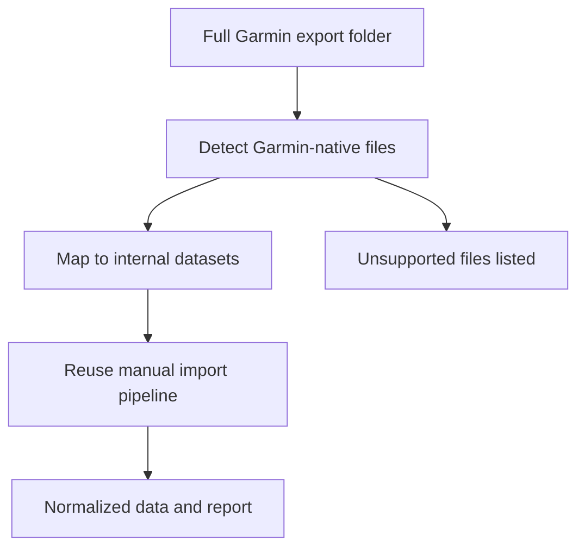

## req_002_patch_manual_import_to_support_full_garmin_connect_export_shapes - Patch manual import to support full Garmin Connect export shapes
> From version: 0.1.0
> Schema version: 1.0
> Status: Draft
> Understanding: 95
> Confidence: 92
> Complexity: Medium
> Theme: Health
> Reminder: Update status/understanding/confidence and references when you edit this doc.

# Needs
- Extend the manual import pipeline so it can ingest the real Garmin Connect full export already downloaded by the user.
- Map Garmin's actual export filenames and folder shapes to the internal datasets already used by the repository.
- Make the manual export path usable as a first post-processing and analytics validation path while authenticated sync remains blocked.
- Preserve the current local-first, raw-first, deterministic processing model instead of introducing a parallel one-off importer.

# Context
- The repository already supports manual import, but only when export files match simplified dataset names such as activities, sleep, heart_rate, hrv, stress, or steps.
- The user's real Garmin export under `C:\Users\Pmondou\Downloads\garmin-export` contains valid Garmin Connect data, but it uses Garmin-native names such as `summarizedActivities`, `sleepData`, `healthStatusData`, `TrainingHistory`, and `MetricsAcuteTrainingLoad`.
- The current discovery logic found real Garmin data but classified all candidate files as unsupported because dataset detection is too narrow.
- Authenticated Garmin sync is currently blocked by Garmin or Cloudflare rate limiting, so the manual export path is now the practical way to validate the post-processing layer on real data.
- The repository already has a deterministic normalization and reporting path that should be reused once the real export files are recognized and mapped correctly.

# Scope
- In scope: patch dataset discovery and import mapping so the real Garmin Connect export structure can be ingested.
- In scope: deliver a first intentionally narrow but useful slice covering activities, sleep, steps, heart rate, stress, and HRV so the post-processing layer can be inspected on real data quickly.
- In scope: identify and document one canonical Garmin export source per supported internal dataset even if multiple export files contain overlapping signals.
- In scope: document unsupported export files clearly instead of silently discarding them.
- In scope: validate that a real manual import produces raw artifacts, normalized DuckDB records, and a metrics report.
- Out of scope: full coverage of every Garmin export domain present in the archive.
- Out of scope: redesigning the normalization schema beyond what is needed to accept the mapped real export files.
- Out of scope: solving authenticated login instability in this request.

# Constraints
- Personal Garmin data must remain local-only.
- The importer should continue preserving raw source artifacts and provenance.
- The patch should prefer deterministic filename and folder mapping over brittle heuristics when possible.
- The first implementation should be split into two phases: file detection and mapping first, then parsing or normalization adjustments only where real payloads require them.
- Unsupported Garmin export files should remain visible in the import summary for future follow-up work.
- The manual import path should stay compatible with the simplified fixture-based tests already in the repository.

# Desired outcomes
- The user can point the CLI at the downloaded Garmin export folder and get a successful import.
- The importer recognizes the real Garmin export files needed for the first analytics slice.
- The normalized layer and latest metrics report can be generated from the user's manual export.
- The repository clearly reports which Garmin export files were mapped and which were left unsupported.
- The project gains a reliable real-data validation path independent of live Garmin authentication.

# Acceptance criteria
- AC1: The request defines that the patch must support the real Garmin Connect export shape currently available on disk, not only simplified fixture filenames.
- AC2: The request identifies dataset detection and filename or folder mapping as the primary change area for the manual import path.
- AC3: The request states that the mapped import path must feed the existing raw, normalized, and reporting pipeline rather than a separate ad hoc loader.
- AC4: The request requires validation on the user's real export folder and a successful end-to-end local import.
- AC5: The request requires clear reporting of unsupported Garmin export files that remain outside the first supported slice.
- AC6: The request keeps scope focused on the first useful real-data datasets needed to inspect post-processing behavior: activities, sleep, steps, heart rate, stress, and HRV.
- AC7: The request allows one canonical Garmin export source to be selected per supported internal dataset when several export files overlap.
- AC8: The request explicitly requires a decision for chunked Garmin export files: either merge before normalization or ingest independently and deduplicate downstream, with the chosen behavior documented.
- AC9: The request is specific enough to promote into a bounded backlog item for importer mapping, validation, and documentation.

# Definition of Ready (DoR)
- [x] Problem statement is explicit and user impact is clear.
- [x] Scope boundaries (in/out) are explicit.
- [x] Acceptance criteria are testable.
- [x] Dependencies and known risks are listed.

# Risks and dependencies
- Garmin export files may contain overlapping or differently shaped wellness signals that do not map cleanly onto the existing internal schema.
- Some Garmin-native files may need content-based parsing rather than filename mapping alone.
- The current analytics layer may assume a narrower fixture structure than the real export provides.
- Importing the full export may surface duplicate, partial, or chunked history files that need deterministic merge behavior.
- Some high-value signals may exist only in files that are not yet understood by the current normalization layer.

# Clarifications
- The immediate goal is not complete Garmin export coverage.
- The first priority is to unlock real-data post-processing with the export the user already has.
- This request complements the authenticated-sync work by providing a reliable fallback path for real-data validation.
- The patch should keep unsupported files visible so future work can widen coverage incrementally.
- The preferred first delivery slice is intentionally narrow: activities, sleep, steps, heart rate, stress, and HRV.
- The implementation should prefer one documented canonical Garmin source per supported dataset over trying to merge every overlapping signal immediately.
- Delivery should happen in two phases: detection and mapping first, then parsing or normalization adjustments where real payloads force them.
- The downloaded export path is currently `C:\Users\Pmondou\Downloads\garmin-export`.

# Open questions
- Does the existing normalized schema need small adjustments once real Garmin export payloads are parsed?
- Which concrete Garmin-native files should be selected as the canonical source for each of the first-slice datasets?
- Should chunked export files be merged before normalization or ingested independently and deduplicated downstream?

# Companion docs
- Product brief(s): (none yet)
- Architecture decision(s): `adr_000_choose_local_first_garmin_data_sync_and_storage_architecture`
# AI Context
- Summary: Patch the manual Garmin import flow so the repository can ingest the user's full Garmin Connect export and run the existing local analytics pipeline on real data.
- Keywords: garmin, export, manual-import, dataset-mapping, normalization, duckdb, analytics, local-first
- Use when: Use when planning or implementing support for Garmin-native export filenames and folders in the existing manual import pipeline.
- Skip when: Skip when the work is about live Garmin authentication, UI, or unrelated analysis features.

# Backlog
- `item_002_patch_manual_import_to_support_full_garmin_connect_export_shapes`
