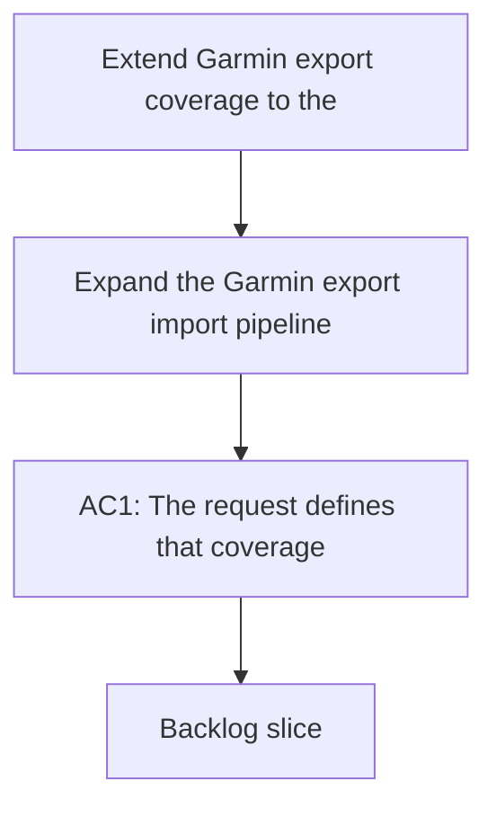

## req_003_extend_garmin_export_coverage_to_the_full_initial_data_surface - Extend Garmin export coverage to the full initial data surface
> From version: 0.1.0
> Schema version: 1.0
> Status: Done
> Understanding: 96
> Confidence: 94
> Complexity: High
> Theme: Health
> Reminder: Update status/understanding/confidence and references when you edit this doc.

# Needs
- Expand the Garmin export import pipeline beyond the first supported slice so it covers the broader set of structured data already produced by Garmin Connect.
- Preserve local-first raw retention and deterministic normalization while extending coverage to more export domains.
- Make the imported archive useful as a complete post-processing source, not only a minimal analytics proof of concept.
- Keep unsupported or non-structured export artifacts visible, but stop treating the broader export as an unexplored edge case.

# Context
- The repository now successfully imports the user's real Garmin export for the first slice of datasets: activities, sleep, steps, heart rate, stress, and HRV.
- The full export contains many additional Garmin-native domains that are present in the archive but not yet modeled by the pipeline, including wellness, metrics, user profile, device, fitness, goals, and auxiliary data.
- Some of those files are directly useful for local analytics; others are operational metadata or secondary history that still matters for provenance and future analysis.
- The current importer and normalization layers were intentionally narrowed to get a working first pass. The next step is to widen coverage in a controlled way rather than bolt on one-off exceptions.
- The user wants the full personal archive to be usable locally, which means the pipeline should progressively absorb the other structured Garmin export surfaces that are already available on disk.

# Scope
- In scope: extend the import/mapping layer to recognize the broader Garmin Connect export domains that are part of the initial archive surface.
- In scope: classify the additional files into meaningful internal datasets or clearly documented metadata/provenance buckets.
- In scope: preserve raw artifacts, manifests, normalized storage, and deterministic reporting as coverage expands.
- In scope: define a staged coverage plan so the remaining Garmin export surface is added in bounded slices instead of one oversized patch.
- In scope: apply a narrow-but-deep strategy first on `activities`, `training_load`, `hrv`, and `sleep`.
- In scope: add `training_history` and `acute_load` right after the first deep slice because they are high-value coaching signals.
- In scope: normalize non-analytical but useful reference data for `profile` and `heart_rate_zones`.
- In scope: keep `device` and `settings` files raw-only at first (retained and indexed in provenance) without immediate normalized modeling.
- In scope: validate the expanded coverage on the already downloaded real export archive.
- Out of scope: cloud sync, multiplayer, dashboards, or live Garmin authentication fixes.
- Out of scope: assuming every Garmin export file is analytically meaningful if it is only operational or archival metadata.

# Constraints
- Personal Garmin data must remain local-only.
- The existing first-slice behavior must keep working while coverage expands.
- The importer should remain deterministic, with explicit mappings instead of fragile heuristic guessing where possible.
- Structured and chunked Garmin export files should remain auditable through raw retention and provenance.
- Any unsupported files should be reported explicitly, not silently ignored.

# Desired outcomes
- The full Garmin export becomes progressively usable as a local analytical archive, not just a first-slice proof.
- Additional structured Garmin domains are imported or classified in a documented way.
- The repository can explain which export surfaces are modeled, which are metadata-only, and which remain unsupported.
- The user can inspect more of the real Garmin archive locally without switching back to the vendor UI.

# Acceptance criteria
- AC1: The request defines that coverage should expand beyond the first supported slice to the broader structured Garmin export surface already available in the user's archive.
- AC2: The request distinguishes between analytically useful datasets, metadata/provenance files, and unsupported artifacts.
- AC3: The request keeps raw retention and deterministic normalization as first-class requirements while coverage expands.
- AC4: The request requires a staged delivery approach so the remaining Garmin export surface is added in bounded slices.
- AC5: The request requires validation on the user's real Garmin export archive.
- AC6: The request remains compatible with the first-slice importer and does not regress the datasets already supported.
- AC7: The request is specific enough to break into backlog items for the remaining Garmin export domains.
- AC8: The first expansion slice is explicitly narrow but deep on `activities`, `training_load`, `hrv`, and `sleep`.
- AC9: `training_history` and `acute_load` are explicitly prioritized as the next coaching-focused slice.
- AC10: `profile` and `heart_rate_zones` are normalized as reference data in this expansion effort.
- AC11: `device` and `settings` are retained raw-first (indexed in manifests/provenance) before any normalization work.

# Definition of Ready (DoR)
- [x] Problem statement is explicit and user impact is clear.
- [x] Scope boundaries (in/out) are explicit.
- [x] Acceptance criteria are testable.
- [x] Dependencies and known risks are listed.

# Risks and dependencies
- Garmin export domains vary widely in schema shape, payload density, and analytical value.
- Some additional files may be large, repetitive, or chunked in ways that require dedicated merge logic.
- The normalized schema may need incremental extension as new datasets are admitted.
- Expanding coverage too quickly could destabilize the already working first-slice path if the changes are not kept bounded.

# Clarifications
- This request is about coverage expansion, not authentication recovery.
- The first slice already works; this request is about the rest of the structured archive surface that was intentionally left out.
- The goal is broader local usability, not blind ingestion of every byte in the export.
- Metadata and operational files should be handled explicitly even if they are not promoted to analytical datasets.
- Confirmed strategy: narrow but deep first, then widen.
- Confirmed first deep focus: `activities`, `training_load`, `hrv`, `sleep`.
- Confirmed second priority slice: `training_history`, `acute_load` for coaching value.
- Confirmed non-analytical handling:
- `profile` + `heart_rate_zones`: normalize.
- `device` + `settings`: raw storage only for the first iteration.

# Open questions
- Do any of the remaining domains require schema additions before they can be stored cleanly?

# Companion docs
- Product brief(s): (none yet)
- Architecture decision(s): `adr_000_choose_local_first_garmin_data_sync_and_storage_architecture`
# AI Context
- Summary: Expand Garmin export coverage beyond the first supported slice so the broader structured archive can be used locally for analysis and provenance.
- Keywords: garmin, export, coverage, archive, normalization, provenance, local-first, datasets, metadata
- Use when: Use when planning broader Garmin export coverage after the first supported slice is working.
- Skip when: Skip when the work is only about live authentication, a single dataset fix, or unrelated UI work.

# Backlog
- `item_003_extend_garmin_export_coverage_to_the_full_initial_data_surface`
- `logics/backlog/item_003_extend_garmin_export_coverage_to_the_full_initial_data_surface.md`
