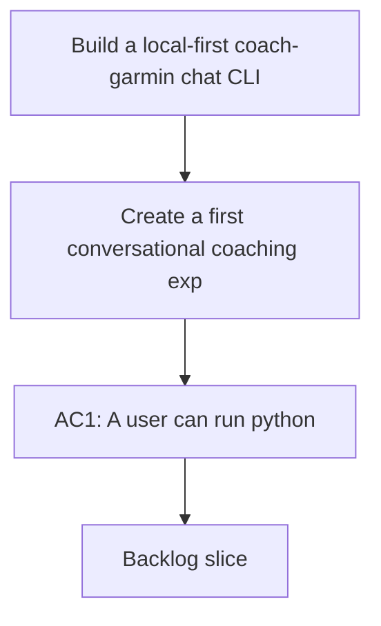

## req_004_build_a_local_first_coach_garmin_chat_cli - Build a local-first coach-garmin chat CLI
> From version: 0.1.0
> Schema version: 1.0
> Status: Done
> Understanding: 95
> Confidence: 92
> Complexity: High
> Theme: Health
> Reminder: Update status/understanding/confidence and references when you edit this doc.

# Needs
- Create a first conversational coaching experience directly inside this repository through a CLI chat entrypoint.
- Let the user state a running goal in natural language, then receive clarification questions before getting a first weekly plan.
- Reuse the existing local-first Garmin foundation instead of introducing a separate coaching stack.
- Keep the coaching flow grounded in local data, deterministic metrics, and auditable outputs.

# Context
- The repository already supports local Garmin data ingestion, raw retention, DuckDB normalization, and deterministic daily metrics.
- The current foundation is useful for storage and reporting, but it does not yet expose a user-facing coaching workflow.
- The next useful product slice is a local CLI coach that can ask follow-up questions, inspect the current training state, and generate a first actionable weekly plan.
- The user wants a local-first MVP, not a cloud-first assistant, so Ollama should be the default AI provider.
- The first target experience is pragmatic: run a command, type a goal, answer a few questions, and receive a saved weekly plan.

# Scope
- In scope: add a CLI chat entrypoint under `python -m coach_garmin coach chat`.
- In scope: run the coaching conversation in French by default.
- In scope: use Ollama locally as the default provider for the MVP.
- In scope: support one default model profile suitable for the local machine, with `qwen2.5:7b` as the initial baseline.
- In scope: implement four local coaching tool surfaces:
- `metrics`: read the latest deterministic metrics and current state signals.
- `goals`: read and write the current goal profile.
- `plan`: generate and persist the weekly plan output.
- `history`: summarize recent training history from local normalized data.
- In scope: add an automatic clarification loop when the initial goal is underspecified.
- In scope: save the produced weekly plan in versioned files under `data/reports/`.
- In scope: keep all Garmin-derived data processing local to the machine.
- Out of scope: web UI, mobile UI, cloud APIs, long-term calendar planning, medical advice, and fully autonomous training-periodization logic.
- Out of scope: replacing deterministic metrics with pure LLM judgment.

# Constraints
- The MVP must remain local-first and work without a paid cloud API token.
- Garmin data should not be sent to external services in this slice.
- The LLM should rely on local tools and summarized context rather than raw uncontrolled dumps.
- The coaching output must remain cautious, non-medical, and explicit about uncertainty when data is missing.
- Errors must stay actionable, especially when Ollama is unavailable or the configured model is missing.

# Desired outcomes
- A user can launch a chat, describe a running goal, answer refinement questions, and receive a first weekly plan.
- The coaching output is visibly grounded in local metrics and recent history.
- The plan is persisted locally in a versioned format under `data/reports/`.
- The repo gains a first end-to-end coaching surface that can be iterated on before any UI work.

# Acceptance criteria
- AC1: A user can run `python -m coach_garmin coach chat` from the repository CLI.
- AC2: The chat accepts a free-form running goal in French and starts a coaching conversation.
- AC3: If essential context is missing, the system asks automatic clarification questions before proposing a plan.
- AC4: The MVP exposes exactly four local coaching tool surfaces for `metrics`, `goals`, `plan`, and `history`.
- AC5: The coaching response uses local data from the existing normalized and reporting layer rather than operating as a generic chat with no data access.
- AC6: A first weekly plan is generated in a human-readable structure and saved in a versioned file under `data/reports/`.
- AC7: The plan output clearly references the main local signals used when available, such as load, sleep, HRV, fatigue, acute load, or recent training history.
- AC8: If Ollama is unavailable, unreachable, or missing the configured model, the CLI returns a clear and actionable error.
- AC9: The MVP remains fully local-first and does not require any paid API token.
- AC10: Automated tests cover the CLI entrypoint, the four tool adapters, the clarification loop, and the main error path.

# Definition of Ready (DoR)
- [x] Problem statement is explicit and user impact is clear.
- [x] Scope boundaries (in/out) are explicit.
- [x] Acceptance criteria are testable.
- [x] Dependencies and known risks are listed.

# Risks and dependencies
- Local LLM quality may be uneven if prompts, guardrails, and tool outputs are not sufficiently constrained.
- Some users may have partial Garmin data coverage, which can weaken the quality of coaching suggestions.
- The line between deterministic guardrails and model-generated recommendations needs to stay explicit.
- Ollama availability, local model installation, and response latency are operational dependencies for the CLI experience.

# Clarifications
- This request is for a CLI MVP, not a web or app interface.
- The MVP should prefer one strong local model baseline rather than multiple providers.
- The first deliverable is a coaching loop with saved outputs, not a complete training platform.
- The existing analytics tables and reports are intended to remain the main factual substrate.
- Weekly plan persistence should be versioned in `data/reports/` so outputs remain reviewable over time.

# Open questions
- Should the weekly plan also be written in Markdown alongside JSON for easier reading?
- Should the chat session history be persisted in the MVP or only the goal profile and weekly plan?
- Should the CLI support a future non-interactive mode after the chat MVP is stable?

# Companion docs
- Product brief(s): (none yet)
- Architecture decision(s): `adr_000_choose_local_first_garmin_data_sync_and_storage_architecture`
# AI Context
- Summary: Build a local-first conversational running coach in CLI form using Ollama, local Garmin-derived metrics, and versioned weekly plan outputs.
- Keywords: coaching, running, cli, chat, ollama, garmin, local-first, weekly-plan, duckdb, metrics
- Use when: Use when planning or implementing the first user-facing coaching workflow on top of the Garmin local data foundation.
- Skip when: Skip when the work is only about ingestion, storage, authentication, or non-conversational reporting.

# Backlog
- `item_004_build_a_local_first_coach_garmin_chat_cli`
- `logics/backlog/item_004_build_a_local_first_coach_garmin_chat_cli.md`
