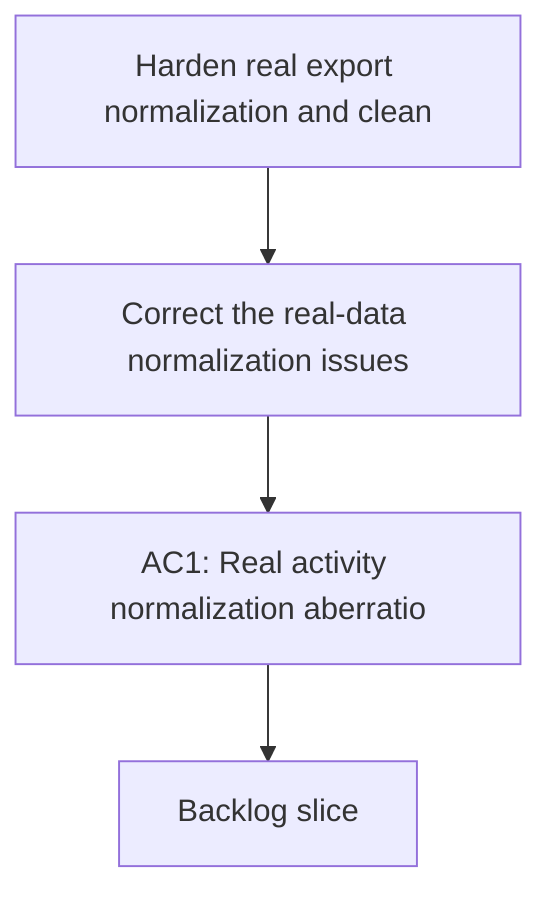

## req_005_harden_real_export_normalization_and_clean_repo_delivery_artifacts - Harden real export normalization and clean repo delivery artifacts
> From version: 0.1.0
> Schema version: 1.0
> Status: Done
> Understanding: 96
> Confidence: 94
> Progress: 100%
> Complexity: High
> Theme: Health
> Reminder: Update status/understanding/confidence and references when you edit this doc.

# Needs
- Correct the real-data normalization issues that produce absurd activity-derived coaching outputs.
- Clean the repository and Logics artifacts so the current delivery state stays coherent, reviewable, and trustworthy.
- Keep the coaching workflow usable on real Garmin exports, not only on fixtures or happy-path synthetic cases.

# Context
- The repository now supports a local-first coaching CLI backed by Ollama and local Garmin-derived analytics.
- A real Garmin export was copied locally from `D:\Transfert PC these\garmin-export` into the repository under `data/sources/garmin-export` for validation.
- The import completed successfully on the local copy, but the real coaching smoke test exposed major anomalies in normalized activity-derived values.
- Observed examples include impossible recent-history aggregates and a weekly plan containing a long run measured in thousands of minutes.
- These anomalies indicate that some real Garmin activity payload fields are being interpreted with the wrong units, the wrong fallback logic, or the wrong record-shape assumptions.
- The copied export is for local validation only and must remain local to this machine; it must not be treated as a pushable repository artifact.
- In parallel, the repository now contains temporary validation outputs, copied source data, and freshly added Logics artifacts that should be reviewed and cleaned so the repo stays intentional rather than gradually accumulating delivery debris.
- The cleanup pass should explicitly include a bounded audit of repo hygiene and Logics hygiene related to this delivery wave.

# Scope
- In scope: inspect the real Garmin export activity payloads that are currently producing absurd durations, distances, and loads.
- In scope: identify the exact field-shape or unit mismatches in normalization and fix them in the ingestion or analytics layer.
- In scope: apply a tolerant correction strategy first:
- prefer correcting units, field mappings, and shape assumptions over dropping records immediately
- exclude a record from downstream coaching only when it still remains implausible after tolerant correction attempts
- In scope: add guardrails so obviously impossible activity values do not silently flow into history summaries or coaching plans.
- In scope: validate the corrected pipeline on the copied real export in `data/sources/garmin-export`.
- In scope: clean delivery artifacts that are clearly temporary, stale, misleading, duplicated, or structurally noisy in the repo and in Logics docs.
- In scope: audit the current repo and Logics state for delivery debris, placeholders, stale references, accidental validation leftovers, or push-risk artifacts.
- In scope: keep cleanup bounded to repository hygiene directly related to this delivery wave.
- Out of scope: broad product redesign, major schema redesign unrelated to the detected anomalies, or adding new Garmin domains beyond what is needed to correct the current failures.
- Out of scope: deleting the user-owned source export outside the repo.
- Out of scope: pushing copied local export data or local-only validation artifacts to the remote repository.

# Constraints
- Personal Garmin data must remain local-only.
- The copied export under `data/sources/garmin-export` is for local validation and must not be pushed.
- Raw retention and provenance must remain intact.
- Cleanup must not destroy useful validation evidence without replacing it with a clearer retained artifact.
- Real-data fixes should prefer explicit parsing and validation rules over silent heuristics.
- The coaching flow should fail safely when data looks suspicious rather than confidently produce absurd recommendations.

# Desired outcomes
- Real exported activities no longer produce impossible durations, distances, or loads in normalized history.
- The coach chat produces plausible weekly plans on the copied real export.
- Suspicious activity values are either corrected, excluded with traceability, or surfaced explicitly after tolerant repair attempts.
- The repo contains fewer temporary or misleading artifacts after the cleanup pass.
- Logics docs accurately reflect the real delivery state and no longer contain avoidable debris.

# Acceptance criteria
- AC1: Real activity normalization aberrations are reproduced, understood, and corrected with repo-visible changes.
- AC2: The corrected normalization prevents impossible values from propagating into recent-history summaries and coaching plan generation.
- AC3: The coach flow is revalidated on the copied real export and produces a plausible weekly plan with sane durations and volume references.
- AC4: Automated tests cover at least one real-shape anomaly case that previously produced absurd outputs.
- AC5: Cleanup removes or clarifies temporary repo or Logics debris introduced during the recent delivery wave without deleting important source-of-truth artifacts.
- AC6: Logics request, backlog, and task indicators remain coherent after the cleanup pass.
- AC7: Validation evidence is recorded with exact commands and observed outcomes on the local real-export copy.
- AC8: The copied real export and local-only validation artifacts are explicitly kept out of push-oriented delivery flow.
- AC9: The fix preserves local-first behavior and does not introduce any paid cloud dependency.

# Definition of Ready (DoR)
- [x] Problem statement is explicit and user impact is clear.
- [x] Scope boundaries (in/out) are explicit.
- [x] Acceptance criteria are testable.
- [x] Dependencies and known risks are listed.

# Risks and dependencies
- Garmin real export payloads may mix units or structures across activity types, export eras, or device sources.
- Some anomalous values may come from multiple causes, not one single parsing bug.
- A tolerant repair strategy can accidentally preserve a bad record if the correction rules are too permissive.
- Cleanup can accidentally remove useful context if it is done too broadly instead of as a bounded delivery-hygiene pass.
- Real-data validation depends on the copied local export staying available in the repo workspace but remaining excluded from push-oriented workflows.

# Clarifications
- This request is not about adding new coaching features first; it is about restoring trust in the real-data substrate.
- The normalization strategy should be tolerant-first, not drop-first.
- The cleanup objective is targeted hygiene, not cosmetic refactoring for its own sake.
- The copied export inside the repo is the validation source for this request and should stay local-only.
- The priority is to fix absurd coaching outputs before expanding the coaching feature set further.
- The cleanup pass should explicitly include a repo and Logics audit focused on the recent coach delivery wave.

# Open questions
- Should tolerant correction add an explicit anomaly marker in normalized outputs when a record had to be repaired?
- Should temporary validation outputs under `data/validation_real_export` be kept, rotated, or partly gitignored after this wave?
- Should cleanup include generating a short anomaly report for future debugging of real Garmin payload shapes?

# Companion docs
- Product brief(s): (none yet)
- Architecture decision(s): `adr_000_choose_local_first_garmin_data_sync_and_storage_architecture`
# AI Context
- Summary: Fix real Garmin export normalization issues that create absurd coaching outputs, then clean repo and Logics delivery artifacts so the project remains trustworthy and reviewable.
- Keywords: garmin, normalization, anomaly, duration, distance, load, cleanup, logics, local-first, coaching
- Use when: Use when stabilizing real-data coaching behavior and cleaning bounded delivery debris after a feature wave.
- Skip when: Skip when the work is about adding new coaching surfaces before the real-data substrate is trustworthy.

# Backlog
- `item_005_correct_real_garmin_activity_normalization_and_coaching_plausibility_on_local_exports`
- `item_006_clean_local_validation_artifacts_and_logics_delivery_hygiene`

# Progress notes
- `item_005_correct_real_garmin_activity_normalization_and_coaching_plausibility_on_local_exports` is complete.
- `item_006_clean_local_validation_artifacts_and_logics_delivery_hygiene` is complete.
