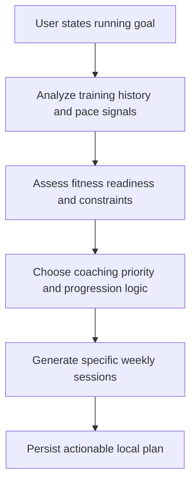

## req_006_make_the_running_coach_history_and_pace_aware - Make the running coach history-aware and pace-aware
> From version: 0.1.0
> Schema version: 1.0
> Status: Done
> Understanding: 98
> Confidence: 96
> Progress: 100%
> Complexity: High
> Theme: Health
> Reminder: Update status/understanding/confidence and references when you edit this doc.

# Needs
- Upgrade the current coaching MVP so it stops producing generic weekly plans and starts reasoning from the user's actual running history, observed paces, recent races, and training context.
- Make the coach capable of analyzing prior training and recent performances before proposing sessions.
- Make weekly sessions concrete enough to reflect the user's level, not just generic placeholders such as `recovery run` or `controlled quality session`.
- Prioritize pace-aware coaching over generic effort-only advice when the historical evidence is strong enough.

# Context
- The repository already contains a first local-first coach chat in CLI form using Ollama and local Garmin-derived data.
- The current MVP is technically functional and safe enough to run, but the coaching quality remains too generic.
- Real user feedback on April 8, 2026 shows that the coach does not yet exploit prior workouts, observed paces, or recent race outcomes in a meaningful way.
- Example gap observed:
- the user reports a recent `10 km sub 42` on April 5, 2026
- the user reports a restricted training block since mid-November due to periostitis
- the current coach still responds with a broad, low-specificity weekly structure and little real analysis of past training
- The next useful slice is therefore not a UI improvement but a coaching-intelligence improvement:
- stronger analysis of prior training
- stronger use of observed pace data
- better prioritization between performance ambition and injury context
- more concrete session prescriptions
- When several objectives are stated, the coach should identify or ask for the principal objective before prescribing the training week.

# Scope
- In scope: make the coach analyze recent training history and recent benchmark performances before proposing a plan.
- In scope: extract useful pace-level information from recent runs and races.
- In scope: detect recent benchmark performances such as a 5 km, 10 km, half-marathon, marathon, or equivalent strong session.
- In scope: estimate practical training paces from observed recent performance and current context.
- In scope: use multiple historical windows:
- `21 days` for recent form
- `90 days` for training structure
- `365 days` for race and benchmark references
- In scope: use local history to decide whether the user is in:
- return-to-running phase
- rebuild phase
- 10 km progression phase
- marathon-base phase
- mixed-objective conflict state
- In scope: when multiple goals are detected, choose or ask for the principal objective before prescribing the week.
- In scope: generate more specific workouts, including:
- easy run with target duration and pace or effort ceiling
- threshold or tempo session with concrete blocks
- interval session with concrete reps, recoveries, and pace guidance
- long run with progression guidance
- cautious return-to-quality progression after reduced training or injury
- In scope: explicitly explain why the coach chose those sessions from past data.
- In scope: preserve local-first behavior and keep using local Garmin-derived data as the factual basis.
- Out of scope: medical diagnosis, full long-term periodization engine, and a polished UI.
- Out of scope: cloud-only AI workflows or paid API requirements.

# Constraints
- The coach must remain local-first.
- Garmin data must remain local and must not be sent to external services in this slice.
- Recommendations must remain cautious in the presence of injury history or sparse recent load.
- The coach should prioritize pace-aware prescriptions when the evidence is good enough.
- If pace inference is weak, the coach should explicitly fall back to effort guidance rather than pretending precision.
- The coaching tone should be direct and analytical rather than generic or overly diplomatic.

# Desired outcomes
- The coach gives an actual analysis before the plan.
- The coach references recent races, training density, recent load, and pace evidence from local data.
- The weekly plan contains sessions that feel individualized rather than boilerplate.
- The coach can explain tradeoffs such as:
- `sub 40 10 km is plausible but not by adding too much quality too early`
- `recent periostitis means rebuild durability before increasing intensity density`
- The output becomes useful for real manual review and iteration.

# Acceptance criteria
- AC1: The coach analyzes recent training history and recent benchmark performances before generating the weekly plan.
- AC2: The coach uses observed local running data to derive individualized pace targets when evidence is sufficient.
- AC3: The coach explicitly identifies a training phase or coaching priority derived from recent history and injury context.
- AC4: When multiple goals are detected, the coach selects or asks for the principal objective before generating the weekly plan.
- AC5: The generated weekly sessions are more specific than generic labels and include concrete workout structure when appropriate.
- AC6: The coach explains which historical signals influenced the recommendation, including recent races, recent activity density, and observed quality-session evidence when available.
- AC7: If the data is insufficient for reliable pace prescription, the coach explicitly falls back to effort-based guidance instead of pretending precision.
- AC8: Tests cover at least one recent-race case and one return-from-injury or reduced-load case.
- AC9: The implementation remains local-first and does not require any paid cloud API token.

# Clarifications
- This request is specifically about coaching quality and training relevance, not about frontend or packaging.
- The current pain point is not that the CLI is broken, but that the coaching output is too generic.
- The expected improvement is analytical and coaching-specific:
- better reading of past training
- better use of observed performances
- better workout specificity
- The user wants the coach to take prior workouts and pace-level signals seriously.
- Pace priority is explicit for this slice.
- The coach should use the 21-day, 90-day, and 365-day windows together rather than relying on one recent snapshot only.
- If several goals are present, one principal objective should drive the week.
- The first targeted workout families are:
- easy runs
- threshold or tempo work
- interval work
- long runs
- cautious return-to-quality sessions after injury or reduced training
- The desired coaching tone is direct and analytical.

# Open questions
- Should the first pace model rely only on recent race-equivalent performances, or also on best recent structured workouts?
- Should the first implementation express pace guidance mainly in `min/km`, or combine pace ranges with explicit RPE and heart-rate hints?
- Should the first implementation focus first on 10 km intelligence before widening the same logic toward marathon training?

# Companion docs
- Product brief(s): (none yet)
- Architecture decision(s): `adr_000_choose_local_first_garmin_data_sync_and_storage_architecture`

# AI Context
- Summary: Improve the local running coach so it analyzes actual training history and observed paces before generating individualized weekly sessions.
- Keywords: running, coaching, pace, history, recent race, benchmark, training analysis, local-first, garmin, workout prescription
- Use when: Use when improving coaching quality from generic weekly plans toward individualized, history-aware recommendations.
- Skip when: Skip when the work is about ingestion plumbing, auth sync, or generic UI changes.

# Backlog
- `item_007_make_the_running_coach_history_and_pace_aware`

# Progress notes
- `item_007_make_the_running_coach_history_and_pace_aware` is complete.
