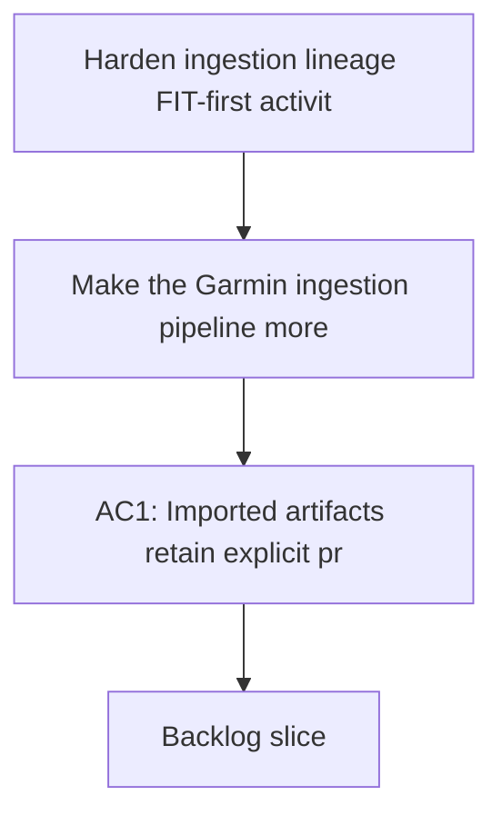

## req_007_harden_ingestion_lineage_fit_first_activity_parsing_and_coaching_feature_coverage_reporting - Harden ingestion lineage, FIT-first activity parsing, and coaching feature coverage reporting
> From version: 0.1.0
> Schema version: 1.0
> Status: Done
> Understanding: 96
> Confidence: 93
> Complexity: High
> Theme: Health
> Reminder: Update status/understanding/confidence/progress and references when you edit this doc.

# Needs
- Make the Garmin ingestion pipeline more robust by tracking provenance and lineage for every imported artifact.
- Prefer FIT-based activity parsing as the most stable source of activity truth, while keeping Garmin export JSON as context and fallback.
- Make it obvious, after each import, which data is only present in raw form, which data is normalized, which data is available as features, and which data actually feeds coaching decisions.
- Reduce the risk that the coach silently works with partial, stale, or misinterpreted data.

# Context
- The repository already has a local-first Garmin foundation with raw artifact preservation, normalized DuckDB storage, and a coaching CLI.
- Real-data validation already exposed the need for clearer handling of source shapes, unit mismatches, and partial coverage.
- The current project can import and coach from Garmin data, but the pipeline still benefits from stronger lineage metadata and more explicit data coverage reporting.
- A stronger ingest contract will make the rest of the coaching stack easier to trust, debug, and extend.
- FIT files remain the most stable activity source for durable parsing, while Garmin export JSON is still valuable for metadata, completeness checks, and fallback context.

# Scope
- In scope: add or strengthen lineage metadata for imported artifacts so each normalized record can be traced back to its source file, source type, and ingestion path.
- In scope: make activity parsing prefer FIT inputs when they exist, with JSON summaries used as fallback or companion context.
- In scope: improve import-time deduplication and artifact identity handling so repeated imports stay deterministic.
- In scope: produce a coverage report after import that separates raw presence, normalized coverage, feature availability, and coach usage.
- In scope: surface missing or suspicious data explicitly instead of silently treating it as complete.
- In scope: keep the implementation local-first and compatible with the existing DuckDB plus report-based storage model.
- Out of scope: cloud sync redesign, UI work, full new schema overhaul, or a broad Garmin API reimplementation.

# Constraints
- Personal Garmin data must remain local-only.
- Raw retention and provenance must remain intact.
- FIT parsing should be the primary path for activity truth when FIT artifacts are available.
- The pipeline must remain resilient when some Garmin export slices are missing, partial, or malformed.
- The coverage report should be machine-readable enough for tests and human-readable enough for manual review.

# Desired outcomes
- Each imported artifact has a traceable lineage from source to normalized feature.
- The pipeline uses FIT first for activities and falls back cleanly when FIT is absent.
- The coach can tell which signals are genuinely available instead of assuming full coverage.
- Import summaries become more useful for debugging and for deciding whether coaching recommendations are trustworthy.
- The repository gains a stronger foundation for future analytics, pacing, and injury-risk features.

# Acceptance criteria
- AC1: Imported artifacts retain explicit provenance and lineage metadata linking source files to normalized records.
- AC2: Activity parsing prefers FIT inputs when available and falls back to other export shapes only when necessary.
- AC3: The pipeline still works on the current local Garmin export fixtures and on the copied real export.
- AC4: Duplicate or repeated imports remain deterministic and do not create duplicate normalized records.
- AC5: A coverage report is generated after import that distinguishes raw, normalized, feature-level, and coach-used data coverage.
- AC6: The coach can consume the new coverage report to avoid overclaiming unavailable signals.
- AC7: At least one test covers a FIT-first activity path and one test covers a missing-FIT fallback path.
- AC8: At least one test covers lineage/provenance fields or artifact identity handling.
- AC9: The implementation remains local-first and does not require any paid cloud API token.

# Clarifications
- This request is about strengthening the data substrate, not adding a new UI or a new coaching mode.
- FIT-first means FIT should be the primary activity truth when present, not that JSON becomes irrelevant.
- Coverage reporting should help answer a simple question: what data can the coach truly trust right now.
- The report should help separate imported data volume from actually usable coaching signals.

# Open questions
- Should lineage be stored in the normalized database, in a separate inventory table, or in both places?
- Should the coverage report be a standalone JSON artifact, an appended report section, or both?
- Should FIT parsing be expanded immediately to every activity subtype, or first to the most common running activity shapes?

# Companion docs
- Product brief(s): (none yet)
- Architecture decision(s): `adr_000_choose_local_first_garmin_data_sync_and_storage_architecture`
# AI Context
- Summary: Harden Garmin ingestion with explicit lineage, FIT-first parsing for activities, and a coverage report that shows what data the coach can really trust.
- Keywords: ingestion, lineage, provenance, fit, activity parsing, coverage report, deduplication, local-first, garmin
- Use when: Use when improving the reliability and trustworthiness of the Garmin data substrate before expanding coaching logic.
- Skip when: Skip when the work is only about UI, marketing, or unrelated feature areas.

# Backlog
- `item_008_harden_ingestion_lineage_fit_first_activity_parsing_and_coaching_feature_coverage_reporting`
- `logics/backlog/item_008_harden_ingestion_lineage_fit_first_activity_parsing_and_coaching_feature_coverage_reporting.md`
