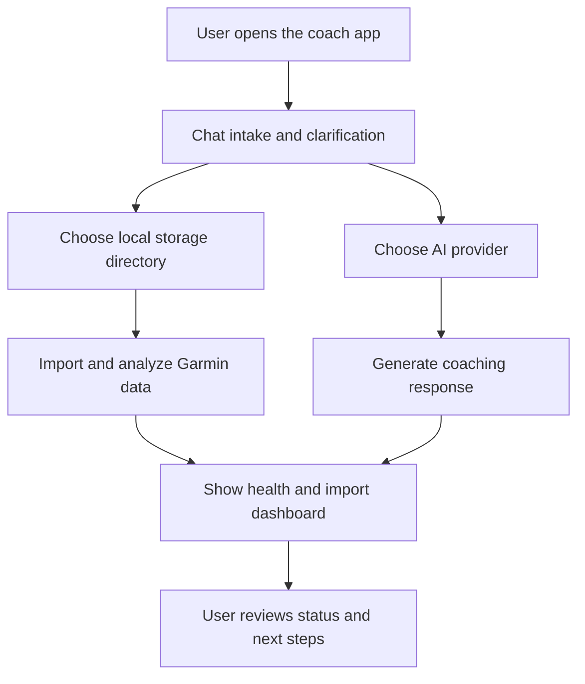

## req_008_local_first_pwa_coach_dashboard - Local-first PWA coach dashboard
> From version: 0.1.0
> Schema version: 1.0
> Status: Done
> Understanding: 97%
> Confidence: 94%
> Complexity: High
> Theme: UI
> Reminder: Update status, understanding, confidence, progress, and linked backlog or task refs when you edit this doc.

# Needs
- Deliver a first version of Coach Garmin as a local-first PWA that can be installed on desktop and reused later on mobile.
- Provide a chat surface where the user can discuss goals, answer coaching questions, and receive clarifying prompts.
- Let the user choose a local storage directory first, with persistence designed around a machine-local workspace.
- Let the user choose which AI backend to use, with Ollama as the default and Gemini or OpenAI as optional fallbacks.
- Show a small dashboard that proves the app is working, shows import status, and summarizes several recent analysis metrics in a simple way.

# Context
- The project already has local Garmin ingestion, normalized analytics, feature coverage reporting, and a first coach chat flow.
- The next step is to expose that capability in a browser-first app that can also be installed as a PWA.
- The reference project from the hands-on shows a useful pattern: one web app, one hosted web version, and one installable app path.
- For Coach Garmin, the PWA should stay offline-first by default and avoid forcing a paid API or remote backend just to be usable.
- The dashboard should not try to replace the analytics engine; it should surface health, import, and a few concrete analysis metrics in a compact way.
- The chat should remain the primary interaction surface because the coaching flow depends on user goals, context, and follow-up questions.

# Scope
- In scope: installable PWA shell with a coaching chat.
- In scope: settings for a local storage directory and persistence mode.
- In scope: settings for AI provider selection with Ollama default.
- In scope: dashboard cards for app health, import state, and recent analysis metrics.
- In scope: local-first data handling for Garmin imports and cached coaching state.
- In scope: a path that can evolve toward desktop packaging and later Android.
- Out of scope: full redesign of the coaching engine, native mobile features, and multi-user cloud sync.
- Out of scope: a full analytics rewrite or replacing the existing local data foundation.

# Acceptance criteria
- AC1: A user can install the app as a PWA on desktop from the browser.
- AC2: The app opens to a chat surface that can ask coaching questions and accept a running goal.
- AC3: The user can choose a local storage directory from settings.
- AC4: The user can choose the AI backend from Ollama, Gemini, or OpenAI, with Ollama as the default.
- AC5: The dashboard shows app health, latest import status, and multiple recent analysis metrics.
- AC6: The app stays offline-first by default and does not require a paid cloud API to open or inspect local data.
- AC7: The app can surface import and analysis status without requiring the user to dig through logs.
- AC8: The first version is clean enough to serve as the base for a later Android APK path.

# Definition of Ready (DoR)
- [x] Problem statement is explicit and user impact is clear.
- [x] Scope boundaries are explicit.
- [x] Acceptance criteria are testable.
- [x] Dependencies and known risks are listed.

# Risks and dependencies
- PWA storage options differ from native app storage, so the local data model must be chosen carefully.
- AI provider selection must degrade cleanly if a key is missing or a local model is not available.
- A browser-only PWA may be enough for desktop install, but Android APK will probably need a later wrapper or sync strategy.
- If the app stores too much state in browser storage, migration to desktop or Android can become painful.
- If the dashboard becomes too large too early, the product can drift away from the core coaching chat.

# Clarifications
- The default recommendation should be offline-first with Ollama, but the app must allow a cloud provider for quality fallback.
- The storage model should start with a simple local directory before trying to support every possible local path.
- The dashboard should stay small: app health, import status, and a few analysis metrics are enough for the first version.
- The chat should remain the core experience, not a secondary panel hidden behind the dashboard.

# Open questions
- Which local directory convention should the app use first for data storage and import caches?
- Should the dashboard show only operational signals, or also one or two concrete running insights?
- Should the app support direct import path selection in settings, or keep import on a separate screen?

# Suggestions
1. Default storage: use a local directory for the first PWA release, then add export/import and a future desktop workspace option.
2. Default AI provider: use Ollama first, with Gemini and OpenAI behind an explicit settings toggle.
3. Dashboard scope: keep three sections only at first - health, latest import, and analysis metrics.
4. Chat scope: keep a single chat thread with goal intake, follow-up questions, and a saved weekly plan.
5. Android path: keep the web/PWA core clean so a later wrapper such as Capacitor can reuse it without major rewrites.

# Companion docs
- Product brief(s): (none yet)
- Architecture decision(s): (none yet)

# AI Context
- Summary: Build an installable offline-first PWA for Coach Garmin with chat, local directory storage, AI provider settings, and a compact status dashboard.
- Keywords: local-first, pwa, coach, chat, dashboard, storage, provider, ollama, gemini, openai, garmin
- Use when: Use when planning the first browser-installable product surface on top of the existing Garmin coaching stack.
- Skip when: Skip when the work is limited to backend ingestion, raw parsing, or CLI-only coaching.

# Backlog
- `item_009_promoted_backlog_item`
