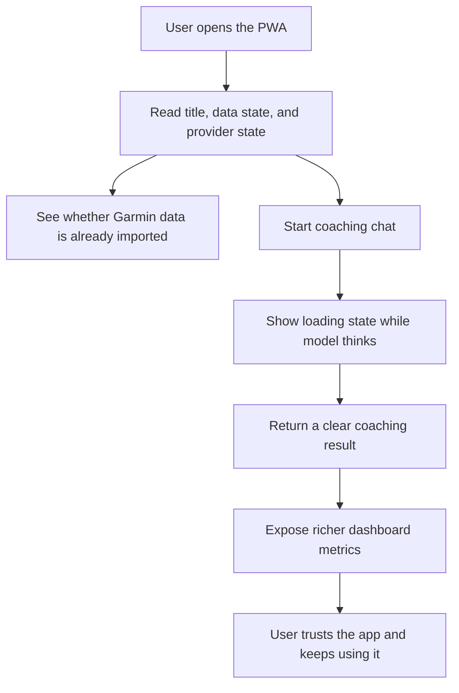

## req_009_pwa_coach_ux_polish_and_dashboard_enrichment - PWA coach UX polish and dashboard enrichment
> From version: 0.1.0
> Schema version: 1.0
> Status: Done
> Understanding: 96%
> Confidence: 93%
> Complexity: High
> Theme: UI
> Reminder: Update status, understanding, confidence, progress, and linked backlog or task refs when you edit this doc.

# Needs
- Make the first PWA version feel balanced, clear, and responsive instead of visually uneven.
- Improve the title and first impression so the app reads like a premium coaching product, not a technical demo.
- Clarify whether Garmin data is already imported, where it lives locally, and what state the app is in.
- Reduce the temptation to click several actions while the LLM is still thinking by showing a clear busy state.
- Enrich the dashboard with more useful running and recovery metrics so the user can trust the coach output.

# Context
- The local-first PWA coach is now functional and installable.
- First user feedback shows that the layout is not yet well balanced:
  - the hero/title copy feels too generic
  - the provider status pill is oversized
  - it is not obvious whether data is already imported or not
  - the app gives too little feedback while the model is inferring
  - the dashboard is too thin for serious running analysis
- The existing local Garmin pipeline already exposes useful signals that the PWA can surface:
  - training load
  - weekly volume
  - recent running history
  - heart rate / pace relationships
  - resting heart rate
  - sleep duration
  - estimated max heart rate when available
- This request is about product clarity and dashboard usefulness, not a backend rewrite.
- The goal is to make the app feel calmer, more informative, and more trustworthy at first glance.
- The dashboard can take a bit more visual space if that improves readability and coach usefulness.

# Scope
- In scope: adjust hero/title copy and the overall visual balance of the first screen.
- In scope: make the provider status compact, informative, and not visually dominant.
- In scope: add a clear import state so the user immediately knows whether data is already available locally.
- In scope: add a clear busy/loading state for LLM inference and long-running actions.
- In scope: persist the last local workspace and import source so the user does not have to re-enter them every time, while still allowing a manual choice when needed.
- In scope: enrich the dashboard with running and recovery metrics from the local dataset.
- In scope: surface at least some time-series or trend-style information instead of only static summary cards.
- Out of scope: replacing the whole PWA shell, changing the provider abstraction, or redesigning the Garmin ingestion pipeline.
- Out of scope: native mobile packaging or cloud sync.

# Acceptance criteria
- AC1: The PWA landing screen presents a clearer premium coaching identity, with a better title and more balanced visual hierarchy.
- AC2: The provider status is displayed in a compact way that does not dominate the layout.
- AC3: The app clearly indicates whether Garmin data has already been imported and where the active local workspace lives.
- AC4: While the LLM or another long-running action is working, the UI shows a clear busy state or progress indicator.
- AC5: The user does not need to repeatedly re-enter the local import directory when a workspace is already known and available.
- AC6: The dashboard shows richer coaching metrics, including training load, weekly volume, heart rate / pace context, resting heart rate, sleep duration, and estimated max heart rate when available.
- AC7: The dashboard exposes at least one trend-oriented view or summary that helps interpret the latest data, not just raw status badges.
- AC8: The app remains local-first and continues to work without requiring a paid cloud API just to inspect local data.

# Definition of Ready (DoR)
- [x] Problem statement is explicit and user impact is clear.
- [x] Scope boundaries are explicit.
- [x] Acceptance criteria are testable.
- [x] Dependencies and known risks are listed.

# Risks and dependencies
- If the app tries to show too many metrics at once, the dashboard can become noisy again.
- If inference feedback is too subtle, users may still click multiple actions and create duplicate requests.
- If the workspace and import source are not persisted clearly, the app will keep feeling repetitive.
- Some richer metrics may be missing depending on the local Garmin export coverage, so the UI must degrade gracefully.
- Any new charts or sparklines must stay readable on a small laptop screen and not create a heavy analytics wall.

# Clarifications
- The title should feel more like "Coach ultra perso" than a generic technical description.
- The provider chip should be compact and mostly informational, not the main visual event.
- The app should remember the last local workspace by default unless the user explicitly changes it, while still exposing a manual selector.
- The loading state should be obvious enough that the user understands the app is still working.
- The dashboard should prioritize coaching-relevant signals over pure engineering metrics.

# Open questions
- Should the title be a short premium label like "Coach ultra perso" or a slightly more descriptive label like "Coach ultra perso Garmin"?
- Should the loading state be a full-width banner, a spinner inside the chat panel, or both?
- Which additional metrics should be prioritized after the core set if space allows?
- Should the dashboard emphasize cards, cards plus sparklines, or a split layout with both?

# Suggestions
1. Title treatment: use a short premium title such as "Coach ultra perso" and keep the Garmin mention secondary.
2. Provider status: collapse it into a small chip or badge with a simple ready/busy label.
3. Import state: show a direct "data imported / not imported yet" callout and remember the last source path.
4. Busy state: show both an inline spinner in the chat and a top-level "analysis in progress" strip.
5. Dashboard depth: start with training load, weekly volume, resting HR, sleep, and a pace/HR trend, then add more only if the layout stays clean.
6. Extra metrics worth considering: HRV trend, acute/chronic load ratio, workout count over 7d and 28d, training status or recovery time, longest run, easy-run pace drift, and zone distribution.

# Companion docs
- Product brief(s): `prod_000_local_first_pwa_coach_dashboard`
- Architecture decision(s): `adr_001_choose_local_pwa_storage_and_provider_integration`
# AI Context
- Summary: Refine the local-first PWA coach UI so the first impression is balanced, the loading state is obvious, data import state is clear, and the dashboard exposes richer running and recovery metrics.
- Keywords: pwa, coach, ux, dashboard, loading state, import state, training load, weekly volume, heart rate, sleep, local-first
- Use when: Use when improving the first browser-installable coaching experience so it feels clear, responsive, and analytically useful.
- Skip when: Skip when the work is limited to backend ingestion, raw parsing, or provider integration only.

# Backlog
- `item_010_pwa_coach_ux_polish_and_dashboard_enrichment`
